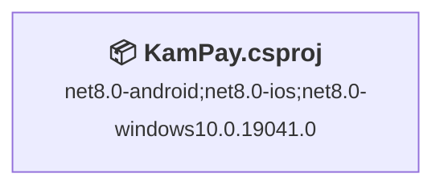
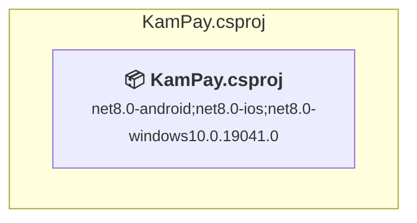

# Projects and dependencies analysis

This document provides a comprehensive overview of the projects and their dependencies in the context of upgrading to .NETCoreApp,Version=v10.0.

## Table of Contents

- [Executive Summary](#executive-Summary)
  - [Highlevel Metrics](#highlevel-metrics)
  - [Projects Compatibility](#projects-compatibility)
  - [Package Compatibility](#package-compatibility)
  - [API Compatibility](#api-compatibility)
- [Aggregate NuGet packages details](#aggregate-nuget-packages-details)
- [Top API Migration Challenges](#top-api-migration-challenges)
  - [Technologies and Features](#technologies-and-features)
  - [Most Frequent API Issues](#most-frequent-api-issues)
- [Projects Relationship Graph](#projects-relationship-graph)
- [Project Details](#project-details)

  - [KamPay\KamPay.csproj](#kampaykampaycsproj)

## Executive Summary

### Highlevel Metrics

| Metric | Count | Status |
| :--- | :---: | :--- |
| Total Projects | 1 | All require upgrade |
| Total NuGet Packages | 20 | 7 need upgrade |
| Total Code Files | 220 |  |
| Total Code Files with Incidents | 1 |  |
| Total Lines of Code | 41776 |  |
| Total Number of Issues | 8 |  |
| Estimated LOC to modify | 0+ | at least 0,0% of codebase |

### Projects Compatibility

| Project | Target Framework | Difficulty | Package Issues | API Issues | Est. LOC Impact | Description |
| :--- | :---: | :---: | :---: | :---: | :---: | :--- |
| [KamPay\KamPay.csproj](#kampaykampaycsproj) | net8.0-android;net8.0-ios;net8.0-windows10.0.19041.0 | 🟢 Low | 7 | 0 |  | ClassLibrary, Sdk Style = True |

### Package Compatibility

| Status | Count | Percentage |
| :--- | :---: | :---: |
| ✅ Compatible | 13 | 65,0% |
| ⚠️ Incompatible | 6 | 30,0% |
| 🔄 Upgrade Recommended | 1 | 5,0% |
| ***Total NuGet Packages*** | ***20*** | ***100%*** |

### API Compatibility

| Category | Count | Impact |
| :--- | :---: | :--- |
| 🔴 Binary Incompatible | 0 | High - Require code changes |
| 🟡 Source Incompatible | 0 | Medium - Needs re-compilation and potential conflicting API error fixing |
| 🔵 Behavioral change | 0 | Low - Behavioral changes that may require testing at runtime |
| ✅ Compatible | 0 |  |
| ***Total APIs Analyzed*** | ***0*** |  |

## Aggregate NuGet packages details

| Package | Current Version | Suggested Version | Projects | Description |
| :--- | :---: | :---: | :--- | :--- |
| CommunityToolkit.Maui | 9.0.0 |  | [KamPay.csproj](#kampaykampaycsproj) | ✅Compatible |
| CommunityToolkit.Maui.Core | 9.0.0 |  | [KamPay.csproj](#kampaykampaycsproj) | ✅Compatible |
| CommunityToolkit.Mvvm | 8.2.2 |  | [KamPay.csproj](#kampaykampaycsproj) | ✅Compatible |
| FFImageLoading.Maui | 1.2.4 |  | [KamPay.csproj](#kampaykampaycsproj) | ✅Compatible |
| FirebaseAuthentication.net | 3.7.2 |  | [KamPay.csproj](#kampaykampaycsproj) | ✅Compatible |
| FirebaseDatabase.net | 4.2.0 |  | [KamPay.csproj](#kampaykampaycsproj) | ✅Compatible |
| FirebaseStorage.net | 1.0.3 |  | [KamPay.csproj](#kampaykampaycsproj) | ✅Compatible |
| Mapsui.Maui | 4.1.9 |  | [KamPay.csproj](#kampaykampaycsproj) | ✅Compatible |
| Microsoft.Extensions.Logging.Debug | 8.0.1 | 10.0.5 | [KamPay.csproj](#kampaykampaycsproj) | NuGet paketinin yükseltilmesi önerilir |
| Microsoft.Maui.Controls | 8.0.100 |  | [KamPay.csproj](#kampaykampaycsproj) | ✅Compatible |
| Microsoft.Maui.Controls.Compatibility | 8.0.100 |  | [KamPay.csproj](#kampaykampaycsproj) | ✅Compatible |
| SkiaSharp | 2.88.9 |  | [KamPay.csproj](#kampaykampaycsproj) | ✅Compatible |
| Xamarin.Android.Glide | 4.16.0 |  | [KamPay.csproj](#kampaykampaycsproj) | ⚠️NuGet paketi uyumsuz |
| Xamarin.AndroidX.Collection | 1.4.2.1 |  | [KamPay.csproj](#kampaykampaycsproj) | ⚠️NuGet paketi uyumsuz |
| Xamarin.AndroidX.Collection.Ktx | 1.4.2.1 |  | [KamPay.csproj](#kampaykampaycsproj) | ⚠️NuGet paketi uyumsuz |
| Xamarin.AndroidX.Lifecycle.Runtime.Android | 2.8.6 |  | [KamPay.csproj](#kampaykampaycsproj) | ⚠️NuGet paketi uyumsuz |
| Xamarin.AndroidX.Lifecycle.Runtime.Ktx | 2.8.6 |  | [KamPay.csproj](#kampaykampaycsproj) | ⚠️NuGet paketi uyumsuz |
| Xamarin.AndroidX.RecyclerView | 1.3.2.7 |  | [KamPay.csproj](#kampaykampaycsproj) | ⚠️NuGet paketi uyumsuz |
| ZXing.Net.Maui | 0.4.0 |  | [KamPay.csproj](#kampaykampaycsproj) | ✅Compatible |
| ZXing.Net.Maui.Controls | 0.4.0 |  | [KamPay.csproj](#kampaykampaycsproj) | ✅Compatible |

## Top API Migration Challenges

### Technologies and Features

| Technology | Issues | Percentage | Migration Path |
| :--- | :---: | :---: | :--- |

### Most Frequent API Issues

| API | Count | Percentage | Category |
| :--- | :---: | :---: | :--- |

## Projects Relationship Graph

Legend:
📦 SDK-style project
⚙️ Classic project

## Project Details

### KamPay\KamPay.csproj

#### Project Info

- **Current Target Framework:** net8.0-android;net8.0-ios;net8.0-windows10.0.19041.0
- **Proposed Target Framework:** net8.0-android;net8.0-ios;net8.0-windows10.0.19041.0;net10.0-windows
- **SDK-style**: True
- **Project Kind:** ClassLibrary
- **Dependencies**: 0
- **Dependants**: 0
- **Number of Files**: 223
- **Number of Files with Incidents**: 1
- **Lines of Code**: 41776
- **Estimated LOC to modify**: 0+ (at least 0,0% of the project)

#### Dependency Graph

Legend:
📦 SDK-style project
⚙️ Classic project

### API Compatibility

| Category | Count | Impact |
| :--- | :---: | :--- |
| 🔴 Binary Incompatible | 0 | High - Require code changes |
| 🟡 Source Incompatible | 0 | Medium - Needs re-compilation and potential conflicting API error fixing |
| 🔵 Behavioral change | 0 | Low - Behavioral changes that may require testing at runtime |
| ✅ Compatible | 0 |  |
| ***Total APIs Analyzed*** | ***0*** |  |

