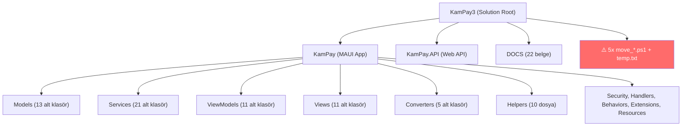

# 🔍 KamPay3 — Klasör Yapısı Analiz ve İyileştirme Planı

> **Tarih:** 2026-04-18 | **Kapsam:** Tüm proje klasörleri ve alt klasörleri

---

## 📊 Genel Mimari Görünüm



---

## 🚨 KRİTİK SORUNLAR (Acil Müdahale Gerekli)

### 1. 🔴 Transaction Servisleri — Dev Duplike Dosyalar (~370 KB Atık Kod)

| Dosya | Boyut | Satır |
|-------|-------|-------|
| `TransactionCrudService.cs` | **91.7 KB** | ~1815 |
| `TransactionPaymentService.cs` | **92.7 KB** | ~1838 |
| `TransactionNegotiationService.cs` | **91.7 KB** | ~1815 |
| `TransactionCompletionService.cs` | **91.7 KB** | ~1815 |

> [!CAUTION]
> **4 dosyanın her biri hemen hemen aynı içeriği taşıyor!** Faz 3 refactoring'de eski God-Class içeriği 4 dosyaya kopyalanmış ancak her dosyada sadece ilgili metotlar bırakılması gerekirken, **TÜM METOTLAR** dört dosyada da kalmış. Her servis ~92 KB ile `RespondToOfferAsync`, `CreatePaymentSimulationAsync`, `CompleteTransactionInternalAsync`, `CreateRequestAsync` gibi **aynı metotları** birebir içeriyor.
>
> **Sonuç:** 4 × 92 KB = **~368 KB duplike kod**. Gerçekte sadece ~40-50 KB olması gereken toplam kod, **~380 KB** yer kaplıyor.

**Facade doğru bağlanmış:** `TransactionFacade.cs` (4.5 KB) doğru servislere yönlendiriyor, ancak alt servisler hâlâ birbirinin klonları.

### 2. 🔴 ServiceRequestService.cs — Yeni God-Class (75.7 KB)

[ServiceRequestService.cs](file:///c:/Users/seyda/source/repos/seydakaratekeli/KamPay3/KamPay/Services/ServiceSharing/ServiceRequestService.cs) dosyası Faz 3.2'de oluşturulmuş olmasına rağmen **75.7 KB** boyutunda — hâlâ bir God-Class. `ServiceSharingFacade` (5.7 KB) doğru çalışsa da, bu dosya kendi içinde parçalanmamış.

### 3. 🟠 Kök Dizinde Artık Dosyalar

| Dosya | Açıklama | Durum |
|-------|----------|-------|
| `move_converters.ps1` | Refactoring taşıma scripti | ❌ Artık, işi bitti |
| `move_models.ps1` | Refactoring taşıma scripti | ❌ Artık, işi bitti |
| `move_services.ps1` | Refactoring taşıma scripti | ❌ Artık, işi bitti |
| `move_viewmodels.ps1` | Refactoring taşıma scripti | ❌ Artık, işi bitti |
| `move_views.ps1` | Refactoring taşıma scripti | ❌ Artık, işi bitti |
| `temp.txt` | Geçici kod parçası | ❌ Artık, silinmeli |

> [!WARNING]
> Bu dosyalar kaynak koda **karmaşıklık** ekler ve `.gitignore`'da yer almıyor. Repoya commit edilmiş olabilirler.

### 4. 🟠 Models/Messages vs Models/Messaging — İsimlendirme Karmaşası

```
Models/
├── Messages/          ← MapLocationUpdateMessage.cs, QRCodeScannedMessage.cs
├── Messaging/         ← Conversation.cs, Message.cs, ScrollToChatMessage.cs
```

> [!IMPORTANT]
> `Messages` → CommunityToolkit MVVM mesajları (WeakReferenceMessenger pattern)
> `Messaging` → Chat/konuşma veri modelleri
>
> İsim benzerliği yanıltıcı. `Messages` → **`MessengerMessages`** veya **`EventMessages`** olarak yeniden adlandırılmalı.

### 5. 🟠 Boş Klasör: `Services/Helpers`

`Services/Helpers/` klasörü **tamamen boş**. İçinde hiçbir dosya yok. Ya kullanılmalı ya da silinmeli.

---

## 📋 KATMAN BAZINDA DETAYLI ANALİZ

### 📁 Models Katmanı (13 alt klasör)

| Alt Klasör | Dosya Sayısı | Amaç | Uygunluk |
|-----------|-------------|------|----------|
| `Auth` | 1 | API login DTO | ✅ Doğru |
| `Core` | 1 | Category modeli | ⚠️ Tek dosya için klasör fazla |
| `Features` | 1 | SurpriseBox | ⚠️ Tek dosya için klasör fazla |
| `Messages` | 2 | MVVM mesajları | ⚠️ İsim yanıltıcı |
| `Messaging` | 3 | Chat modelleri | ✅ Doğru |
| `Notifications` | 1 | Notification modeli | ✅ Doğru |
| `Products` | 3 | Ürün/Favori/Paged | ✅ Doğru |
| `ServiceSharing` | 3 | Hizmet modelleri | ✅ Doğru |
| `Shared` | 1 | ValidationResult | ⚠️ Tek dosya |
| `Social` | 2 | GoodDeed + Comment | ✅ Doğru |
| `Support` | 1 | SupportTicket | ⚠️ Tek dosya |
| `Transactions` | 5 | İşlem modelleri | ✅ Doğru |
| `Users` | 4 | User/Profile/Badge/Stats | ✅ Doğru |

**Değerlendirme:** Klasör organizasyonu genel olarak **iyi** ancak `Core`, `Features`, `Shared`, `Support` birer dosya içeriyor — birleştirilmeyi bekliyor.

### 📁 Services Katmanı (21 alt klasör)

| Alt Klasör | Dosya | Boyut | Durum |
|-----------|-------|-------|-------|
| `Auth` | 2 | 50 KB | ⚠️ `FirebaseAuthService` 50 KB — büyük |
| `Caching` | 3 | 10 KB | ✅ İyi |
| `Categories` | 2 | 3 KB | ✅ İyi |
| `Email` | 3 | 12 KB | ✅ İyi |
| `Favorites` | 2 | 9 KB | ✅ İyi |
| `Features` | 5 | 29 KB | ✅ İyi (GoodDeed + SurpriseBox) |
| `Handlers` | 2 | 4 KB | ✅ İyi |
| **`Helpers`** | **0** | **0 KB** | **🔴 BOŞ KLASÖR** |
| `Localization` | 2 | 10 KB | ✅ İyi |
| `Location` | 2 | 3 KB | ✅ İyi |
| `Messaging` | 6 | 42 KB | ✅ İyi (Facade decomposed) |
| `Notifications` | 6 | 25 KB | ✅ İyi (Coordinator pattern) |
| `Payment` | 5 | 16 KB | ✅ İyi (OCP Factory pattern) |
| `Products` | 7+sub | 60 KB | ✅ İyi (Coordinator + Validation) |
| `Profile` | 4 | 30 KB | ✅ İyi |
| `QRCode` | 2 | 27 KB | ✅ İyi |
| `Realtime` | 3 | 4 KB | ✅ İyi |
| **`ServiceSharing`** | **14** | **~135 KB** | **🔴 ServiceRequestService 75.7 KB** |
| `Shared` | 2 | 8 KB | ✅ İyi |
| `Storage` | 2 | 14 KB | ✅ İyi |
| **`Transactions`** | **10** | **~480 KB** | **🔴 4x ~92 KB duplike dosya** |

### 📁 ViewModels Katmanı (11 alt klasör)

| Alt Klasör | Dosya | En Büyük Dosya | Boyut |
|-----------|-------|----------------|-------|
| Auth | 2 | LoginViewModel | 7.8 KB |
| Core | 2 | AppShellViewModel | 11 KB |
| Features | 2 | QRCodeViewModel | **40.7 KB** ⚠️ |
| Messaging | 2 | ChatViewModel | **54 KB** ⚠️ |
| Notifications | 1 | NotificationsViewModel | 9 KB |
| Products | 5 | ProductDetailViewModel | **42.8 KB** ⚠️ |
| ServiceSharing | 5 | ServiceRequestsViewModel | **35 KB** ⚠️ |
| Shared | 1 | ImageViewerViewModel | 4.8 KB |
| Social | 1 | GoodDeedBoardViewModel | **32.3 KB** ⚠️ |
| Transactions | 3 | OffersViewModel | **59.9 KB** ⚠️ |
| Users | 2 | ProfileViewModel | 11 KB |

> [!WARNING]
> **6 ViewModel 30 KB'ı aşıyor.** `OffersViewModel` (60 KB), `ChatViewModel` (54 KB), `ProductDetailViewModel` (43 KB) gibi dosyalar SRP ihlali riskinde. Bunlar ileride parçalanmaya aday.

### 📁 Views Katmanı (11 alt klasör)

Views katmanı ViewModels ile **1:1 simetrik** — bu çok iyi. Her alt klasör doğru sayfaları barındırıyor.

### 📁 Converters Katmanı (5 alt klasör)

| Alt Klasör | Dosya | Durum |
|-----------|-------|-------|
| Chat | 3 | ✅ |
| Generic | 10 | ✅ |
| Negotiation | 6 | ✅ |
| Product | 6 | ✅ |
| Transaction | 4 | ✅ |

**Mükemmel organizasyon.** Alan bazlı ayrım çok temiz.

### 📁 Diğer Klasörler

| Klasör | Durum | Not |
|--------|-------|-----|
| `Helpers/` | ✅ İyi | 10 dosya, amaca uygun |
| `Extensions/` | ✅ İyi | Tek dosya (TranslateExtension) |
| `Behaviors/` | ✅ İyi | Tek dosya (CollectionView optimization) |
| `Handlers/` | ✅ İyi | 3 platform-specific handler |
| `Security/` | ✅ İyi | Interface + Implementation |
| `Resources/` | ✅ İyi | 7 alt klasör, standart MAUI yapısı |
| `Platforms/` | ✅ İyi | Standart MAUI (Android, iOS, Windows, Mac, Tizen) |

### 📁 KamPay.API Projesi

| Klasör | Dosya | Durum |
|--------|-------|-------|
| `Controllers` | 2 (Auth, Products) | ✅ İyi |
| `Models` | 3 | ✅ İyi |
| `Services/Auth` | 2 | ✅ İyi |
| `Services/products` | 2 | ⚠️ Klasör adı **küçük harf** (tutarsız) |
| `Repositories` | 2 | ✅ İyi |
| `Middlewares` | 1 | ✅ İyi |

> [!NOTE]
> API projesi minimal ve temiz. `Services/products` → `Services/Products` olarak büyük harfle düzeltilmeli.

### 📁 DOCS Klasörü (22 belge)

Tamamı kök seviye markdown dosyaları. Konulara göre alt klasörler oluşturulabilir:
- `Security/` → 6 güvenlik belgesi
- `SOLID/` → 5 SOLID analiz belgesi
- `Guides/` → Teknik rehberler
- `Migration/` → Göç belgeleri

### 📁 Kök Dizin Dışı Notlar

| Dosya/Klasör | Not |
|-------------|-----|
| `KamPay/Docs/` | Sadece 1 dosya: `ApiIntegrationGuide.md` → `DOCS/` ile birleştirilmeli |
| `KamPay/.github/` | `instructions/` ve `skills/` — ayrı AI asistan config'i mi? |
| `.github/workflows/` | **BOŞ** — CI/CD henüz kurulmamış |
| `.github/upgrades/scenarios/` | Muhtemelen Dependabot senaryoları |

---

## 🎯 AKSİYON PLANI

### Faz 1 — Acil Temizlik (Risk: Düşük, Etki: Yüksek)

| # | Görev | Önem | Tahmini Süre |
|---|-------|------|-------------|
| 1.1 | Kök dizindeki `move_*.ps1` (5 dosya) ve `temp.txt` sil | 🔴 | 5 dk |
| 1.2 | `Services/Helpers/` boş klasörü sil | 🟠 | 1 dk |
| 1.3 | `KamPay.API/Services/products` → `Products` olarak yeniden adlandır | 🟠 | 5 dk |
| 1.4 | `KamPay/Docs/ApiIntegrationGuide.md` → `DOCS/` altına taşı | 🟡 | 2 dk |

### Faz 2 — Transaction Servis Duplikasyonunu Temizle (Risk: Orta, Etki: Çok Yüksek)

| # | Görev | Detay |
|---|-------|-------|
| 2.1 | `TransactionCrudService.cs` → Sadece CRUD metotları bırak | `CreateRequestAsync`, `CreateTradeOfferAsync`, `GetMyOffersAsync`, `GetIncomingOffersAsync`, `StartConversationForTransactionAsync` |
| 2.2 | `TransactionPaymentService.cs` → Sadece ödeme metotları bırak | `StartSalePaymentAsync`, `CreatePaymentSimulationAsync`, `ConfirmPaymentSimulationAsync`, `SetPaymentMethodAsCashAsync`, `SimulatePaymentAndCompleteAsync`, `GetSimulationOtpAsync` |
| 2.3 | `TransactionNegotiationService.cs` → Sadece pazarlık metotları bırak | `ProposePriceForSaleAsync`, `SendCounterOfferForSaleAsync`, `ProposeAdditionalCashAsync`, `SendCounterCashOfferAsync`, `AcceptNegotiatedPriceAsync` |
| 2.4 | `TransactionCompletionService.cs` → Sadece tamamlama metotları bırak | `CompletePaymentAsync`, `ConfirmDonationAsync`, `CompleteManualSaleAsync`, `CompleteTransactionInternalAsync`, `RespondToOfferAsync` |
| 2.5 | Ortak yardımcıları (`PaymentConstants`, `TempOtpModel`, `CreateDeliveryQRCodeModel`, `GenerateSecureOtp`) **tek yerde** birleştir | Shared bir base class veya helper |

> [!IMPORTANT]
> **Tahmini kazanç:** ~370 KB → ~50 KB (4 dosya toplam). **%87 kod azaltma.**

### Faz 3 — ServiceRequestService Parçalama (Risk: Orta)

| # | Görev |
|---|-------|
| 3.1 | `ServiceRequestService.cs` (75.7 KB) analiz et, sorumluluk alanlarını belirle |
| 3.2 | Offer CRUD, Request lifecycle, Payment, Proposal yönetimi olarak parçala |
| 3.3 | `ServiceSharingFacade`'ı yeni servislere bağla |

### Faz 4 — İsimlendirme ve Organizasyon (Risk: Düşük)

| # | Görev |
|---|-------|
| 4.1 | `Models/Messages/` → `Models/EventMessages/` veya `Models/MessengerMessages/` |
| 4.2 | `Models/Core` + `Models/Shared` + `Models/Support` + `Models/Features` → Tek dosyalıları birleştirme değerlendir |
| 4.3 | `DOCS/` altına konu bazlı alt klasörler oluştur (Security, SOLID, Guides, Migration) |

### Faz 5 — İleri Seviye İyileştirmeler (Risk: Düşük)

| # | Görev |
|---|-------|
| 5.1 | `.github/workflows/` → CI/CD pipeline kur (build + test) |
| 5.2 | Büyük ViewModel'ları (>30 KB) parçalama planı oluştur |
| 5.3 | `FirebaseAuthService.cs` (50 KB) → Auth strategy pattern ile parçala |

---

## 📈 SKORLAMA TABLOSU

| Kategori | Puan (10 üzerinden) | Not |
|----------|---------------------|-----|
| **Klasör organizasyonu** | 7/10 | Feature-based ayrım iyi, birkaç tutarsızlık var |
| **İsimlendirme tutarlılığı** | 6/10 | Messages/Messaging karmaşası, API'de küçük harf |
| **MVVM Pattern uyumu** | 8/10 | Views↔ViewModels simetrisi mükemmel |
| **Kod duplikasyonu** | 2/10 | Transaction servisleri ciddi sorun |
| **God-Class durumu** | 4/10 | ServiceRequestService + büyük ViewModel'lar |
| **Temizlik** | 5/10 | Artık scriptler, boş klasörler, temp dosyalar |
| **API projesi** | 8/10 | Minimal, temiz, doğru katmanlı |
| **Genel verimlilik** | 5.5/10 | Duplikasyon giderilirse 7.5+ olur |

---

## 🏁 Öncelik Sırası

```
1️⃣ Faz 1 — Acil Temizlik (5 dk)
2️⃣ Faz 2 — Transaction Duplikasyon (En büyük etki, ~370 KB tasarruf)
3️⃣ Faz 3 — ServiceRequestService parçalama
4️⃣ Faz 4 — İsimlendirme düzenlemeleri
5️⃣ Faz 5 — CI/CD ve ileri iyileştirmeler
```

> [!TIP]
> **En kritik adım Faz 2'dir.** 4 dosyadaki duplike kodu temizlemek hem derleme süresini hem de bakım yükünü dramatik şekilde azaltacaktır. Her biri ~92 KB olan dosyalar aslında ~10-15 KB olmalıdır.
