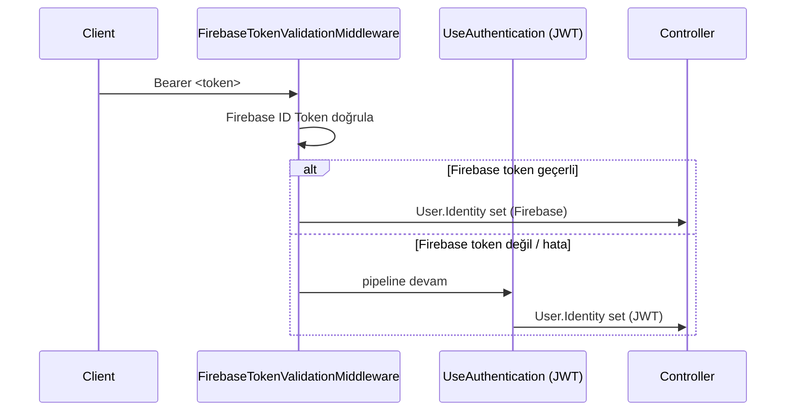

## Genel Değerlendirme

Proje güçlü bir temel üzerine kurulu: MVVM mimarisi, Repository pattern, Orchestrator pattern, OCP uyumlu ödeme sistemi, Firebase Auth + custom JWT hibrit auth. Ancak production'a çıkmadan önce **kritik güvenlik açıkları**, **ölçeklenebilirlik sorunları** ve **eksik üretim özellikleri** giderilmeli.

---

## Adım 1 — Kritik Güvenlik Açıkları (ZORUNLU, öncelik 1)

### 1.1 Hardcoded Firebase Database Secret — `KamPay.API/Program.cs:30`
```
AuthTokenAsyncFactory = () => Task.FromResult("7t7wMzquCV96p0v2zu0eLd14hMTWHoO1iRYI2Nkm")
```
> Bu Realtime Database **admin secret** kaynak kodunda açık duruyor. Git geçmişinde de var — hemen rotate edilmeli.

**Yapılacak:**
- Firebase Console → Project Settings → Service Accounts → Database secrets → Bu secret'ı **iptal et, yenisini oluştur**
- `appsettings.json`'a (veya environment variable'a) taşı, `configuration["Firebase:DatabaseSecret"]` ile oku
- `.gitignore`'a `appsettings.Production.json` ekle

### 1.2 JWT Secret Fallback — `Program.cs:34`, `AuthService.cs:39`
```csharp
?? "YOUR_VERY_SECURE_SECRET_KEY_HERE_MIN_16_CHARS"
```
**Yapılacak:**
- `appsettings.json`'da boşsa startup'ta **exception fırlat**, silent fallback kaldır
- Production'da environment variable veya Azure Key Vault kullan

### 1.3 MAUI Client — Hardcoded Local IP — `Constants.cs:11`
```csharp
public const string RealDeviceApiUrl = "http://192.168.1.5:5011";
```
**Yapılacak:**
- Build configuration'a göre `DEBUG`→local, `RELEASE`→production URL seç
- Tercihen `appsettings.json` embedded resource'dan yükle (zaten `LoadFirebaseConfig` benzeri pattern var)

### 1.4 `firebase-admin.json` Dosyası
**Yapılacak:**
- `.gitignore`'a ekle (şu an var mı kontrol et)
- Production'da Docker secret / environment variable içinden yükle

---

## Adım 2 — API Mimari Düzeltmeleri

### 2.1 Tutarsız Route Prefix
- `ProductsController`: `api/v1/[controller]`
- `AuthController`: `api/[controller]`

**Yapılacak:** `AuthController` route'unu `api/v1/auth` olarak güncelle. Veya tüm controllerlara global prefix ekle (`[assembly: RoutePrefix]` yerine `MapControllers().WithGroupNameConvention()`).

### 2.2 `WeatherForecastController` — Kaldır
`KamPay.API/Controllers/WeatherForecastController.cs` — scaffolding artifact, production'da kalmamalı.

### 2.3 Ölçeklenebilirlik: `GetByUserIdAsync` — `ProductRepository.cs:34`
```csharp
var allProducts = await GetAllAsync(1000); // ❌ 1000 ürün belleğe çekiliyor
return allProducts.Where(p => p.UserId == userId).ToList();
```
**Yapılacak:**
- Firebase RTDB'de `products` koleksiyonuna `UserId` index'i zaten `Constants.cs`'de belgelenmiş — Firebase query'yi `OrderBy("UserId").EqualTo(userId)` ile yap
- Sayfalama ekle: `GET /api/v1/products?page=1&pageSize=20`

### 2.4 Global Hata Yönetimi — Yok
**Yapılacak:** `Program.cs`'e `app.UseExceptionHandler` + ProblemDetails middleware ekle. Tüm controllerlardaki tekrarlayan `try/catch (Exception ex) { return StatusCode(500, ex.Message) }` bloklarını bu merkezi handler'a taşı.

### 2.5 CORS Policy — Yok
**Yapılacak:** `builder.Services.AddCors(...)` ile named policy tanımla. Development'ta `AllowAnyOrigin`, production'da domain kısıtlı.

### 2.6 Rate Limiting — API'de Yok
MAUI client'ta `AdvancedRateLimiter` var ama API'de yok. Herhangi bir HTTP client API'yi sömürebilir.

**Yapılacak:** `Microsoft.AspNetCore.RateLimiting` (built-in .NET 7+) ile fixed window / sliding window ekle. Özellikle `POST /auth/login` endpoint'ine.

### 2.7 Health Check Endpoint
**Yapılacak:** `builder.Services.AddHealthChecks()` → `app.MapHealthChecks("/health")`. Firebase bağlantısı için custom health check.

### 2.8 Loglama Altyapısı
**Yapılacak:** `Serilog` ekle. Console + File sink (development), üretimde Seq / Application Insights.

---

## Adım 3 — Çift Auth Middleware Karmaşıklığı

Şu an `FirebaseTokenValidationMiddleware` + JWT Bearer aynı anda çalışıyor. Akış:



**Sorun:** MAUI client login akışı şöyle: `FirebaseAuth → Firebase IdToken → POST /auth/login → Custom JWT` alıyor. Sonraki çağrılarda Custom JWT kullanıyor. Yani Firebase middleware ikinci çağrılarda her zaman exception'a düşüp sessizce devam ediyor — bu gereksiz Firebase Admin SDK çağrısı ve latency demek.

**Yapılacak:**
- `FirebaseTokenValidationMiddleware`'i sadece `/auth/login` dışındaki ve "Firebase token beklenen" endpoint'lere uygulamak yerine kaldır (zaten `AuthService` Firebase token'ı validate ediyor)
- Ya da token prefix'e göre ayırt et (`FB_` vs standart JWT)

---

## Adım 4 — MAUI Client Güvenliği

### 4.1 `appsettings.json` — API key'leri bundle içinde
Firebase API Key MAUI uygulamasının kaynak paketinde. Decompile ile okunabilir.

**Yapılacak:**
- Firebase API key client-side'da kaçınılmaz (Google bunu biliyor) ama `google-services.json` / `GoogleService-Info.plist` native yöntemlerini kullan
- Hassas backend secret'ları (SMTP şifresi, JWT secret) **kesinlikle** MAUI bundle'a gömme — bunlar zaten API tarafında olmalı

### 4.2 `ServerCertificateCustomValidationCallback = (m,c,ch,e) => true` — `MauiProgram.cs:162`
DEBUG'da bypass var, RELEASE'de doğru. **Production APK/IPA'da bu kod bloğuna girme** garantisi için `#if !DEBUG` koşulunu dokümante et ve CI/CD'de RELEASE build zorunlu tut.

---

## Adım 5 — Eksik Production Özellikleri

### 5.1 Üniversite E-posta Doğrulaması
`Constants.cs:32`'de `@bartin.edu.tr` domain tanımlı ama kayıt akışında domain kısıtlaması tam uygulanıyor mu? **Yapılacak:** API tarafında (`AuthService`) da domain check ekle — client-side check bypass edilebilir.

### 5.2 FCM Push Notification
Bildirim sistemi Firebase RTDB üzerinden polling/listener ile çalışıyor. Production'da mobil push notification için Firebase Cloud Messaging (FCM) entegrasyonu şart.

**Yapılacak:**
- `FirebaseNotificationService` → FCM HTTP v1 API'yi çağıracak şekilde genişlet
- MAUI tarafında `Plugin.Firebase.CloudMessaging` veya `Firebase.Messaging` entegre et

### 5.3 Gerçek Ödeme Entegrasyonu
`CardSimulationProvider` ve `BankTransferSimulationProvider` mevcut. OCP pattern sayesinde yeni provider eklemek kolay.

**Yapılacak (opsiyonel sıralamaya göre):**
- Iyzico veya PayTR entegrasyonu için `IyzicoPaymentProvider : IPaymentProvider` sınıfı yaz
- MAUI'de WebView tabanlı ödeme sayfası (3D Secure için)

### 5.4 İçerik Moderasyonu & Raporlama
Kullanıcı, ilan veya mesajı şikayet edebilmeli.

**Yapılacak:**
- `ReportController` (API) + `report` Firebase koleksiyonu
- Admin review için basit webhook veya e-posta bildirimi

### 5.5 Sayfalama — API Yok, Client-Side Var
`ProductListViewModel`'de muhtemelen virtual scroll veya lazy load var ama API `GetAllProducts` 50 kayıt döndürüyor (hardcoded). 

**Yapılacak:**
- `GET /api/v1/products?cursor=<lastKey>&pageSize=20` cursor-based pagination ekle (Firebase RTDB için `StartAfter` uygun)
- Response'a `{ data: [], nextCursor: "..." }` wrapper ekle

### 5.6 Admin Paneli
Kampüs moderasyonu için basit web tabanlı admin panel.

**Yapılacak (opsiyonel ama önemli):**
- Blazor veya React tek sayfada: ilan listesi, kullanıcı yönetimi, raporlar
- `[Authorize(Roles = "Admin")]` attribute'unu `ProductsController`'daki silme endpointlerine ekle
- Firebase Custom Claims ile rol ata

---

## Adım 6 — Deployment & CI/CD

### 6.1 API Deployment
**Önerilen stack:**
- Azure App Service (Free/B1) + GitHub Actions
- Environment variables: JWT secret, Firebase credentials, SMTP credentials
- `appsettings.Production.json` → App Service Configuration'da environment variable'lar

### 6.2 MAUI Release Build
**Yapılacak:**
- `Constants.cs`'deki production API URL'ini bir build constant veya `appsettings.Release.json`'a taşı
- Android: keystore ile imzala, AAB (Google Play) hazırla
- iOS: provisioning profile + App Store Connect hazırlığı

### 6.3 Firebase Güvenlik Kuralları
Firebase RTDB kurallarda `".read": true` gibi açık kurallar varsa kapatılmalı.

**Yapılacak:** Her koleksiyon için `auth != null && auth.uid == $userId` kısıtlı kurallar yaz.

---

## Öncelik Sırası (DoD)

| Öncelik | Alan | Hedef |
|---|---|---|
| P0 (HEMEN) | Firebase secret, JWT fallback | Kaynak koddan sır kaldırıldı |
| P0 (HEMEN) | `WeatherForecastController` silindi | Temiz API |
| P1 | Global error handler, CORS, rate limiting | API production-safe |
| P1 | `GetByUserIdAsync` query düzeltmesi | Scalable veri erişimi |
| P1 | Tutarsız route fix | Consistent API versioning |
| P2 | FCM push notification | Gerçek mobil bildirim |
| P2 | Cursor-based pagination | Ölçeklenebilir listeleme |
| P2 | Üniversite email backend doğrulaması | Domain güvenliği |
| P3 | Gerçek ödeme entegrasyonu | Production-grade ödeme |
| P3 | İçerik raporlama + admin panel | Moderasyon altyapısı |
| P3 | CI/CD pipeline | Otomatik deploy |

---

## Doğrulama Kriterleri

- [ ] Kaynak kodda hiçbir secret/API key literal string yok
- [ ] `dotnet build -c Release` hatasız tamamlanıyor
- [ ] `/health` endpoint 200 dönüyor
- [ ] Yetkilendirme olmadan `/api/v1/products` POST → 401
- [ ] Rate limiting: 60 istek/dakika sonrası 429
- [ ] Android APK'da hardcoded local IP yok, production URL geçerli
- [ ] Firebase RTDB rules: anonim okuma/yazma yok
