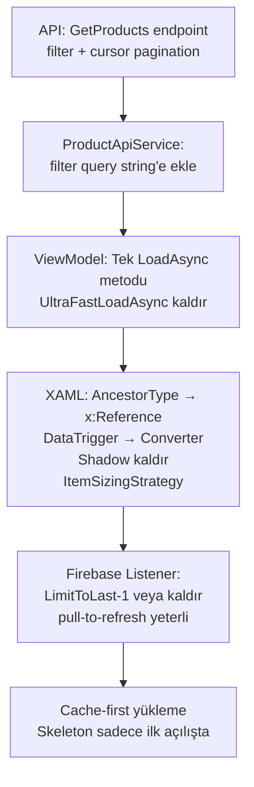

## Tespit Edilen Kök Nedenler

Kodu okuyunca takılmanın 4 katmanlı nedeni var:

```
1. API filtre parametreleri tamamen yok sayılıyor → her zaman tüm veri geliyor
2. Firebase Realtime Listener ilk açılışta 50+ "InsertOrUpdate" event fırlatıyor → debounce timer 50 kez reset
3. XAML item template'de AncestorType binding + 6 DataTrigger × her kart = scroll sırasında yüzlerce binding değerlendirmesi
4. Paralel iki yükleme yolu (UltraFastLoadAsync + LoadProductsAsync) birbiriyle çakışıyor
```

---

## Katman 1 — API: Filtreleme + Sayfalama Endpoint'i

### Sorun
`ProductApiService.GetAllProductsAsync` → `filter` parametresi alıyor ama API'ye **hiç göndermiyor**:
```csharp
// ProductApiService.cs:76 — filter tamamen görmezden geliniyor
var response = await _httpClient.GetAsync(_baseUrl, cancellationToken);
```
API de `GET /api/v1/products/paged` endpoint'ini tanımıyor (controller'da yok).

### Yapılacaklar

**`KamPay.API/Controllers/ProductsController.cs`**
- `GetProducts()` metoduna `[FromQuery]` parametreler ekle: `categoryId`, `type`, `search`, `pageSize`, `cursor`
- Firebase RTDB `LimitToLast` + `StartAfter` ile gerçek cursor-based pagination uygula
- `GET /api/v1/products?pageSize=20&cursor=lastKey&categoryId=X&type=Satis&search=text` formatı

**`KamPay.API/Repositories/ProductRepository.cs`**
- `GetAllAsync(int limit)` → `GetPagedAsync(int pageSize, string? cursor, ProductQueryOptions options)` olarak genişlet
- Firebase query: `.OrderByKey().StartAfter(cursor).LimitToFirst(pageSize)` (cursor-based)
- `GetByUserIdAsync` → in-memory 1000 yükleme yerine `.OrderBy("UserId").EqualTo(userId)` Firebase query kullan

**`KamPay/Services/ProductApiService.cs`**
- `GetAllProductsAsync` → query string'e filter parametreleri ekle:
  ```
  ?pageSize=20&categoryId=X&type=Satis&search=kitap&cursor=lastKey
  ```
- `GetProductsPagedAsync` kaldırılır, `GetAllProductsAsync` tek metoda birleşir

---

## Katman 2 — Firebase Realtime Listener Tasarımı

### Sorun
`UltraFastLoadAsync` şu anda hem API'den veri çekiyor **hem de** realtime listener başlatıyor.  
Firebase listener ilk bağlandığında mevcut tüm veriyi `InsertOrUpdate` event olarak fırlatır → 50 ürün varsa 50 event, her biri `_allProductsLock` alarak `_allProducts` listesini değiştirip debounce timer'ı sıfırlıyor. 300ms timer sürekli reset, UI kasıyor.

### Yapılacaklar

**`ProductListViewModel.UltraFastLoadAsync`**
- Listener'ı API yüklemesi **tamamlandıktan** sonra ve yalnızca **yeni eklenen/silinen** ürünler için başlat
- Başlangıç snapshot'ını listener'a değil API'ye bırak; listener sadece delta (değişim) için
- Bunu `_loader.Listen` yerine Firebase RTDB'de `.LimitToLast(1).AsObservable()` ile sadece yeni eklenenler için yap:
  ```csharp
  // Sadece son 1 kaydı izle — initial snapshot yükü sıfır
  _listener = _firebaseClient
      .Child("products")
      .OrderByKey()
      .LimitToLast(1)
      .AsObservable<Product>()
      .Subscribe(evt => ApplyRealtimeEvent(evt));
  ```
- Ya da listener'ı tamamen kaldırıp `RefreshView` pull-to-refresh ile değiştir (Letgo da böyle çalışır — realtime değil, pull-to-refresh)

---

## Katman 3 — XAML Item Template Optimizasyonları

### Sorun 1: `AncestorType` Binding (En Ağır Hit)
```xml
<!-- ProductListPage.xaml:272 — CollectionView item içinde AncestorType lookup -->
Command="{Binding Source={RelativeSource AncestorType={x:Type vm:ProductListViewModel}}, Path=ProductTappedCommand}"
```
Her scroll event'inde her görünür item için ancestor ağacını tarar. 2-column grid'de 6-8 görünür kart × her scroll frame = çok pahalı.

**Fix:** `ProductListPage.xaml.cs` code-behind'a komutları `BindableProperty` olarak açıkla veya XAML'da `x:Reference` kullan:
```xml
<ContentPage x:Name="ThisPage" ...>
...
TapGestureRecognizer Command="{Binding Source={x:Reference ThisPage}, Path=BindingContext.ProductTappedCommand}"
```
Bu, `AncestorType` visual tree taramasını ortadan kaldırır.

### Sorun 2: DataTrigger Zincirleri
Her kartta fiyat gösterimi için 3 label + 4 DataTrigger var (Satış, Bağış, Takas). Her binding güncellenmesinde tüm trigger'lar değerlendirilir.

**Fix:** Bunları `IsSaleConverter`, `ProductTypeShowPriceConverter` (zaten mevcut!) ile tek label'a indir:
```xml
<!-- Tek label, converter ile metin ve renk döndür -->
<Label Text="{Binding Type, Converter={StaticResource ProductTypePriceDisplayConverter}}"
       TextColor="{Binding Type, Converter={StaticResource ProductTypePriceColorConverter}}"/>
```
`ProductTypeShowPriceConverter` zaten `KamPay/Converters/` altında var — kullan.

### Sorun 3: Shadow Her Kartta
```xml
<Border.Shadow>
    <Shadow Brush="Black" Offset="0,2" Radius="8" Opacity="0.1"/>
</Border.Shadow>
```
50 kart × shadow render = her frame'de GPU'ya 50 gölge geçişi. Android'de özellikle ağır.

**Fix:** Shadow'u kaldır, Border stroke ile hafif görsel derinlik ver:
```xml
<Border StrokeShape="RoundRectangle 16"
        Stroke="#E8ECF0"
        StrokeThickness="1"
        BackgroundColor="White">
```

### Sorun 4: Avatar EllipseGeometry Clip
```xml
<ffimageloading:CachedImage.Clip>
    <EllipseGeometry Center="12,12" RadiusX="12" RadiusY="12"/>
</ffimageloading:CachedImage.Clip>
```
Her scroll'da re-clip. Fix: `CachedImage` yerine bir `Border` içine al, `StrokeShape="Ellipse"` kullan — GPU-accelerated.

### Sorun 5: Emoji Label'lar
`Text="❤️"`, `Text="👁️"` — emoji font render pahalı ve platform bağımlı. Material Icons font zaten kayıtlı.

**Fix:** `Text="favorite"` + `FontFamily="MaterialIcons"` kullan veya sayıyı sadece göster.

### Sorun 6: CollectionView ItemSizingStrategy
XAML'da belirtilmemiş — varsayılan `MeasureAllItems` kullanıyor (her item ölçülür).

**Fix:**
```xml
<CollectionView ItemSizingStrategy="MeasureFirstItem"
                ItemsSource="{Binding Products}"
```
`HeightRequest="270"` zaten sabit — `MeasureFirstItem` ile sonraki itemlar ölçülmez.

---

## Katman 4 — ViewModel Yükleme Yolu Birleştirme

### Sorun
İki çakışan yükleme yolu var:
- `UltraFastLoadAsync` → API `GetAllProductsAsync` → tüm veri
- `LoadProductsAsync` → API `GetProductsPagedAsync` → sayfalı (ama endpoint yok!)

`RefreshProductsCommand` → `LoadProductsAsync` çağırıyor ama `UltraFastLoadAsync` değil.  
`OnSelectedCategoryChanged` → `ReloadWithFilterAsync` → `GetAllProductsAsync` (filter göndermiyor)

### Yapılacak: Tek Yükleme Fonksiyonu

```
LoadAsync(filter, cursor=null)
  ↓
API: GET /products?pageSize=20&cursor=X&categoryId=Y&type=Z&search=W
  ↓
İlk 20 item → Products.ReplaceRange()
  ↓
Scroll sonu → LoadAsync(filter, cursor=lastKey) → Products.AddRange()
```

- `UltraFastLoadAsync` kaldırılır
- `LoadProductsAsync` + `ReloadWithFilterAsync` tek `LoadAsync(ProductFilter, string? cursor)` metoduna birleşir
- `OnSelectedCategoryChanged`, `OnSelectedTypeChanged` → `LoadAsync(yeniFilter, cursor=null)` çağırır
- `OnSelectedSortOptionChanged` → client-side sıralama yeterli (API'ye gitmez)
- `RemainingItemsThresholdReachedCommand` → `LoadAsync(mevcutFilter, cursor=_lastKey)`

---

## Katman 5 — Cache Stratejisi

`ProductCacheService` var ama `LoadProductsAsync` cache'i okuyup return edince skeleton hâlâ gösteriliyor. 

**Fix:**
1. İlk açılışta önce cache'ten göster (skeleton yok, anlık veri)
2. Arkaplanda API'den tazele, fark varsa güncelle
3. Cache TTL: 3 dakika (mevcut `TimeSpan.FromMinutes(3)` doğru)

```
Açılış → Cache var mı?
  ✓ → Anında göster → Arkaplanda API'ye git → Fark varsa güncelle
  ✗ → Skeleton → API → Göster → Cache'e yaz
```

---

## Uygulama Sırası



---

## Doğrulama Kriterleri

| Kriter | Hedef |
|---|---|
| İlk açılış (cache yok) | ≤1.5 saniye skeleton → içerik |
| İlk açılış (cache var) | ≤200ms — anında içerik |
| Scroll FPS | 60fps (Perfdog / Android GPU overdraw modu ile ölç) |
| Kategori filter | API'ye tek istek, local filtre değil |
| Sayfa sonu scroll | 20 item daha yükle, mevcut liste kaymasın |
| Realtime event | Yeni ilan eklendiğinde ≤2sn listede görünsün |
| `AncestorType` binding | XAML'da sıfır adet kalmalı |
| `DataTrigger` sayısı | Item başına ≤2 (mevcut: 6) |
