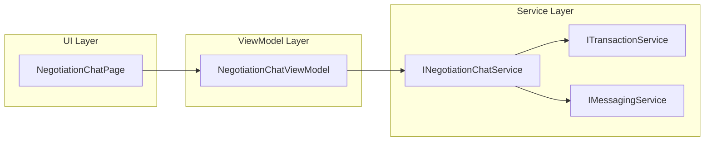

# KamPay Chat & Negotiation System — Production-Level Analysis

> **Staff-level analysis** | Realtime messaging, state management, Firebase architecture
> Analiz tarihi: 2026-05-05

---

## 1. ROOT CAUSE ANALİZİ — Neden Realtime Çalışmıyor?

### 🔴 Birincil Sorun: İlk Yükleme (Initial Load) Eksik

[ChatViewModel.Messaging.cs](file:///c:/Users/seyda/source/repos/seydakaratekeli/KamPay3/KamPay/ViewModels/Messaging/ChatViewModel.Messaging.cs#L38-L97) dosyasındaki `StartListeningToMessages()` metodu incelendiğinde:

```csharp
_messagesSubscription = _firebaseClient
    .Child(Constants.MessagesCollection)
    .Child(ConversationId)
    .AsObservable<Message>()          // ← Firebase SSE stream
    .Where(e => e.Object != null && !e.Object.IsDeleted)
    .Buffer(TimeSpan.FromMilliseconds(200))
    .Subscribe(...)
```

**Firebase `.AsObservable<T>()`** davranışı:
1. Bağlantı kurulduğunda **tüm mevcut verileri tek tek event olarak gönderir** (initial dump)
2. Sonra gerçek zamanlı değişiklikleri stream eder

**Problem:** `LoadChatAsync()` metodu ([ChatViewModel.cs:222](file:///c:/Users/seyda/source/repos/seydakaratekeli/KamPay3/KamPay/ViewModels/Messaging/ChatViewModel.cs#L222)) **hiçbir zaman Firebase'den mesajları doğrudan çekmiyor**. Tüm mesaj yükleme tamamen `AsObservable()` stream'ine bırakılmış. Bu, aşağıdaki sorunlara neden olur:

| Sorun | Açıklama |
|-------|----------|
| **Gecikmeli ilk yükleme** | Stream bağlantısı kurulana kadar ekran boş kalıyor |
| **Cache tutarsızlığı** | Cache'den restore sonra listener yeniden başlatılıyor ama eski+yeni mesajlar çakışıyor |
| **Race condition** | `_initialLoadComplete` flag'i stream'in ilk batch'inde set ediliyor, bu güvenilir değil |

### 🔴 İkincil Sorun: Subscription Lifecycle Hataları

[ChatPage.xaml.cs](file:///c:/Users/seyda/source/repos/seydakaratekeli/KamPay3/KamPay/ViewModels/Messaging/ChatViewModel.cs#L498-L549):

```csharp
// ChatPage.xaml.cs — OnDisappearing
protected override void OnDisappearing()
{
    base.OnDisappearing();
    WeakReferenceMessenger.Default.Unregister<ScrollToChatMessage>(this);
    (_viewModel as IDisposable)?.Dispose();  // ← HER sayfa kapanışında dispose!
}
```

**Kritik Bug:** ViewModel `Transient` olarak kayıtlı + `OnDisappearing`'de dispose ediliyor. Ancak:
- Android'de `OnDisappearing` her zaman sayfa kapanışı demek değil (örn: notification panel açıldığında)
- Dispose sonrası `_messagesSubscription = null` → geri dönüşte listener ölü

### 🔴 Üçüncü Sorun: Duplicate Message Processing

[ProcessMessageBatch](file:///c:/Users/seyda/source/repos/seydakaratekeli/KamPay3/KamPay/ViewModels/Messaging/ChatViewModel.Messaging.cs#L149-L197) analizinde:

```csharp
var existingMessage = Messages.FirstOrDefault(m => m.MessageId == message.MessageId);
```

Bu `O(n)` arama, her yeni mesajda tüm listeyi tarar. 500+ mesajda performans düşer. Ayrıca `AsObservable()` initial dump sırasında aynı mesajı tekrar gönderebilir.

### 🟡 Threading Analizi

Threading **doğru yapılmış** — `MainThread.BeginInvokeOnMainThread()` kullanılıyor. Bu kısım sorunlu değil.

---

## 2. REALTIME MİMARİ TASARIMI

### Mevcut vs Önerilen Mimari

```mermaid
graph TB
    subgraph "MEVCUT (Kırık)"
        A[LoadChatAsync] -->|"Sadece cache/metadata"| B[StartListeningToMessages]
        B -->|"AsObservable initial dump"| C[Tüm mesajlar stream'den]
        C -->|"Buffer 200ms"| D[ProcessMessageBatch]
        D -->|"MainThread"| E[UI Update]
    end
    
    subgraph "ÖNERİLEN (Sağlam)"
        F[LoadChatAsync] -->|"1. Snapshot"| G["OnceAsync → İlk 50 mesaj"]
        G -->|"Hemen göster"| H[UI Ready]
        H -->|"2. Realtime"| I["AsObservable → Sadece yeni mesajlar"]
        I -->|"Deduplicate + Buffer"| J[ProcessMessageBatch]
        J -->|"MainThread"| K[UI Update]
    end
```



### Production-Ready Realtime Listener

```csharp
// ===== YENİ: IChatRealtimeService =====
public interface IChatRealtimeService
{
    /// <summary>Snapshot + Realtime dinleme başlat</summary>
    Task<List<Message>> LoadAndListenAsync(
        string conversationId,
        Action<Message> onNewMessage,
        Action<Message> onUpdatedMessage,
        Action<string> onDeletedMessage);
    
    void StopListening();
}

public class ChatRealtimeService : IChatRealtimeService, IDisposable
{
    private readonly FirebaseClient _firebaseClient;
    private IDisposable? _subscription;
    private HashSet<string> _knownMessageIds = new();
    private DateTime _latestTimestamp = DateTime.MinValue;

    public ChatRealtimeService(FirebaseClient firebaseClient)
    {
        _firebaseClient = firebaseClient;
    }

    public async Task<List<Message>> LoadAndListenAsync(
        string conversationId,
        Action<Message> onNewMessage,
        Action<Message> onUpdatedMessage,
        Action<string> onDeletedMessage)
    {
        // ADIM 1: Snapshot — anında UI'a yansıt
        var snapshot = await _firebaseClient
            .Child(Constants.MessagesCollection)
            .Child(conversationId)
            .OrderByKey()
            .LimitToLast(50)
            .OnceAsync<Message>();

        var messages = new List<Message>();
        foreach (var item in snapshot)
        {
            var msg = item.Object;
            if (msg == null || msg.IsDeleted) continue;
            msg.MessageId = item.Key;
            _knownMessageIds.Add(msg.MessageId);
            if (msg.SentAt > _latestTimestamp)
                _latestTimestamp = msg.SentAt;
            messages.Add(msg);
        }

        // ADIM 2: Realtime — sadece snapshot'tan sonraki değişiklikleri dinle
        _subscription = _firebaseClient
            .Child(Constants.MessagesCollection)
            .Child(conversationId)
            .AsObservable<Message>()
            .Where(e => e.Object != null)
            .Buffer(TimeSpan.FromMilliseconds(150))
            .Where(batch => batch.Any())
            .Subscribe(events =>
            {
                MainThread.BeginInvokeOnMainThread(() =>
                {
                    foreach (var e in events)
                    {
                        var msg = e.Object;
                        if (msg == null) continue;
                        msg.MessageId = e.Key;

                        if (e.EventType == FirebaseEventType.Delete)
                        {
                            onDeletedMessage(e.Key);
                            _knownMessageIds.Remove(e.Key);
                            continue;
                        }

                        if (msg.IsDeleted)
                        {
                            onDeletedMessage(e.Key);
                            _knownMessageIds.Remove(e.Key);
                            continue;
                        }

                        if (_knownMessageIds.Contains(msg.MessageId))
                        {
                            // Bilinen mesaj → güncelleme
                            onUpdatedMessage(msg);
                        }
                        else
                        {
                            // Yeni mesaj
                            _knownMessageIds.Add(msg.MessageId);
                            onNewMessage(msg);
                        }
                    }
                });
            });

        return messages.OrderBy(m => m.SentAt).ToList();
    }

    public void StopListening()
    {
        _subscription?.Dispose();
        _subscription = null;
        _knownMessageIds.Clear();
    }

    public void Dispose() => StopListening();
}
```

---

## 3. CHAT + NEGOTIATION AYRIMI (KRİTİK KARAR)

### Mevcut Durum Analizi

| Bileşen | Durum | Sorun |
|---------|-------|-------|
| `Conversation.ConversationType` | `"General"` / `"Negotiation"` | ✅ Model seviyesinde ayrım var |
| `MessagesPage` / `NegotiationMessagesPage` | İki ayrı sayfa | ✅ Liste seviyesinde ayrım var |
| `ChatPage` | **Tek sayfa** | ❌ Hem sohbet hem pazarlık aynı ekranda |
| `ChatViewModel` | **Tek ViewModel** | ❌ 1400+ satır, her şey iç içe |
| Firebase `messages/{conversationId}` | Tek koleksiyon | ❌ Normal + negotiation mesajlar karışık |

### Önerilen Mimari: Dual-Channel Approach

```
conversations/
├── conv_abc (ConversationType: "General")     → Normal sohbet
│   └── messages/conv_abc/                     → Text, Image, System mesajları
│
└── conv_abc_neg (ConversationType: "Negotiation")  → Pazarlık sohbeti  
    └── messages/conv_abc_neg/                 → Negotiation, System mesajları
```

> [!IMPORTANT]
> **Neden tek conversation + MessageType değil de ayrı channel?**
> 1. Firebase `AsObservable()` tüm node'u dinler — filtreleme client-side'da olur, bandwidth israfı
> 2. Pazarlık mesajları farklı lifecycle'a sahip (expire olabilir, state machine var)
> 3. UI'da tamamen farklı template gerekiyor (offer card vs text bubble)
> 4. Performans: 1000 mesajlık sohbette 5 pazarlık mesajını bulmak O(n)

### Geçiş Stratejisi (Breaking Change Olmadan)

**Faz 1 — Mevcut yapıyı koru, UI ayır:**
- `ChatPage` → sadece `General` mesajları gösterir
- Yeni `NegotiationChatPage` → sadece `Negotiation` mesajlarını gösterir
- `FilteredMessages` property'sini kaldır, her sayfa kendi conversation'ını dinler

**Faz 2 — Ayrı conversation oluştur:**
- Pazarlık başladığında otomatik `Negotiation` conversation oluştur
- `Transaction.ConversationId` → negotiation conversation'a referans
- Genel sohbet ayrı conversation olarak devam eder

**Faz 3 — Eski verileri migrate et:**
- Mevcut `Negotiation` tipli mesajları yeni conversation'a taşı
- Backward compatibility: eski mesajlar okunabilir kalır

---

## 4. PAZARLIK (NEGOTIATION) ENTEGRASYONU

### Mevcut Problemler

**Problem 1: Eski teklifler hala aktif görünüyor**

[ChatViewModel.Negotiation.cs](file:///c:/Users/seyda/source/repos/seydakaratekeli/KamPay3/KamPay/ViewModels/Messaging/ChatViewModel.Negotiation.cs#L262-L323) — `AcceptOfferAsync`:

```csharp
if (!message.IsActiveOffer)  // ← Bu kontrol var ama...
{
    // Mesajdaki IsActiveOffer değeri Firebase'den geldiği anda set ediliyor
    // Ancak başka bir kullanıcı yeni teklif verdiğinde eski mesajların
    // IsActiveOffer alanı güncellenmİYOR!
}
```

**Root Cause:** Yeni teklif yapıldığında eski mesajların `IsActiveOffer = false` yapılması **transaction service'de** olmalı ama mevcut kodda bu yapılmıyor.

**Problem 2: Chat → Business Logic Karışık**

`ChatViewModel.Negotiation.cs` doğrudan `_transactionService.ProposePriceForSaleAsync()` çağırıyor. Bu ViewModel'in sorumluluğunda olmamalı.

### Önerilen Mimari



```csharp
// Chat → sadece display, business logic ayrı
public interface INegotiationChatService
{
    Task<ServiceResult> ProposeOffer(string transactionId, decimal amount, string userId);
    Task<ServiceResult> AcceptOffer(string transactionId, string userId);
    Task<ServiceResult> RejectOffer(string transactionId, string userId);
    
    // Offer state UI ile senkronize
    Task InvalidateOldOffers(string transactionId, string newOfferId);
}
```

---

## 5. STATE MANAGEMENT — ChatViewModel Refactoring

### Mevcut Sorumluluk Analizi

| Partial File | Satır | Sorumluluklar |
|-------------|-------|---------------|
| [ChatViewModel.cs](file:///c:/Users/seyda/source/repos/seydakaratekeli/KamPay3/KamPay/ViewModels/Messaging/ChatViewModel.cs) | 589 | Init, lifecycle, user state, dispose, navigation, online status |
| [ChatViewModel.Messaging.cs](file:///c:/Users/seyda/source/repos/seydakaratekeli/KamPay3/KamPay/ViewModels/Messaging/ChatViewModel.Messaging.cs) | 285 | Realtime listener, typing, message sending, batch processing |
| [ChatViewModel.Negotiation.cs](file:///c:/Users/seyda/source/repos/seydakaratekeli/KamPay3/KamPay/ViewModels/Messaging/ChatViewModel.Negotiation.cs) | 327 | Transaction loading, offer propose/accept, filter chips |
| [ChatViewModel.Cache.cs](file:///c:/Users/seyda/source/repos/seydakaratekeli/KamPay3/KamPay/ViewModels/Messaging/ChatViewModel.Cache.cs) | 184 | LRU cache, save/restore, cleanup |
| [ChatViewModel.Media.cs](file:///c:/Users/seyda/source/repos/seydakaratekeli/KamPay3/KamPay/ViewModels/Messaging/ChatViewModel.Media.cs) | 209 | Pick/take photo, upload, send image |
| **TOPLAM** | **~1594** | **7+ sorumluluk** → SRP ihlali |

### Önerilen Refactor Yapısı

```
ViewModels/
├── Messaging/
│   ├── ChatViewModel.cs                    (~200 satır) — Sadece UI state + navigation
│   ├── NegotiationChatViewModel.cs         (~250 satır) — Pazarlık chat UI
│   └── MessagesViewModel.cs               (mevcut — değişmez)
│
Services/
├── Messaging/
│   ├── IMessagingService.cs                (mevcut)
│   ├── FirebaseMessagingService.cs         (mevcut)
│   ├── IChatRealtimeService.cs             (YENİ) — Realtime listener
│   ├── ChatRealtimeService.cs              (YENİ)
│   ├── IChatCacheService.cs                (YENİ) — LRU cache
│   ├── ChatCacheService.cs                 (YENİ)
│   ├── IChatMediaService.cs                (YENİ) — Image pick/upload
│   ├── ChatMediaService.cs                 (YENİ)
│   ├── INegotiationChatService.cs          (YENİ) — Offer logic
│   └── NegotiationChatService.cs           (YENİ)
│
Views/
├── Messaging/
│   ├── ChatPage.xaml / .cs                 (sadece genel sohbet)
│   ├── NegotiationChatPage.xaml / .cs      (YENİ — pazarlık sohbeti)
│   ├── MessagesPage.xaml / .cs             (mevcut)
│   └── NegotiationMessagesPage.xaml / .cs  (mevcut)
```

---

## 6. UI/UX DAVRANIŞI

### Scroll Davranışı

Mevcut [ScrollToLastMessage](file:///c:/Users/seyda/source/repos/seydakaratekeli/KamPay3/KamPay/Views/Messaging/ChatPage.xaml.cs#L105-L130) her mesajda en alta kaydırıyor. Bu yanlış:

```csharp
// ÖNERİLEN: Smart Scroll
private bool _isUserScrolledUp = false;

private void OnListViewScrolled(object sender, ScrolledEventArgs e)
{
    // Kullanıcı en alttan 200px yukarıdaysa "scrolled up" kabul et
    _isUserScrolledUp = e.ScrollY < (totalContentHeight - visibleHeight - 200);
}

private void OnNewMessageReceived(Message message)
{
    if (message.IsSentByMe || !_isUserScrolledUp)
    {
        ScrollToLastMessage();
    }
    else
    {
        // "Yeni mesaj var ↓" banner'ı göster
        ShowNewMessageBanner(message);
    }
}
```

### State Tanımları

| State | Görsel | Koşul |
|-------|--------|-------|
| **Loading** | Skeleton shimmer | İlk snapshot yüklenirken |
| **Empty** | "Henüz mesaj yok" kartı | Mesaj listesi boş |
| **Loaded** | Mesaj listesi | Normal durum |
| **Sending** | Temp mesaj (opacity 0.6) | Mesaj gönderilirken |
| **Error** | Retry butonu | Firebase bağlantı hatası |
| **Reconnecting** | "Bağlanıyor..." banner | Internet kesilip geri geldiğinde |
| **Typing** | "... yazıyor" indicator | Karşı taraf yazarken |

---

## 7. EDGE CASE ANALİZİ

| Durum | Mevcut | Çözüm |
|-------|--------|-------|
| **Aynı anda 2 mesaj** | Buffer(200ms) ile batch | ✅ Doğru |
| **Duplicate message** | `FirstOrDefault` ile kontrol | 🟡 `HashSet` ile O(1) yap |
| **DB yazma hatası** | Temp mesaj siliniyor | ✅ Doğru, retry ekle |
| **Internet kesildi** | Listener sessizce ölüyor | ❌ Connectivity monitor + auto-reconnect ekle |
| **Chatten çıkıldı ama listener açık** | Dispose'da temizleniyor | 🟡 Android lifecycle'da riskli |
| **Hızlı mesaj akışı** | Buffer var | ✅ Doğru |
| **Sayfa arası geçişte dispose** | OnDisappearing'de dispose | ❌ Navigation pop'ta dispose, push'ta yapma |

### Connectivity Monitor Önerisi

```csharp
// App.xaml.cs'ye ekle
Connectivity.ConnectivityChanged += async (s, e) =>
{
    if (e.NetworkAccess == NetworkAccess.Internet)
    {
        // Aktif chat varsa listener'ı yeniden başlat
        WeakReferenceMessenger.Default.Send(new ConnectivityRestoredMessage());
    }
};
```

---

## 8. PERFORMANS

### Mevcut Bottleneck'ler

| Sorun | Yer | Etki |
|-------|-----|------|
| `GetUserConversationsAsync` tüm conversations çekiyor | [FirebaseMessagingService.cs:194](file:///c:/Users/seyda/source/repos/seydakaratekeli/KamPay3/KamPay/Services/Messaging/FirebaseMessagingService.cs#L194) | N büyüdükçe yavaşlar |
| `GetOrCreateConversationAsync` tüm conversations çekiyor | [FirebaseMessagingService.cs:234](file:///c:/Users/seyda/source/repos/seydakaratekeli/KamPay3/KamPay/Services/Messaging/FirebaseMessagingService.cs#L234) | Her mesaj gönderiminde |
| `Messages.FirstOrDefault` → O(n) arama | [ChatViewModel.Messaging.cs:162](file:///c:/Users/seyda/source/repos/seydakaratekeli/KamPay3/KamPay/ViewModels/Messaging/ChatViewModel.Messaging.cs#L162) | Her event'te |
| `UpdateUserInfoInMessagesAsync` tüm mesajları teker teker patch'liyor | [FirebaseMessagingService.cs:505](file:///c:/Users/seyda/source/repos/seydakaratekeli/KamPay3/KamPay/Services/Messaging/FirebaseMessagingService.cs#L505) | Profil güncelleme = N API call |
| Static `_conversationCache` — thread-safe değil | [ChatViewModel.cs:37](file:///c:/Users/seyda/source/repos/seydakaratekeli/KamPay3/KamPay/ViewModels/Messaging/ChatViewModel.cs#L37) | Race condition riski |

### Optimizasyon Önerileri

**1. Message lookup → Dictionary:**
```csharp
private readonly Dictionary<string, int> _messageIndexMap = new();
// Insert/update'te map'i güncelle → O(1) lookup
```

**2. Conversation lookup → Firebase index:**
Firebase Rules'a composite index ekle:
```json
"conversations": {
  ".indexOn": ["User1Id", "User2Id", "ConversationType"]
}
```

**3. Pagination:**
```csharp
// İlk yükleme: son 50 mesaj
// Yukarı scroll: önceki 50 mesaj (LimitToLast + EndBefore)
public async Task<List<Message>> LoadOlderMessages(string conversationId, string beforeKey)
{
    return await _firebaseClient
        .Child("messages")
        .Child(conversationId)
        .OrderByKey()
        .EndBefore(beforeKey)
        .LimitToLast(50)
        .OnceAsync<Message>();
}
```

---

## 9. REFACTOR PLANI — Öncelikli Aksiyonlar

### Faz 1: Realtime Fix (Acil — 1-2 gün)

| # | Aksiyon | Dosya | Etki |
|---|---------|-------|------|
| 1 | `LoadChatAsync`'e snapshot ekle — `OnceAsync` ile ilk mesajları çek | ChatViewModel.cs | Anlık yükleme |
| 2 | `_knownMessageIds` HashSet ekle — duplicate'leri önle | ChatViewModel.Messaging.cs | Duplicate fix |
| 3 | `OnDisappearing` → sadece listener pause, tam dispose etme | ChatPage.xaml.cs | Lifecycle fix |
| 4 | Connectivity monitor ekle | App.xaml.cs | Reconnect |

### Faz 2: Chat/Negotiation Ayrımı (2-3 gün)

| # | Aksiyon | Yeni Dosya |
|---|---------|------------|
| 5 | `IChatRealtimeService` + impl oluştur | Services/Messaging/ |
| 6 | `NegotiationChatViewModel` oluştur — Negotiation logic'i ChatVM'den çıkar | ViewModels/Messaging/ |
| 7 | `NegotiationChatPage` oluştur | Views/Messaging/ |
| 8 | `ChatViewModel`'den negotiation kodu kaldır | ViewModels/Messaging/ |

### Faz 3: Servis Ayrımı (2-3 gün)

| # | Aksiyon | Yeni Dosya |
|---|---------|------------|
| 9 | `IChatCacheService` çıkar — static cache'i injectable yap | Services/Messaging/ |
| 10 | `IChatMediaService` çıkar — media logic'i ViewModel'den ayır | Services/Messaging/ |
| 11 | `INegotiationChatService` çıkar — offer logic'i ayır | Services/Messaging/ |
| 12 | `MauiProgram.cs`'de yeni DI kayıtları ekle | MauiProgram.cs |

### Faz 4: Performans (1-2 gün)

| # | Aksiyon |
|---|---------|
| 13 | Message lookup'ı Dictionary'ye çevir |
| 14 | Conversation lookup'a Firebase index ekle |
| 15 | Mesaj pagination ekle (scroll-up = load more) |

---

## 10. SONUÇ ÖZETİ

### Root Cause
Mesajlar realtime güncellenmİYOR çünkü **initial snapshot yükleme yok** — tüm mesajlar `AsObservable()` stream'inin initial dump'ına bırakılmış. Stream bağlantı gecikmesi + cache race condition = boş ekran veya eski veri.

### Mevcut Sistem Hataları
1. Snapshot + Realtime ayrımı yok (Snapshot-Then-Listen pattern eksik)
2. `OnDisappearing`'de agresif dispose → listener ölüyor
3. Normal chat + pazarlık chat aynı ViewModel/Page'de → 1600 satır God Object
4. Eski tekliflerin `IsActiveOffer` alanı güncellenmİYOR
5. Static `_conversationCache` thread-safe değil
6. `GetOrCreateConversationAsync` her seferinde tüm conversation'ları çekiyor

### Önerilen Mimari
- **Snapshot-Then-Listen** pattern ile ilk yükleme + realtime
- **Dual-Channel**: General ve Negotiation ayrı conversation'larda
- **SRP uyumlu**: ChatVM → 200 satır, logic → servisler
- **HashSet** ile O(1) duplicate detection

### Yapılması Gereken İlk 5 Aksiyon (Öncelik Sırasıyla)
1. ⚡ `LoadChatAsync`'e `OnceAsync` snapshot ekle → anlık mesaj gösterimi
2. 🔧 `HashSet<string> _knownMessageIds` ekle → duplicate önleme
3. 🛡️ `OnDisappearing` → listener pause (dispose değil), `OnAppearing` → resume
4. 🏗️ `IChatRealtimeService` oluştur → ViewModel'den realtime logic'i çıkar
5. ✂️ `NegotiationChatViewModel` + `NegotiationChatPage` oluştur → ayrı ekran

> [!WARNING]
> Bu aksiyonlar sırayla yapılmalı. Faz 1 tamamlanmadan Faz 2'ye geçilmemeli — aksi halde realtime bug'lar negotiation ayrımıyla çakışır.
