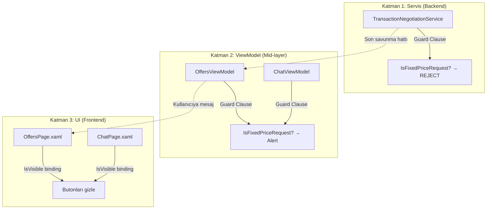
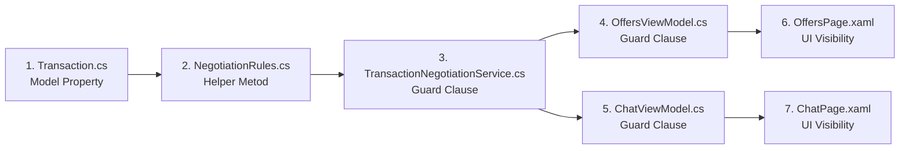

# 🏗️ Sabit Fiyat / Pazarlık Akışı Ayrımı — Refactoring Planı

## 📋 Özet

**Sorun:** Alıcı "Liste Fiyatından Al" butonuna bastığında (`IsFixedPriceRequest=true`), satıcı ekranında hâlâ pazarlık butonları (karşı teklif, teklif ver) görünüyor. Pazarlık tur sayacı ve zamanlayıcı da gereksiz yere gösteriliyor.

**Çözüm:** 3 katmanlı savunma (Defense in Depth) ile sabit fiyat ve pazarlık akışlarını kesin olarak ayırmak.



---

## 📊 Etkilenen Dosyalar

| # | Dosya | Katman | Değişiklik Türü | Öncelik |
|---|-------|--------|-----------------|---------|
| 1 | `Transaction.cs` | Model | Computed property ekleme | 🔴 Kritik |
| 2 | `TransactionNegotiationService.cs` | Servis | Guard clause ekleme | 🔴 Kritik |
| 3 | `OffersViewModel.cs` | ViewModel | Guard clause ekleme | 🟡 Yüksek |
| 4 | `ChatViewModel.cs` | ViewModel | Guard clause ekleme | 🟡 Yüksek |
| 5 | `OffersPage.xaml` | UI | IsVisible binding | 🔴 Kritik |
| 6 | `ChatPage.xaml` | UI | IsVisible binding | 🟡 Yüksek |
| 7 | `NegotiationRules.cs` | Helper | Yeni validasyon metodu | 🟢 Düşük |

---

## 🔧 Değişiklik Detayları

---

### DEĞİŞİKLİK 1: `Transaction.cs` — Model Katmanı

**Dosya:** [Transaction.cs](file:///c:/Users/seyda/source/repos/seydakaratekeli/KamPay3/KamPay/Models/Transactions/Transaction.cs)
**Satırlar:** 83-100

**Ne yapılacak:**
1. `IsNegotiationAllowed` computed property ekle (XAML binding kolaylığı için)
2. `RemainingRoundsText` property'sini sabit fiyat için farklı metin döndürecek şekilde güncelle

**Gerekçe:**
- XAML'de `IsFixedPriceRequest` + `InvertedBoolConverter` zinciri yerine doğrudan `IsNegotiationAllowed` kullanmak daha okunabilir
- `RemainingRoundsText` sabit fiyat talebi olduğunda "Kalan Teklif Hakkı: 10" yerine "✅ Liste fiyatı ile satın alma talebi" göstermeli

```diff
 public bool IsFixedPriceRequest { get; set; } = false;

+/// <summary>
+/// ✅ Computed: Pazarlığa izin veriliyor mu?
+/// IsFixedPriceRequest=true ise false döner → XAML'de doğrudan bind edilir.
+/// </summary>
+[JsonIgnore]
+public bool IsNegotiationAllowed => !IsFixedPriceRequest;
+
 // Son pazarlık tarihi
 public DateTime? LastNegotiationDate { get; set; }
```

```diff
 [JsonIgnore]
-public string RemainingRoundsText => $"Kalan Teklif Hakkı: {Math.Max(0, ...)}";
+public string RemainingRoundsText =>
+    IsFixedPriceRequest
+        ? "✅ Liste fiyatı ile satın alma talebi"
+        : $"Kalan Teklif Hakkı: {Math.Max(0, ...)}";
```

---

### DEĞİŞİKLİK 2: `TransactionNegotiationService.cs` — Servis Katmanı (Guard Clause)

**Dosya:** [TransactionNegotiationService.cs](file:///c:/Users/seyda/source/repos/seydakaratekeli/KamPay3/KamPay/Services/Transactions/TransactionNegotiationService.cs)

#### 2a. `ProposePriceForSaleAsync` (Satır ~67)

**Ne yapılacak:** `transaction.Status` kontrolünden hemen sonra `IsFixedPriceRequest` guard clause ekle

```diff
 if (transaction.Status != TransactionStatus.Pending)
     return ServiceResult<bool>.FailureResult("İşlem artık beklemede değil");

+// ✅ Guard: Sabit fiyatlı taleplerde pazarlık yapılamaz
+if (transaction.IsFixedPriceRequest)
+    return ServiceResult<bool>.FailureResult(
+        "Bu işlem liste fiyatı ile satın alma talebidir. Pazarlık yapılamaz.");
+
 // ✅ FAZ 2: Sıra kontrolü
```

#### 2b. `SendCounterOfferForSaleAsync` (Satır ~171)

**Ne yapılacak:** Aynı guard clause'u ekle

```diff
 if (transaction.Status != TransactionStatus.Pending)
     return ServiceResult<bool>.FailureResult("İşlem artık beklemede değil");

+// ✅ Guard: Sabit fiyatlı taleplerde karşı teklif gönderilemez
+if (transaction.IsFixedPriceRequest)
+    return ServiceResult<bool>.FailureResult(
+        "Bu işlem liste fiyatı ile satın alma talebidir. Karşı teklif gönderilemez.");
+
 // ✅ FAZ 2: Sıra kontrolü
```

> [!IMPORTANT]
> Bu, **son savunma hattıdır**. UI ve ViewModel katmanları bypass edilse bile, servis katmanında işlem engellenecektir.

---

### DEĞİŞİKLİK 3: `OffersViewModel.cs` — ViewModel Katmanı (Guard Clause)

**Dosya:** [OffersViewModel.cs](file:///c:/Users/seyda/source/repos/seydakaratekeli/KamPay3/KamPay/ViewModels/Transactions/OffersViewModel.cs)

#### 3a. `SendCounterOfferAsync` (Satır 1316)

**Mevcut:** Satıcı direkt `DisplayPromptAsync` ile karşı teklif girebiliyor.
**Düzeltme:** Metodun başına guard ekle.

```diff
 private async Task SendCounterOfferAsync(Transaction transaction)
 {
     if (transaction == null || transaction.SellerId != _currentUserId) return;
     if (Shell.Current?.CurrentPage == null) return;

+    // ✅ Guard: Sabit fiyatlı taleplerde karşı teklif engellenir
+    if (transaction.IsFixedPriceRequest)
+    {
+        await Shell.Current.CurrentPage.DisplayAlertAsync(
+            "ℹ️ Bilgi",
+            "Bu talep liste fiyatı ile yapılmıştır. Karşı teklif gönderemezsiniz.\n\nKabul Et veya Reddet seçeneklerini kullanabilirsiniz.",
+            "Tamam");
+        return;
+    }
```

#### 3b. `ProposePriceAsync` (Satır 1197)

```diff
 private async Task ProposePriceAsync(Transaction transaction)
 {
     if (transaction == null || transaction.BuyerId != _currentUserId) return;
     if (Shell.Current?.CurrentPage == null) return;

+    // ✅ Guard: Sabit fiyatlı taleplerde yeni teklif engellenir
+    if (transaction.IsFixedPriceRequest)
+    {
+        await Shell.Current.CurrentPage.DisplayAlertAsync(
+            "ℹ️ Bilgi",
+            "Bu talep liste fiyatı ile yapılmıştır. Fiyat teklifi gönderemezsiniz.",
+            "Tamam");
+        return;
+    }
```

---

### DEĞİŞİKLİK 4: `ChatViewModel.cs` — ViewModel Katmanı (Guard Clause)

**Dosya:** [ChatViewModel.cs](file:///c:/Users/seyda/source/repos/seydakaratekeli/KamPay3/KamPay/ViewModels/Messaging/ChatViewModel.cs)

#### 4a. `ProposeOfferAsync` (Satır 963)

**Ne yapılacak:** `targetTransaction` bulunduktan sonra guard ekle

```diff
 // ✅ FAZ 4: ProductId cross-check
 if (Conversation != null && ... )
 { ... }

 if (_currentUser == null) return;

+// ✅ Guard: Sabit fiyatlı taleplerde pazarlık yapılamaz
+if (targetTransaction.IsFixedPriceRequest)
+{
+    await Application.Current!.MainPage!.DisplayAlert(
+        "ℹ️ Bilgi",
+        "Bu işlem liste fiyatı ile başlatılmıştır. Pazarlık yapılamaz.",
+        "Tamam");
+    return;
+}
+
 try
 {
     var result = await Application.Current!.MainPage!.DisplayPromptAsync(
```

---

### DEĞİŞİKLİK 5: `OffersPage.xaml` — UI Katmanı (KRİTİK)

**Dosya:** [OffersPage.xaml](file:///c:/Users/seyda/source/repos/seydakaratekeli/KamPay3/KamPay/Views/Transactions/OffersPage.xaml)

Bu dosya en fazla değişikliğe ihtiyaç duyan dosya. **4 ayrı alan** düzeltilmeli:

#### 5a. Incoming Offers — 💰 Karşı Teklif Butonu (Satır 302-327)

**Mevcut:** `Type=Satis && (Pending || IsNegotiating)` ise görünür.
**Sorun:** `IsFixedPriceRequest` kontrol edilmiyor → satıcı sabit fiyat talebine karşı teklif gönderebiliyor.

```diff
 <Button Text="💰"
     Command="... SendCounterOfferCommand ..."
     ...>
     <Button.IsVisible>
         <MultiBinding Converter="{StaticResource AllTrueConverter}">
             <Binding Path="Type" Converter="..." ConverterParameter="Satis"/>
+            <Binding Path="IsNegotiationAllowed"/>
             <MultiBinding Converter="{StaticResource AnyTrueConverter}">
                 <Binding Path="Status" Converter="...IsPendingConverter"/>
                 <Binding Path="IsNegotiating"/>
             </MultiBinding>
         </MultiBinding>
     </Button.IsVisible>
```

#### 5b. Incoming Offers — Pazarlık Bilgi Paneli (Satır 216-268)

**Mevcut:** `IsVisible="{Binding IsNegotiating}"` — IsNegotiating false ise zaten gizli.
**Durum:** Bu panel zaten IsNegotiating'e bağlı. Sabit fiyat talebinde `IsNegotiating=false` olduğu için **bu alan sorun değil** ✅. Ancak ek güvenlik olarak:

```diff
-<Border IsVisible="{Binding IsNegotiating}" ...>
+<Border ...>
+    <Border.IsVisible>
+        <MultiBinding Converter="{StaticResource AllTrueConverter}">
+            <Binding Path="IsNegotiating"/>
+            <Binding Path="IsNegotiationAllowed"/>
+        </MultiBinding>
+    </Border.IsVisible>
```

#### 5c. Outgoing Offers — 💰 Teklif Ver Butonu (Satır 536-561)

**Aynı fix:** `IsNegotiationAllowed` binding'i ekle

```diff
 <Button Text="💰"
     Command="... ProposePriceCommand ..."
     ...>
     <Button.IsVisible>
         <MultiBinding Converter="{StaticResource AllTrueConverter}">
             <Binding Path="Type" Converter="..." ConverterParameter="Satis"/>
+            <Binding Path="IsNegotiationAllowed"/>
             <MultiBinding Converter="{StaticResource AnyTrueConverter}">
                 <Binding Path="Status" Converter="...IsPendingConverter"/>
                 <Binding Path="IsNegotiating"/>
             </MultiBinding>
         </MultiBinding>
     </Button.IsVisible>
```

#### 5d. Outgoing Offers — Pazarlık Bilgi Paneli (Satır 450-502)

```diff
-<Border IsVisible="{Binding IsNegotiating}" ...>
+<Border ...>
+    <Border.IsVisible>
+        <MultiBinding Converter="{StaticResource AllTrueConverter}">
+            <Binding Path="IsNegotiating"/>
+            <Binding Path="IsNegotiationAllowed"/>
+        </MultiBinding>
+    </Border.IsVisible>
```

---

### DEĞİŞİKLİK 6: `ChatPage.xaml` — UI Katmanı

**Dosya:** [ChatPage.xaml](file:///c:/Users/seyda/source/repos/seydakaratekeli/KamPay3/KamPay/Views/Messaging/ChatPage.xaml)

#### 6a. "Kalan Tur Bilgisi" Banner'ı (Satır 293-309)

**Mevcut:** `IsVisible="{Binding HasActiveTransaction}"` — tüm aktif işlemlerde gösterilir.
**Sorun:** Sabit fiyat talebinde bile "Kalan Teklif Hakkı: 10" gösterilir.
**Düzeltme:** `RemainingRoundsText` zaten Değişiklik 1'de güncellendi, banner hep görünür kalabilir. Ama banner'ın **renk ve ikonu** da güncellenmeli:

> [!NOTE]
> Değişiklik 1'de `RemainingRoundsText` güncellendiği için banner otomatik olarak "✅ Liste fiyatı ile satın alma talebi" gösterecek. Ek XAML değişikliği isteğe bağlı (renk değişikliği):

**İsteğe bağlı:** Banner arka plan rengini `IsFixedPriceRequest` durumuna göre değiştirmek:
```diff
 <Border Grid.Row="2"
         IsVisible="{Binding HasActiveTransaction}"
-        BackgroundColor="#FFF3E0"
         ...>
+    <Border.BackgroundColor>
+        <Binding Path="ActiveTransaction.IsFixedPriceRequest">
+            <Binding.FallbackValue>#FFF3E0</Binding.FallbackValue>
+        </Binding>
+    </Border.BackgroundColor>
```
*Veya: DataTrigger ile yeşil/turuncu ayrımı yapılabilir.*

#### 6b. Chat İçi Pazarlık Mesajlarında "Karşı Teklif" Butonu (Satır 394-403)

**Mevcut:** `Karşı Teklif` butonu `IsActiveOffer && !IsSentByMe` ise görünür.
**Sorun:** Sabit fiyatlı talebin chat mesajlarında da karşı teklif butonu çıkabiliyor.
**Düzeltme:** Bu buton zaten `ProposeOfferCommand`'a bağlı ve **Değişiklik 4'teki guard clause** onu yakalayacak. Ancak UX açısından butonu gizlemek daha iyi:

> [!TIP]
> Bu düzeltme isteğe bağlıdır çünkü ViewModel guard clause (Değişiklik 4) zaten engeller. Ama temiz UX için uygulanması önerilir.

**Bu düzeltme, `ActiveTransaction.IsNegotiationAllowed`'ı chat BindingContext'ten okumayı gerektirir. Mevcut template Message context'inde olduğu için `Source={x:Reference chatPageRoot}` kullanılmalı.**

---

### DEĞİŞİKLİK 7: `NegotiationRules.cs` — Helper (İsteğe Bağlı)

**Dosya:** [NegotiationRules.cs](file:///c:/Users/seyda/source/repos/seydakaratekeli/KamPay3/KamPay/Helpers/NegotiationRules.cs)

**Ne yapılacak:** Merkezi bir `CanNegotiate` validasyonu ekle

```csharp
/// <summary>
/// İşlemin pazarlığa uygun olup olmadığını kontrol eder.
/// Sabit fiyat, zaman aşımı ve tur limiti tek noktadan kontrol edilir.
/// </summary>
public static ValidationResult CanNegotiate(Transaction transaction)
{
    if (transaction.IsFixedPriceRequest)
        return ValidationResult.Failure(
            "Bu işlem liste fiyatı ile satın alma talebidir. Pazarlık yapılamaz.");

    return CanContinueNegotiation(
        transaction.NegotiationRoundCount,
        transaction.NegotiationStartedAt);
}
```

**Gerekçe:** Şu anda `CanContinueNegotiation` sadece tur ve süre kontrolü yapıyor. `IsFixedPriceRequest` kontrolü her servis metodunda ayrı ayrı yazılıyor. Bu metod, tüm pazarlık pre-condition'larını tek bir çağrıda toplayarak kod tekrarını azaltır.

---

## 📐 Uygulama Sırası



| Sıra | Adım | Risk | Süre |
|------|------|------|------|
| 1 | `Transaction.cs` — `IsNegotiationAllowed` + `RemainingRoundsText` | Düşük | ~2 dk |
| 2 | `NegotiationRules.cs` — `CanNegotiate()` metodu | Düşük | ~2 dk |
| 3 | `TransactionNegotiationService.cs` — 2 guard clause | Orta | ~3 dk |
| 4 | `OffersViewModel.cs` — 2 guard clause | Düşük | ~3 dk |
| 5 | `ChatViewModel.cs` — 1 guard clause | Düşük | ~2 dk |
| 6 | `OffersPage.xaml` — 4 visibility fix | Yüksek | ~5 dk |
| 7 | `ChatPage.xaml` — Banner + buton fix | Orta | ~3 dk |

---

## ✅ Test Senaryoları

Refactoring tamamlandıktan sonra aşağıdaki senaryolar test edilmelidir:

### Senaryo 1: Sabit Fiyat Satın Alma (Happy Path)
1. Alıcı → Ürün detay → "Liste Fiyatından Al" → Talep gönder
2. Satıcı → OffersPage → Gelen talepler listesinde ürünü gör
3. **Beklenen:** 💰 karşı teklif butonu **GÖRÜNMEMELİ**
4. **Beklenen:** Pazarlık tur/süre paneli **GÖRÜNMEMELİ**
5. **Beklenen:** Sadece ✓ (Kabul) ve ✕ (Red) butonları görünmeli
6. Satıcı → Kabul Et → İşlem `Accepted` durumuna geçmeli

### Senaryo 2: Sabit Fiyat — Chat Ekranı
1. Sabit fiyat talebi sonrası chat'e gir
2. **Beklenen:** Alt toolbar'da 💰 teklif butonu **GÖRÜNMEMELİ**
3. **Beklenen:** Banner'da "✅ Liste fiyatı ile satın alma talebi" yazmalı
4. **Beklenen:** Negotiation mesajlarında "Karşı Teklif" butonu **GÖRÜNMEMELİ**

### Senaryo 3: Pazarlıklı Satın Alma (Regresyon)
1. Alıcı → Ürün detay → "Pazarlık Yap" → Teklif gönder
2. **Beklenen:** Tüm pazarlık butonları normal çalışmalı
3. **Beklenen:** Tur sayacı, zamanlayıcı, karşı teklif hepsi görünmeli

### Senaryo 4: Servis Katmanı Guard (Edge Case)
1. Manuel olarak `ProposeOfferCommand` tetikle (sabit fiyatlı transaction ile)
2. **Beklenen:** Servis "Bu işlem liste fiyatı ile satın alma talebidir" mesajı döndürmeli

---

## ⚠️ Riskler ve Dikkat Edilecekler

| Risk | Açıklama | Önlem |
|------|----------|-------|
| XAML MultiBinding Hatasız | `AllTrueConverter` 3+ binding ile test edilmemiş olabilir | Build sonrası XAML hot reload ile test |
| Firebase Senkronizasyon | `IsFixedPriceRequest` Firebase'den gelirken `false` default olabilir | Mevcut veriler etkilenmez (default `false` = pazarlık açık) |
| Takas/Bağış İşlemleri | Bu değişiklikler sadece `ProductType.Satis` için | Takas/Bağış akışlarına dokunulmuyor |
| Converter Dependency | `IsNegotiationAllowed` kullanılacaksa ek converter gerekmez | Doğrudan bool binding |

---

## 🔄 Mevcut Durum (Değişiklik Öncesi)

### Satıcı Tarafı — OffersPage (Incoming)

| Bileşen | Sabit Fiyat | Pazarlık | Sorun? |
|---------|-------------|----------|--------|
| 💰 Karşı Teklif | ✅ **GÖRÜNÜYOR** | ✅ Görünüyor | 🐛 EVET |
| Pazarlık Paneli | ❌ Gizli (`IsNegotiating=false`) | ✅ Görünüyor | ⚠️ Kısmen OK |
| ✓ Kabul Et | ✅ Görünüyor | ✅ Görünüyor | ✅ OK |
| ✕ Reddet | ✅ Görünüyor | ✅ Görünüyor | ✅ OK |

### Alıcı Tarafı — OffersPage (Outgoing)

| Bileşen | Sabit Fiyat | Pazarlık | Sorun? |
|---------|-------------|----------|--------|
| 💰 Teklif Ver | ✅ **GÖRÜNÜYOR** | ✅ Görünüyor | 🐛 EVET |
| Pazarlık Paneli | ❌ Gizli | ✅ Görünüyor | ⚠️ Kısmen OK |

### Chat Ekranı — ChatPage

| Bileşen | Sabit Fiyat | Pazarlık | Sorun? |
|---------|-------------|----------|--------|
| 💰 Teklif butonu (toolbar) | ❌ Gizli | ✅ Görünüyor | ✅ **ZATEN FIX** |
| Kalan Tur Banner | "10 hak" **GÖRÜNÜYOR** | Doğru gösterir | 🐛 EVET |
| Chat içi "Karşı Teklif" | **GÖRÜNEBİLİR** | ✅ Görünüyor | 🐛 EVET |

### Servis Katmanı

| Metod | IsFixedPriceRequest Guard | Sorun? |
|-------|---------------------------|--------|
| `ProposePriceForSaleAsync` | ❌ YOK | 🐛 EVET |
| `SendCounterOfferForSaleAsync` | ❌ YOK | 🐛 EVET |
| `AcceptNegotiatedPriceAsync` | N/A (kabul her zaman geçerli) | ✅ OK |
