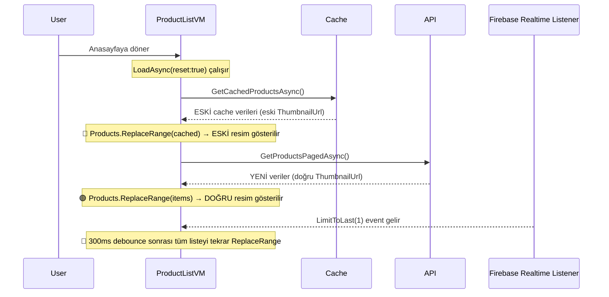
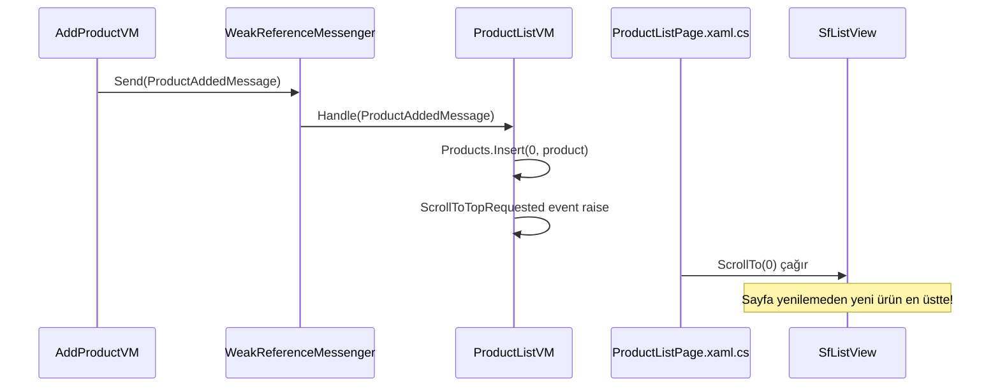

# 🔧 Resim Titreşimi & Scroll-to-Top Düzeltme Planı

> **Proje:** KamPay — ProductListPage Sorunları  
> **Tarih:** 2026-04-21

---

## 📋 Tespit Edilen Sorunlar

### Sorun 1: Ürün eklendikten sonra anasayfaya dönüşte farklı resim görünüyor, sonra düzeliyor
### Sorun 2: İlk açılışta ilanlar yüklenirken de aynı resim titreşimi yaşanıyor
### Sorun 3: Sayfayı yenilemeden yeni ürünün listenin en üstünde görünmesi gerekiyor

---

## 🔍 Kök Neden Analizi

### Sorun 1 & 2: Resim Titreşimi (Image Flickering)

Analiz edilen dosyalar ve akış:



**3 Ayrı Kök Neden:**

#### A. Cache-First → API Çift Yükleme Çakışması
[ProductListViewModel.cs:168-189](file:///c:/Users/seyda/source/repos/seydakaratekeli/KamPay3/KamPay/ViewModels/Products/ProductListViewModel.cs#L168-L189)

```csharp
// İlk açılış: önce cache gösterilir (eski veriler)
var cached = await _productService.GetCachedProductsAsync();
if (cached?.Count > 0)
{
    Products.ReplaceRange(ApplySorting(cached));  // ← ESKİ resimler
    IsSkeletonVisible = false;
}
// Sonra API'den yeni veriler gelir
var result = await _productService.GetProductsPagedAsync(...)
Products.ReplaceRange(items);  // ← YENİ resimler (burada titreşim oluşur)
```

> [!CAUTION]
> Cache'deki ürünlerin `ThumbnailUrl`'i eski olabilir. Cache güncellenmeden önce gösterilince kullanıcı önce eski resmi, sonra yeni resmi görür → **flickering**.

#### B. Eksik Placeholder Görselleri
[ProductListPage.xaml:247-251](file:///c:/Users/seyda/source/repos/seydakaratekeli/KamPay3/KamPay/Views/Products/ProductListPage.xaml#L247-L251)

```xml
<ffimageloading:CachedImage Source="{Binding ThumbnailUrl}"
                            LoadingPlaceholder="loading_image.png"
                            ErrorPlaceholder="error_image.png"
                            .../>
```

`Resources/Images/` klasöründe **`loading_image.png` ve `error_image.png` dosyaları mevcut DEĞİL!** FFImageLoading bu dosyaları bulamayınca:
- Loading sırasında boş/kırık bir görsel gösterir
- Hata durumunda da boş kalır
- Bu, ilk yüklemede "farklı resim görünüyor" hissini artırır

#### C. `ReplaceRange` + `NotifyCollectionChangedAction.Reset` Sorunu
[ObservableRangeCollection.cs:53-68](file:///c:/Users/seyda/source/repos/seydakaratekeli/KamPay3/KamPay/Helpers/ObservableRangeCollection.cs#L53-L68)

```csharp
public void ReplaceRange(IEnumerable<T> collection)
{
    Items.Clear();          // ← TÜM görseller anında yok olur
    foreach (var item in collection) Items.Add(item);
    OnCollectionChanged(new NotifyCollectionChangedEventArgs(
        NotifyCollectionChangedAction.Reset));  // ← TAMAMEN SIFIRLA sinyali
}
```

`Reset` event'i gönderildiğinde SfListView **tüm item'ları sıfırdan** yaratır. Bu da CachedImage'ların tekrar yüklenmesine (ağdan veya disk cache'den) neden olur → **flickering**.

#### D. Realtime Listener Gereksiz Tam Yenileme
[ProductListViewModel.cs:344-351](file:///c:/Users/seyda/source/repos/seydakaratekeli/KamPay3/KamPay/ViewModels/Products/ProductListViewModel.cs#L344-L351)

```csharp
// Realtime event gelince TÜM listeyi replace ediyor
MainThread.BeginInvokeOnMainThread(() => Products.ReplaceRange(snapshot));
```

Sadece 1 ürün eklenmiş olsa bile **tüm liste `ReplaceRange` ile sıfırlanıyor** → tüm görseller yeniden yükleniyor.

---

### Sorun 3: Yeni Ürünün Listenin En Üstünde Görünmemesi

[AddProductViewModel.cs:527](file:///c:/Users/seyda/source/repos/seydakaratekeli/KamPay3/KamPay/ViewModels/Products/AddProductViewModel.cs#L527)

```csharp
await Shell.Current.GoToAsync(".."); // Sadece geri gidiyor, bildirim yok
```

- `AddProductViewModel` ürünü kaydettikten sonra sadece `GoToAsync("..")` yapıyor
- `ProductListViewModel`'e **hiçbir mesaj/event göndermiyor**
- Realtime listener sadece `LimitToLast(1)` izliyor ve debounce var (300ms)
- Liste scroll pozisyonunu korur, yeni ürün ekranda görünmeyebilir
- **Scroll-to-top mekanizması hiç yok**

---

## ✅ Düzeltme Planı

### Faz 1: Placeholder Görselleri Oluştur (Hemen)

| Adım | Dosya | Değişiklik |
|------|-------|------------|
| 1.1 | `Resources/Images/` | `loading_image.png` oluştur (basit gri placeholder) |
| 1.2 | `Resources/Images/` | `error_image.png` oluştur (hata ikonu placeholder) |

> [!TIP]
> Bu tek başına bile flickering'in şiddetini önemli ölçüde azaltacaktır. Kullanıcı kırık ikon yerine düzgün bir placeholder görür.

### Faz 2: Cache-First Stratejisini Düzelt (Kritik)

| Adım | Dosya | Değişiklik |
|------|-------|------------|
| 2.1 | [ProductListViewModel.cs](file:///c:/Users/seyda/source/repos/seydakaratekeli/KamPay3/KamPay/ViewModels/Products/ProductListViewModel.cs) | Cache'den yükleme sonrası API'den gelen verilerle **akıllı merge** yap (`ReplaceRange` yerine) |
| 2.2 | [ProductListViewModel.cs](file:///c:/Users/seyda/source/repos/seydakaratekeli/KamPay3/KamPay/ViewModels/Products/ProductListViewModel.cs) | API verileri geldiğinde **sadece değişen** ürünleri güncelle, değişmeyenlere dokunma |

**Yaklaşım: Smart Diff-Update**

```csharp
// ÖNCE: Products.ReplaceRange(items) → tüm görseller sıfırlanır
// SONRA: Akıllı merge — sadece farklı olanları güncelle
private void SmartMergeProducts(List<Product> newItems)
{
    var newDict = newItems.ToDictionary(p => p.ProductId);
    var existingDict = Products.ToDictionary(p => p.ProductId);

    // 1) Sil: artık olmayan ürünler
    var toRemove = Products.Where(p => !newDict.ContainsKey(p.ProductId)).ToList();
    foreach (var item in toRemove) Products.Remove(item);

    // 2) Güncelle: mevcut ürünlerin değişen alanlarını güncelle
    foreach (var existing in Products)
    {
        if (newDict.TryGetValue(existing.ProductId, out var updated))
        {
            // Sadece değişen property'leri güncelle (ObservableProperty → otomatik notify)
            if (existing.ThumbnailUrl != updated.ThumbnailUrl)
                existing.ThumbnailUrl = updated.ThumbnailUrl;
            if (existing.Title != updated.Title)
                existing.Title = updated.Title;
            // ... diğer değişebilecek alanlar
        }
    }

    // 3) Ekle: yeni ürünleri uygun pozisyona
    for (int i = 0; i < newItems.Count; i++)
    {
        if (!existingDict.ContainsKey(newItems[i].ProductId))
        {
            Products.Insert(Math.Min(i, Products.Count), newItems[i]);
        }
    }
}
```

### Faz 3: Realtime Listener'ı Optimize Et (Önemli)

| Adım | Dosya | Değişiklik |
|------|-------|------------|
| 3.1 | [ProductListViewModel.cs](file:///c:/Users/seyda/source/repos/seydakaratekeli/KamPay3/KamPay/ViewModels/Products/ProductListViewModel.cs) | `ScheduleDebouncedUiUpdate` → `ReplaceRange` yerine **tek ürün insert/update/remove** yapacak şekilde değiştir |

**Yaklaşım: Granüler UI Güncellemesi**

```csharp
private void ApplyRealtimeEvent(FirebaseEvent<Product> evt)
{
    if (evt.Object == null) return;
    var product = evt.Object;
    product.ProductId = evt.Key;

    MainThread.BeginInvokeOnMainThread(() =>
    {
        var existingIndex = -1;
        for (int i = 0; i < Products.Count; i++)
        {
            if (Products[i].ProductId == product.ProductId)
            {
                existingIndex = i;
                break;
            }
        }

        if (evt.EventType == FirebaseEventType.InsertOrUpdate)
        {
            if (existingIndex >= 0)
            {
                // Mevcut ürünü yerinde güncelle (görsel yeniden yüklenmez!)
                UpdateProductProperties(Products[existingIndex], product);
            }
            else
            {
                // Yeni ürün → listenin başına ekle
                Products.Insert(0, product);
            }
        }
        else if (evt.EventType == FirebaseEventType.Delete && existingIndex >= 0)
        {
            Products.RemoveAt(existingIndex);
        }
    });
}
```

### Faz 4: Ürün Ekleme Sonrası Scroll-to-Top (Gerekli)

| Adım | Dosya | Değişiklik |
|------|-------|------------|
| 4.1 | `Models/EventMessages/` | `ProductAddedMessage` mesaj sınıfı oluştur |
| 4.2 | [AddProductViewModel.cs](file:///c:/Users/seyda/source/repos/seydakaratekeli/KamPay3/KamPay/ViewModels/Products/AddProductViewModel.cs) | Ürün kaydedildikten sonra `WeakReferenceMessenger.Default.Send(new ProductAddedMessage(product))` gönder |
| 4.3 | [ProductListViewModel.cs](file:///c:/Users/seyda/source/repos/seydakaratekeli/KamPay3/KamPay/ViewModels/Products/ProductListViewModel.cs) | `ProductAddedMessage` dinle → ürünü listenin başına ekle + scroll-to-top event tetikle |
| 4.4 | [ProductListPage.xaml](file:///c:/Users/seyda/source/repos/seydakaratekeli/KamPay3/KamPay/Views/Products/ProductListPage.xaml) | SfListView'a `x:Name` ekle |
| 4.5 | [ProductListPage.xaml.cs](file:///c:/Users/seyda/source/repos/seydakaratekeli/KamPay3/KamPay/Views/Products/ProductListPage.xaml.cs) | ViewModel event'ini dinle → `sfListView.ScrollTo(0)` çağır |

**Mesaj Akışı:**



### Faz 5: FFImageLoading Optimizasyonu (İsteğe Bağlı)

| Adım | Dosya | Değişiklik |
|------|-------|------------|
| 5.1 | [ProductListPage.xaml](file:///c:/Users/seyda/source/repos/seydakaratekeli/KamPay3/KamPay/Views/Products/ProductListPage.xaml) | `CacheType="Disk"` → `CacheType="All"` (hem memory hem disk cache) |
| 5.2 | [ProductListPage.xaml](file:///c:/Users/seyda/source/repos/seydakaratekeli/KamPay3/KamPay/Views/Products/ProductListPage.xaml) | `FadeAnimationEnabled="False"` zaten doğru (titreşimi önler) |
| 5.3 | [ProductListPage.xaml](file:///c:/Users/seyda/source/repos/seydakaratekeli/KamPay3/KamPay/Views/Products/ProductListPage.xaml) | `CacheDuration` ekle → sık değişmeyen görseller için uzun cache süresi |

---

## 📊 Öncelik Sırası

| Faz | Etki | Zorluk | Öncelik |
|-----|------|--------|---------|
| Faz 1: Placeholder görselleri | 🟡 Orta | 🟢 Kolay | ⭐⭐⭐⭐⭐ |
| Faz 2: Smart merge | 🔴 Yüksek | 🟡 Orta | ⭐⭐⭐⭐⭐ |
| Faz 3: Realtime granüler | 🔴 Yüksek | 🟡 Orta | ⭐⭐⭐⭐ |
| Faz 4: Scroll-to-top | 🟡 Orta | 🟢 Kolay | ⭐⭐⭐⭐ |
| Faz 5: FFImageLoading cache | 🟡 Orta | 🟢 Kolay | ⭐⭐⭐ |

---

## ⏱️ Tahmini Süre

| Faz | Tahmini |
|-----|---------|
| Faz 1 | ~5 dk |
| Faz 2 | ~20 dk |
| Faz 3 | ~15 dk |
| Faz 4 | ~15 dk |
| Faz 5 | ~5 dk |
| **Toplam** | **~60 dk** |

---

## ⚠️ Risk Değerlendirmesi

> [!WARNING]
> **Faz 2 (Smart Merge)**: `ReplaceRange` → diff-update geçişi sıralama mantığını bozabilir. Sıralama değiştikten sonra pozisyonların doğru olduğu test edilmeli.

> [!NOTE]
> **Faz 3 (Realtime)**: `LimitToLast(1)` listener'ı ilk subscribe olduğunda mevcut son kaydı da gönderir. Bu "initial snapshot" durumu düzgün handle edilmeli (duplikasyon riski).

> [!IMPORTANT]
> Tüm değişiklikler `MainThread.BeginInvokeOnMainThread` içinde yapılmalı — aksi halde MAUI UI thread exception fırlatır.
