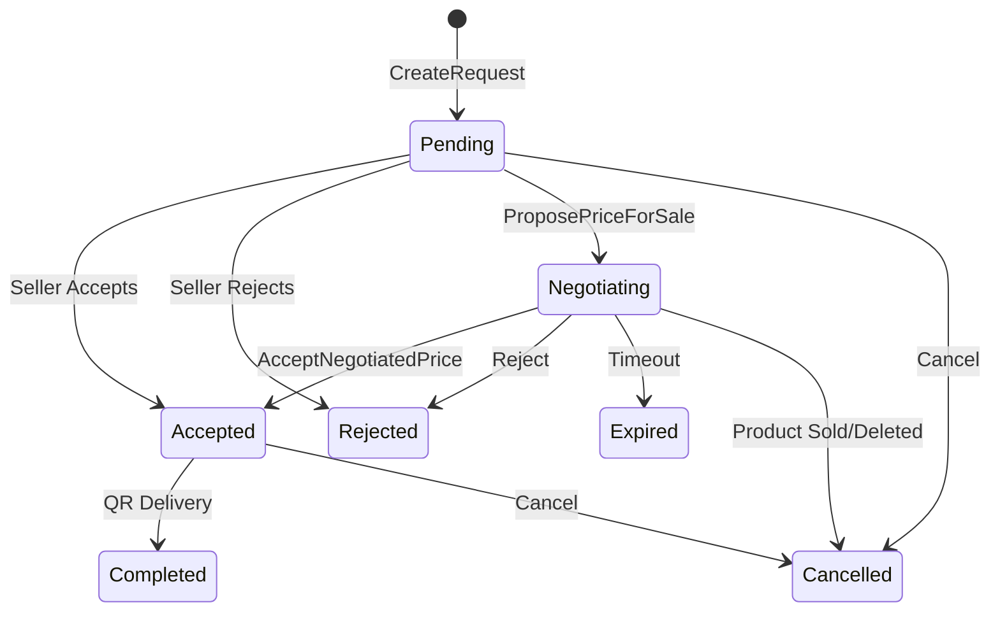

# KamPazar / Anasayfa Modülü — Production Code Review Analiz Planı

> **Modül:** KamPazar / Anasayfa (Ürün Listesi, Detay, Ekleme, Düzenleme, Favoriler, Bildirimler)
> **Tarih:** 2026-05-05
> **Durum:** Kod okundu, bulgular çıkarıldı, aksiyon planı hazırlandı.

---

## 1. Kısa Modül Özeti

**Ne yapıyor?** Üniversite öğrencilerinin ürün ekleme, listeleme, filtreleme, arama, satın alma (liste fiyatı / pazarlık), takas, bağış, favori ve bildirim işlemlerini yöneten ana modül.

**Genel kalite:** Orta-İyi. MVVM yapısı tutarlı, ISP ile interface ayrımı yapılmış, cache-first ve realtime listener var. Ancak bazı ViewModel'ler aşırı sorumluluk taşıyor, güvenlik katmanında kritik boşluklar var, concurrency guard eksik.

**En büyük risk:** `ProductDetailViewModel.SendRequestAsync` içinde transaction oluşturma + mesaj gönderme + navigasyon tek metotta; race condition ve duplicate transaction riski yüksek.

---

## 2. Production Readiness Skoru

### **58 / 100 — High Risk**

| Kategori | Puan | Ağırlık | Not |
|----------|------|---------|-----|
| Mimari Uygunluk | 7/10 | %15 | ISP iyi, SRP ihlalleri var |
| SOLID | 6/10 | %10 | OCP/ISP iyi, SRP kötü |
| MVVM / Mobil | 5/10 | %15 | Concurrency guard yok, memory leak riski |
| Backend / API | 5/10 | %10 | Validation zayıf, IDOR riski |
| Firebase | 6/10 | %10 | Index var, atomic update eksik |
| Güvenlik | 4/10 | %15 | IDOR, token bypass, input validation eksik |
| Concurrency | 4/10 | %10 | Race condition, duplicate transaction |
| Performans | 7/10 | %5 | Cache-first, SmartMerge iyi |
| Hata Yönetimi | 5/10 | %5 | Sessiz hata yutma var |
| Test Edilebilirlik | 5/10 | %5 | Interface'ler mock edilebilir, test yok |

**Gerekçe:** Güvenlik açıkları (IDOR, yetersiz backend validation) ve concurrency sorunları (duplicate transaction, race condition) yayına çıkışı engelleyecek seviyede.

---

## 3. Kritik Bulgular

| Öncelik | Bulgu | Etki | Kanıt / Dosya | Önerilen Çözüm |
|---------|-------|------|---------------|----------------|
| **P0** | `ProductsController.AddProduct` — UserId client'tan gelen body'den alınıyor, JWT claim ile karşılaştırılmıyor | Herhangi bir kullanıcı başkası adına ürün ekleyebilir (IDOR) | `ProductsController.cs:92-111` | `yeniUrun.UserId = userId` (JWT claim) zorunlu override |
| **P0** | `SendRequestAsync` — Concurrency guard yok, çift tıklama ile duplicate transaction oluşur | Aynı ürüne iki kez teklif gider | `ProductDetailViewModel.cs:393-545` | `_isSendingRequest` boolean guard + mevcut transaction kontrolü |
| **P0** | `ProductApiService.SetAuthHeaderAsync` — Token `DefaultRequestHeaders`'a set ediliyor (singleton HttpClient race condition) | Farklı kullanıcıların token'ları karışabilir | `ProductApiService.cs:54-69` | Her istekte `HttpRequestMessage.Headers` kullan |
| **P1** | `GetProductById` endpoint'i auth gerektirmiyor ama `IncrementViewCount` da auth yok | Bot ile view count şişirme | `ProductsController.cs:53-68` | Rate limiting middleware ekle |
| **P1** | `MarkAsSoldAsync` doğrudan Firebase'e yazıyor, API bypass | Client-side Firebase yazımı, güvenlik kuralları yoksa herkes ürün durumunu değiştirebilir | `ProductDetailViewModel.cs:815-870` | Tüm durum değişiklikleri API üzerinden yapılmalı |
| **P1** | `EditProductViewModel.SaveProductAsync` — validation yok | Boş başlık, negatif fiyat gönderilebilir | `EditProductViewModel.cs:251-288` | Client + Server validation ekle |
| **P1** | `ReportProductAsync` — Rate limit yok, Firebase'e doğrudan yazıyor | Spam rapor saldırısı | `ProductDetailViewModel.cs:1060-1116` | Rate limit + API endpoint |
| **P2** | `ProductListViewModel` — Constructor'da 5 messenger kaydı + event subscription | Memory leak riski (Dispose çağrılmazsa) | `ProductListViewModel.cs:109-207` | IDisposable pattern doğru ama Page'de Dispose tetiklenmeli |
| **P2** | `FavoritesViewModel` — Refresh'te listener dispose edilmeden yenisi başlatılıyor | Birden fazla listener aynı anda çalışabilir | `FavoritesViewModel.cs:231-243` | Refresh'te önce `_favoritesSubscription?.Dispose()` |
| **P2** | `AddProductViewModel._cachedCategories` — static field, logout'ta temizlenmiyor | Önceki kullanıcının cache'i kalır | `AddProductViewModel.cs:28` | Logout mesajında temizle |
| **P3** | `EditProductViewModel` — Hardcoded Türkçe stringler | i18n desteği kırılıyor | `EditProductViewModel.cs:65,125,171,280` | `Res["Key"]` pattern kullan |
| **P3** | `ProductRepository.GetPagedAsync` — `OrderByKey()` ile sıralama, `CreatedAt` ile değil | En yeni ürünler garanti edilmiyor | `ProductRepository.cs:50-53` | `OrderBy("CreatedAt")` veya ters sıralama |

---

## 4. Mimari Problemler

### 4.1 ProductDetailViewModel Aşırı Sorumluluk (SRP İhlali)

- **Problem:** 1207 satır, 20+ komut. Ürün yükleme, favori, satış, takas, bağış, pazarlık, QR, rapor, silme, düzenleme, konum — hepsi tek sınıfta.
- **Etki:** Değişiklik maliyeti yüksek, test edilemez, yeni özellik eklemek riskli.
- **Önerilen refactor:** Partial class bölümlemesi (ChatViewModel benzeri):
  - `ProductDetailViewModel.cs` — ana sınıf, yükleme, lifecycle
  - `ProductDetailViewModel.Purchase.cs` — satış/takas/bağış akışı
  - `ProductDetailViewModel.Negotiation.cs` — pazarlık
  - `ProductDetailViewModel.Actions.cs` — favori, paylaş, raporla, sil

### 4.2 ViewModel'den Doğrudan Firebase Erişimi (DIP İhlali)

- **Problem:** `ProductDetailViewModel` direkt `FirebaseClient` kullanarak transaction/report yazıyor. API katmanı bypass ediliyor.
- **Neden önemli:** Güvenlik kuralları sadece API'de uygulanıyorsa, client bypass ile tüm kontroller devre dışı kalır.
- **Önerilen refactor:** Tüm Firebase yazma işlemleri servis katmanı üzerinden yapılmalı. `MarkAsSoldAsync`, `CancelProductTransactionsAsync`, `ReportProductAsync` → ilgili servislere taşınmalı.

### 4.3 Dual Product Save Path (AddProduct)

- **Problem:** `AddProductViewModel.SaveProductAsync` → `SaveProductDirectlyAsync` (Firebase Storage'a doğrudan yükleme + API'ye POST). `ProductApiService.AddProductAsync` da var ama kullanılmıyor.
- **Etki:** İki farklı ürün ekleme akışı; hangisi canonical? Tutarsızlık riski.
- **Önerilen refactor:** Tek yol belirle. `SaveProductDirectlyAsync` API endpoint'ini kullanıyor, doğru. `AddProductAsync` kaldırılabilir veya `SaveProductDirectlyAsync` ile birleştirilmeli.

---

## 5. Güvenlik Açıkları

### 5.1 IDOR — Ürün Ekleme

- **Risk:** `ProductsController.AddProduct` JWT'den userId alıyor ama `yeniUrun.UserId`'yi override ETMİYOR.
- **Saldırı:** Attacker body'de `UserId: "admin123"` gönderir → başkası adına ürün eklenir.
- **Çözüm:** `yeniUrun.UserId = userId;` satırını ekle (JWT claim override).

### 5.2 IDOR — Ürün Güncelleme/Silme

- **Risk:** `UpdateProduct` ve `DeleteProduct`'ta sahiplik kontrolü API servisinde yapılıyor (`UpdateResult.Forbidden`). Doğrulamak gerekir.
- **Çözüm:** Servis katmanında `product.UserId == requestUserId` kontrolü zorunlu.

### 5.3 Client-Side Firebase Yazımı

- **Risk:** `MarkAsSoldAsync`, `CancelProductTransactionsAsync`, `ReportProductAsync` → ViewModel'den direkt Firebase'e yazıyor.
- **Saldırı:** Modifiye edilmiş client ile herhangi bir ürünün durumu değiştirilebilir (Firebase rules yetersizse).
- **Çözüm:** Bu işlemleri API endpoint'lerine taşı + Firebase rules'ta write kısıtlamaları ekle.

### 5.4 Token Race Condition

- **Risk:** `ProductApiService.SetAuthHeaderAsync` → `_httpClient.DefaultRequestHeaders.Authorization` → Singleton HttpClient'ta farklı kullanıcı token'ları karışabilir.
- **Çözüm:** Her istekte `new HttpRequestMessage` oluştur ve header'ı oraya ekle.

---

## 6. Concurrency & State Machine Analizi

### 6.1 Transaction Status Geçişleri (Mevcut)



### 6.2 Eksik/Tehlikeli Geçişler

| Senaryo | Risk | Çözüm |
|---------|------|-------|
| İki kez `SendRequestAsync` tetiklenmesi | Duplicate transaction | Boolean guard + mevcut aktif transaction kontrolü |
| Ürün satıldıktan sonra başka alıcı teklif vermesi | Satılmış ürüne teklif | `Product.IsSold` kontrolü servis katmanında da yapılmalı |
| `AcceptNegotiatedPriceAsync` iki kez çağrılırsa | Double accept | Server-side idempotency + status kontrolü |
| Pazarlık sırasında ürün silinirse | Orphan transaction | `CancelProductTransactionsAsync` var ama race condition olabilir |

### 6.3 Duplicate Transaction Guard (Önerilen Kod)

```csharp
// ProductDetailViewModel.cs
private bool _isSendingRequest;

[RelayCommand]
private async Task SendRequestAsync()
{
    if (Product == null || IsLoading || _isSendingRequest) return;
    
    // Mevcut aktif transaction var mı kontrol et
    if (HasActiveTransaction)
    {
        await Application.Current.MainPage.DisplayAlert(
            "Bilgi", "Bu ürün için zaten bir teklifiniz var.", "Tamam");
        return;
    }
    
    _isSendingRequest = true;
    try { /* ... mevcut kod ... */ }
    finally { _isSendingRequest = false; }
}
```

---

## 7. Performans Problemleri

### Mobil Taraf
- ✅ **İyi:** Cache-first yükleme, SmartMerge (flickering önleme), debounce arama
- ⚠️ **Risk:** `LoadActiveTransactionAsync` her `GetMyOffersAsync` çağrısında TÜM teklifleri çekip filtreliyor → N büyüdükçe yavaşlar
- **Çözüm:** API'de `GET /transactions?productId={id}&buyerId={id}&status=active` endpoint'i

### Backend Taraf
- ⚠️ **Risk:** `ProductRepository.GetPagedAsync` — filtre varsa `pageSize * 4` overfetch yapıyor
- ⚠️ **Risk:** Arama tamamen client-side (`Contains`) → büyük veri setlerinde yavaş
- **Çözüm:** Firebase yerine Algolia/ElasticSearch arama veya `_searchIndex` alanı

### Firebase Taraf
- ⚠️ **Risk:** `OrderByKey()` kullanımı → `CreatedAt` sıralaması garanti değil
- ✅ **İyi:** `LimitToLast(1)` realtime listener → düşük bant genişliği

### Cache Tarafı
- ✅ **İyi:** `IProductCacheService` ile LiteDB önbellek
- ⚠️ **Risk:** Cache invalidation stratejisi belirsiz — stale data gösterilme riski

---

## 8. Kod Kalitesi Sorunları

| Sorun | Dosya | Satır | Çözüm |
|-------|-------|-------|-------|
| 1207 satır ViewModel | `ProductDetailViewModel.cs` | Tamamı | Partial class bölümle |
| `Application.Current?.MainPage` tekrarı (30+ kez) | Tüm VM'ler | — | Extension method: `this.ShowAlert(...)` |
| Static category cache | `AddProductViewModel.cs` | 28 | Instance-level veya DI singleton |
| Hardcoded Türkçe stringler | `EditProductViewModel.cs` | 65,125,171 | `Res["Key"]` kullan |
| `ProductApiService.GetProductsAsync` — kullanılmıyor gibi | `ProductApiService.cs` | 122-139 | Dead code temizle veya document et |
| `ShowTradeOfferPopupMessage` sınıfı ViewModel dosyasında | `ProductDetailViewModel.cs` | 23-30 | `Models/EventMessages/` altına taşı |
| Debug.WriteLine / AppLogger karışık kullanım | Tüm dosyalar | — | Tek logging pattern belirle |

---

## 9. Test Matrisi

| # | Test | Senaryo | Beklenen Sonuç | Tip | Öncelik |
|---|------|---------|----------------|-----|---------|
| 1 | Duplicate transaction | Aynı ürüne 2 kez hızlıca tıkla | Tek transaction oluşur | Integration | P0 |
| 2 | IDOR ürün ekleme | Body'de farklı UserId gönder | JWT claim override eder | API Unit | P0 |
| 3 | Satılmış ürüne teklif | IsSold=true ürüne SendRequest | Hata mesajı gösterilir | Unit | P0 |
| 4 | Token race condition | 2 eşzamanlı API isteği | Doğru token gider | Unit | P0 |
| 5 | Negatif fiyat ürün ekleme | Price = -50 ile ürün ekle | Validation hatası | Unit | P1 |
| 6 | Boş başlık ile güncelleme | Title = "" ile UpdateProduct | Validation hatası | Unit | P1 |
| 7 | Favori toggle hata rollback | Servis hatası döndüğünde | UI eski duruma döner | Unit | P2 |
| 8 | Offline ürün ekleme | İnternet yokken SaveProduct | Anlaşılır hata mesajı | UI | P2 |
| 9 | 100+ ürün sayfalama | Çok fazla ürün yükle | Smooth infinite scroll | Performance | P2 |
| 10 | Ürün silindiğinde transaction iptal | Ürünü sil, bekleyen teklif var | Alıcıya bildirim gider | Integration | P1 |
| 11 | Kategori filtreleme + arama birlikte | Hem kategori hem arama seç | Doğru sonuçlar gelir | E2E | P2 |
| 12 | Pazarlık tur limiti aşımı | MaxRound kadar teklif gönder | "Tur limitine ulaştınız" | Unit | P2 |

---

## 10. Refactor Roadmap

### 🔴 Hemen Yapılacaklar (P0 — Yayın Engelleyici)

1. **IDOR Fix:** `ProductsController.AddProduct` → `yeniUrun.UserId = userId;`
2. **Duplicate Transaction Guard:** `SendRequestAsync`'e `_isSendingRequest` guard ekle
3. **Token Fix:** `SetAuthHeaderAsync` → `HttpRequestMessage` bazlı header
4. **Backend Validation:** `AddProduct` endpoint'inde title/description/category zorunlu kontrol

### 🟠 Bu Sprint Yapılacaklar (P1)

5. **API Endpoint Migration:** `MarkAsSold`, `Report` → API endpoint'lerine taşı
6. **Edit Validation:** `EditProductViewModel.SaveProductAsync`'e client validation ekle
7. **IncrementViewCount Rate Limit:** IP/userId bazlı rate limiting
8. **Firebase Rules:** `products` koleksiyonuna write kuralları (sadece sahibi güncelleyebilir)
9. **Refresh Listener Fix:** `FavoritesViewModel.RefreshFavoritesAsync` → dispose önce

### 🟡 Yayından Önce Yapılacaklar (P2)

10. **ProductDetailViewModel Partial Class:** 4 partial dosyaya böl
11. **Hardcoded String Temizliği:** `EditProductViewModel` → resx anahtarları
12. **Static Cache Cleanup:** `AddProductViewModel._cachedCategories` → logout'ta temizle
13. **Transaction API:** `LoadActiveTransactionAsync` → dedicated API endpoint
14. **Arama İyileştirmesi:** Full-text search index veya API-side arama

### 🟢 Yayından Sonra Teknik Borç (P3)

15. **Unit Test Suite:** Tüm ViewModel komutları için test coverage
16. **Centralized Error Handling:** `Application.Current.MainPage.DisplayAlert` → tek nokta
17. **Logging Standardization:** `Debug.WriteLine` → `AppLogger` tamamen
18. **Dead Code Cleanup:** Kullanılmayan `GetProductsAsync`, `AddProductAsync` metodları
19. **OrderByKey → OrderByCreatedAt:** Repository sıralama düzeltmesi

---

## 11. Yayına Çıkmadan Önce Son 10 Kontrol

1. ☐ `ProductsController.AddProduct` → JWT claim ile UserId override ediliyor mu?
2. ☐ `SendRequestAsync` → Duplicate transaction guard var mı?
3. ☐ `SetAuthHeaderAsync` → `HttpRequestMessage` bazlı header mı?
4. ☐ `MarkAsSoldAsync` → API endpoint üzerinden mi çalışıyor?
5. ☐ `ReportProductAsync` → Rate limit var mı?
6. ☐ `EditProductViewModel.SaveProductAsync` → Validation var mı?
7. ☐ Firebase Security Rules → `products` write kuralları tanımlı mı?
8. ☐ `IncrementViewCount` → Rate limiting aktif mi?
9. ☐ Tüm transaction status geçişleri → Server-side idempotency kontrollü mü?
10. ☐ Logout sonrası static cache (`_cachedCategories`) temizleniyor mu?

---

## 12. Analiz Kapsamındaki Dosyalar

### İncelenen Dosyalar

| Dosya | Satır | İncelendi |
|-------|-------|-----------|
| `ProductListViewModel.cs` | 765 | ✅ Tam |
| `ProductDetailViewModel.cs` | 1207 | ✅ Tam |
| `AddProductViewModel.cs` | 595 | ✅ Tam |
| `EditProductViewModel.cs` | 353 | ✅ Tam |
| `FavoritesViewModel.cs` | 256 | ✅ Tam |
| `ProductApiService.cs` | 509 | ✅ Tam |
| `IProductService.cs` | 25 | ✅ Tam |
| `IProductQueryService.cs` | 27 | ✅ Tam |
| `Product.cs` | 145 | ✅ Tam |
| `Transaction.cs` | 241 | ✅ Tam |
| `ProductsController.cs` | 163 | ✅ Tam |
| `ProductRepository.cs` | 133 | ✅ Tam |

### İncelenen İlişkili Dosyalar

| Dosya | Satır | İncelendi |
|-------|-------|-----------|
| `TransactionCrudService.cs` | 768 | ✅ Tam |
| `FirebaseFavoriteService.cs` | 217 | ✅ Tam |
| `Constants.cs` | 74 | ✅ Tam |
| `ProductListPage.xaml` | 614 | ✅ Tam |
| `ProductDetailPage.xaml` | 495 | ✅ Tam |
| `firebase_rules.md` | 148 | ✅ Tam |
| `ProductCreationCoordinator.cs` | ~230 | ✅ Tam |
| `ProductImageCoordinator.cs` | ~250 | ✅ Tam |

---

## 13. İlişkili Dosya Analizleri — Yeni Bulgular

### 13.1 🔴 Firebase Rules — KRİTİK GÜVENLİK AÇIĞI (P0)

**Dosya:** `DOCS/firebase_rules.md`

**Mevcut durum:** TÜM koleksiyonlar `".read": true, ".write": true` olarak tanımlı!

```json
"products": {
  ".read": true,
  ".write": true,  // ❌ HERKESİN YAZMA YETKİSİ VAR
  ".indexOn": ["IsActive", "CategoryId", "UserId", "CreatedAt", "IsForSurpriseBox"]
}
```

**Etki:** Herhangi biri (authentication olmadan bile) tüm veritabanını okuyabilir ve yazabilir. Bu tek başına Play Store reddi sebebidir.

**Etkilenen tüm koleksiyonlar:** `users`, `products`, `transactions`, `favorites`, `notifications`, `conversations`, `messages`, `delivery_qrcodes`, `temp_otps` — hepsi açık.

**Önerilen Firebase Rules:**
```json
"products": {
  ".read": true,
  ".write": "auth != null && (
    !data.exists() || 
    data.child('UserId').val() === auth.uid || 
    newData.child('UserId').val() === auth.uid
  )",
  ".indexOn": ["IsActive", "CategoryId", "UserId", "CreatedAt", "IsForSurpriseBox"]
}
```

> ⚠️ **ÖNCELİK:** Bu bulgu mevcut P0 listesine eklenmeli ve ilk sırada çözülmeli.

---

### 13.2 FirebaseFavoriteService — Full-Collection Scan Anti-Pattern (P1)

**Dosya:** `KamPay/Services/Favorites/FirebaseFavoriteService.cs`

**Problem:** `AddToFavoritesAsync`, `RemoveFromFavoritesAsync`, `IsFavoriteAsync`, `GetProductFavoriteCountAsync` — **HEPSİ** tüm `favorites` koleksiyonunu çekip client-side filtreleme yapıyor.

```csharp
// ❌ TÜM favorileri çekiyor — N kullanıcı × M favori = felaket
var allFavorites = await _firebaseClient
    .Child(Constants.FavoritesCollection)
    .OnceAsync<Favorite>();  // Tüm koleksiyon!

var existing = allFavorites
    .Select(f => f.Object)
    .FirstOrDefault(f => f.UserId == userId && f.ProductId == productId);
```

**Etki:**
- 1000 kullanıcı × 10 favori = 10.000 kayıt her istekte çekiliyor
- Firebase bandwidth maliyeti katlanarak artar
- Mobilde ciddi latency ve bellek kullanımı

**Çözüm:** Firebase index'leri zaten `UserId` üzerinde tanımlı → `OrderBy("UserId").EqualTo(userId)` kullanılmalı:

```csharp
// ✅ DOĞRU: Index kullanarak sadece ilgili kullanıcının favorilerini çek
var userFavorites = await _firebaseClient
    .Child(Constants.FavoritesCollection)
    .OrderBy("UserId")
    .EqualTo(userId)
    .OnceAsync<Favorite>();
```

> **Not:** `FavoritesViewModel` doğru pattern'i kullanıyor (`OrderBy("UserId").EqualTo(...)`) ama servis katmanı kullanmıyor — tutarsızlık.

---

### 13.3 FirebaseFavoriteService — FavoriteCount Race Condition (P1)

**Problem:** `AddToFavoritesAsync` ve `RemoveFromFavoritesAsync` ürünün `FavoriteCount`'unu read-then-write ile güncelliyor.

```csharp
// ❌ Race condition: İki kullanıcı aynı anda favori eklerse count yanlış olur
product.FavoriteCount++;
await _firebaseClient
    .Child(Constants.ProductsCollection)
    .Child(productId)
    .PutAsync(product);  // Tüm product nesnesini üzerine yazıyor!
```

**Sorunlar:**
1. **Race condition:** İki eşzamanlı favori ekleme → biri kaybolur
2. **Data overwrite:** `PutAsync(product)` tüm ürün verisini üzerine yazıyor — aradan geçen sürede başka bir field değiştiyse kaybolur
3. **İnconsistency:** Favori silinirken hata olursa count eksik kalır

**Çözüm:** Firebase transaction veya atomic increment kullanılmalı.

---

### 13.4 TransactionCrudService — Non-Atomic Multi-Path Updates (P1)

**Dosya:** `KamPay/Services/Transactions/TransactionCrudService.cs`

**Problem:** `ApplyMultiPathUpdatesAsync` adı "atomic" çağrıştırıyor ama aslında sequential `PutAsync` çağrıları:

```csharp
// ❌ Adı "MultiPath" ama aslında sıralı yazma — atomic DEĞİL
private async Task ApplyMultiPathUpdatesAsync(Dictionary<string, object> updates)
{
    foreach (var update in updates)
    {
        // Her path ayrı ayrı yazılıyor — arada hata olursa partial update kalır
        await node.PutAsync(update.Value);
    }
}
```

**Etki:** `RespondToOfferAsync`'te transaction kabul + QR kod oluşturma sırasında hata olursa:
- Transaction "Accepted" olur ama QR kod oluşmaz → alıcı teslimat yapamaz
- veya QR kod oluşur ama transaction güncellenmez → tutarsız durum

**Çözüm:** Firebase REST API'nin `PATCH` endpoint'i ile gerçek multi-path update:
```
PATCH https://{db-url}/.json
{
  "transactions/{id}/Status": "Accepted",
  "delivery_qrcodes/{qrId}": { ... }
}
```

> **Not:** Aynı `ApplyMultiPathUpdatesAsync` pattern'i `ProductDetailViewModel.CancelProductTransactionsAsync`'te de var (satır 985-1003) — aynı risk.

---

### 13.5 TransactionCrudService — CreateRequestAsync Duplicate Guard Eksik (P1)

**Problem:** `CreateRequestAsync` metodu aynı buyer + aynı product için mevcut aktif transaction olup olmadığını kontrol etmiyor.

```csharp
public async Task<ServiceResult<Transaction>> CreateRequestAsync(
    Product product, User buyer, bool isFixedPriceRequest = false)
{
    // ❌ Mevcut aktif transaction kontrolü YOK
    // Doğrudan yeni transaction oluşturuyor
    var transaction = new Transaction { ... };
    await _firebaseClient.Child(Constants.TransactionsCollection)
        .Child(transaction.TransactionId).PutAsync(transaction);
}
```

**Çözüm:** Servis katmanında da guard eklenmeli (ViewModel guard tek başına yeterli değil):
```csharp
// Mevcut aktif transaction kontrolü
var existing = await _firebaseClient
    .Child(Constants.TransactionsCollection)
    .OrderBy("ProductId").EqualTo(product.ProductId)
    .OnceAsync<Transaction>();

var hasActive = existing.Any(t => 
    t.Object.BuyerId == buyer.UserId && 
    (t.Object.Status == TransactionStatus.Pending || 
     t.Object.Status == TransactionStatus.Negotiating));

if (hasActive)
    return ServiceResult<Transaction>.FailureResult("Bu ürün için zaten bir teklifiniz var.");
```

---

### 13.6 ProductListPage.xaml — Duplicate DataTrigger Bug (P2)

**Dosya:** `KamPay/Views/Products/ProductListPage.xaml`

**Problem:** "Tümü" filtre butonunda iki çelişen `DataTrigger` var:

```xml
<!-- Satır 480-490: İki trigger aynı Value ile çakışıyor -->
<DataTrigger TargetType="Button" Binding="{Binding SelectedType}" Value="{x:Null}">
    <Setter Property="BackgroundColor" Value="{StaticResource Primary}" />  <!-- Seçili stil -->
</DataTrigger>
<DataTrigger TargetType="Button" Binding="{Binding SelectedType}" Value="{x:Null}">
    <Setter Property="BackgroundColor" Value="White" />  <!-- Seçili olmayan stil -->
</DataTrigger>
```

**Etki:** İkinci trigger birincisini ezer → "Tümü" butonu hiçbir zaman seçili görünmez.

**Çözüm:** İkinci trigger'ı kaldır. Yalnızca seçili durum trigger'da olmalı, varsayılan stil XAML attribute'larında kalmalı.

---

### 13.7 ProductDetailPage.xaml — Report Button Negatif Margin (P2)

**Problem:** Report butonu `Margin="0,-330,20,0"` ile konumlandırılmış — hardcoded pixel offset:

```xml
<Button Text="{extensions:Translate Report}" 
        Margin="0,-330,20,0"   <!-- ❌ Farklı ekran boyutlarında yanlış konumda -->
        InputTransparent="False" 
        ZIndex="10"/>
```

**Etki:** Farklı cihazlarda buton yanlış konumda görünür veya diğer elementlerle çakışır.

**Çözüm:** `Grid.Row` / `VerticalOptions` ile konumlandır veya `AbsoluteLayout` kullan.

---

### 13.8 ProductCreationCoordinator — Debug.WriteLine Kullanımı (P3)

**Problem:** Tüm coordinator dosyalarında `Debug.WriteLine` kullanılıyor, `AppLogger.DebugLog` değil.

**Etki:** Production build'de log'lar tutarsız — bazı servisler `AppLogger`, coordinator'lar `Debug.WriteLine` kullanıyor.

**Çözüm:** Tüm `Debug.WriteLine` → `AppLogger.DebugLog` standardizasyonu.

---

### 13.9 ProductImageCoordinator — Paralel Upload Hata Toleransı (P3)

**Problem:** `UploadProductImagesParallelAsync`'te kısmi başarı durumu `SuccessResult` olarak dönüyor:

```csharp
// 5 görselden 3'ü yüklendiyse → Success döner ama 2 görsel eksik
if (!imageUrls.Any()) return FailureResult(...);
// Kısmi başarı = Success 🤔
return ServiceResult<List<string>>.SuccessResult(imageUrls, $"{imageUrls.Count} görsel yüklendi");
```

**Etki:** Kullanıcı 5 görsel seçip 3'ü yüklenirse, eksik görsellerin kaybedildiğini fark etmeyebilir.

**Çözüm:** Kısmi başarı için `PartialSuccess` durumu veya kullanıcıya bilgi mesajı gösterilmeli.

---

### 13.10 Constants.cs — İyi Yapılandırılmış ✅

**Dosya:** `KamPay/Helpers/Constants.cs` — 74 satır, temiz.

**Olumlu:**
- Tüm Firebase koleksiyon yolları merkezi olarak tanımlı
- Ürün kuralları (max image count, max title length) sabitler olarak mevcut
- Puan sistemi sabitleri tutarlı

**Küçük iyileştirme:** `reports` koleksiyonu `ProductDetailViewModel.ReportProductAsync`'te hardcoded string olarak kullanılıyor (`"reports"`) ama `Constants.cs`'te tanımlı değil → `ReportsCollection` sabiti eklenmeli.

---

## 14. Güncellenmiş Production Readiness Skoru

### **52 / 100 — Critical Risk** (↓6 puan)

| Kategori | Önceki | Yeni | Değişiklik Sebebi |
|----------|--------|------|-------------------|
| Güvenlik | 4/10 | **2/10** | Firebase rules tamamen açık → P0 |
| Firebase | 6/10 | **4/10** | FavoriteService full-scan, non-atomic writes |
| Performans | 7/10 | **6/10** | Full-collection scan anti-pattern |
| Diğer | — | — | Değişiklik yok |

### Güncellenmiş P0 Listesi (Yayın Engelleyici)

| # | Bulgu | Dosya |
|---|-------|-------|
| **P0-1** | **Firebase Rules açık** — tüm koleksiyonlar read/write: true | `firebase_rules.md` |
| **P0-2** | IDOR — `ProductsController.AddProduct` UserId override yok | `ProductsController.cs:92-111` |
| **P0-3** | Duplicate Transaction — `SendRequestAsync` guard yok + `CreateRequestAsync` server-side check yok | `ProductDetailVM + TransactionCrudService` |
| **P0-4** | Token Race — `DefaultRequestHeaders` singleton'da | `ProductApiService.cs:54-69` |

### Güncellenmiş P1 Listesi

| # | Bulgu | Dosya |
|---|-------|-------|
| **P1-1** | FavoriteService full-collection scan (4 metot) | `FirebaseFavoriteService.cs` |
| **P1-2** | FavoriteCount read-then-write race condition | `FirebaseFavoriteService.cs:74-78` |
| **P1-3** | Non-atomic multi-path updates | `TransactionCrudService.cs:406-424` |
| **P1-4** | MarkAsSold/Report → Firebase direct write (API bypass) | `ProductDetailViewModel.cs` |
| **P1-5** | EditProductViewModel validation eksik | `EditProductViewModel.cs:251-288` |
| **P1-6** | IncrementViewCount rate limit yok | `ProductsController.cs:53-68` |

### Güncellenmiş Refactor Roadmap

#### 🔴 Hemen Yapılacaklar (P0 — Yayın Engelleyici)

1. **Firebase Rules:** Auth-based write kuralları uygula (tüm koleksiyonlar)
2. **IDOR Fix:** `ProductsController.AddProduct` → `yeniUrun.UserId = userId;`
3. **Duplicate Transaction Guard:** Client + Server-side duplicate check
4. **Token Fix:** `SetAuthHeaderAsync` → `HttpRequestMessage` bazlı header
5. **Backend Validation:** `AddProduct` endpoint'inde zorunlu alan kontrolleri

#### 🟠 Bu Sprint Yapılacaklar (P1)

6. **FavoriteService Refactor:** Full-scan → `OrderBy("UserId").EqualTo()` (4 metot)
7. **FavoriteCount Atomic Update:** `PutAsync(product)` → field-level update
8. **Atomic Multi-Path:** `ApplyMultiPathUpdatesAsync` → Firebase REST PATCH
9. **API Endpoint Migration:** `MarkAsSold`, `Report` → API'ye taşı
10. **Edit Validation:** `EditProductViewModel.SaveProductAsync`'e validation ekle
11. **Constants.cs:** `ReportsCollection` sabiti ekle
12. **DataTrigger Bug Fix:** `ProductListPage.xaml` duplicate trigger temizle

---

## 15. Son Tur Analiz — Code-Behind, API Servis, Güvenlik Altyapısı

### 15.1 🔴 FavoritesPage — Finalizer Anti-Pattern (P1)

**Dosya:** `KamPay/Views/Products/FavoritesPage.xaml.cs`

**Problem:** Sayfa bellekten kaldırılması için C# Finalizer (`~FavoritesPage()`) kullanılıyor:

```csharp
// ❌ Finalizer ASLA güvenilir dispose mekanizması değildir
~FavoritesPage()
{
    _viewModel?.Dispose();  // GC thread'inden çağrılır — MainThread DEĞİL
}
```

**Sorunlar:**
1. **GC zamanlaması belirsiz:** Finalizer ne zaman çağrılacağı garanti değil — saatler sonra bile olabilir
2. **GC thread'i:** Dispose MainThread'de değil GC thread'inde çağrılıyor — Firebase listener UI güncellemesi yaparsa crash
3. **Memory leak:** GC, Page'i temizleyene kadar Firebase listener aktif kalmaya devam eder → gereksiz bandwidth + CPU
4. **Circular reference riski:** Listener'daki delegate ViewModel'e referans tutuyorsa → GC hiç temizlemeyebilir

**Çözüm:**
```csharp
protected override void OnDisappearing()
{
    base.OnDisappearing();
    // Sayfa NavigationStack'ten çıkıyorsa dispose et
    if (Navigation.NavigationStack.LastOrDefault() != this)
    {
        _viewModel?.Dispose();
    }
}
```

---

### 15.2 🔴 FavoritesPage — Task.Run + while(true) Memory Leak (P1)

**Problem:** `AnimateBackgroundCircle()` metodu `Task.Run + while(true)` ile sonsuz döngü başlatıyor:

```csharp
// ❌ ASLA durdurulamaz — sayfa dispose edilse bile thread çalışmaya devam eder
private void AnimateBackgroundCircle()
{
    Task.Run(async () =>
    {
        while (true)  // ❌ Sonsuz döngü — CancellationToken yok
        {
            await MainThread.InvokeOnMainThreadAsync(async () =>
            {
                await Circle1.RotateTo(360, 30000, Easing.Linear);
            });
        }
    });
}
```

**Etki:** Her sayfa açılışında yeni bir sonsuz background thread başlar. Dispose edilemez. N kez açılırsa N thread kalır.

**Çözüm:** `ProductListPage`'deki `Animation.Commit` pattern'i kullanılmalı (zaten doğru implementasyon var):

```csharp
// ✅ ProductListPage'deki doğru yaklaşım — bunu kopyala
private void AnimateBackgroundCircle()
{
    var animation = new Animation(v => Circle1.Rotation = v, 0, 360);
    animation.Commit(Circle1, "CircleRotation", length: 30000,
        easing: Easing.Linear, repeat: () => true);
}
```

> **Not:** `ProductListPage` bu pattern'i doğru kullanıyor + `OnDisappearing`'de `AbortAnimation` çağırıyor. `FavoritesPage` aynı pattern'i kullanmalı.

---

### 15.3 API ProductService — Thin Service, Validation Yok (P1)

**Dosya:** `KamPay.API/Services/Products/ProductService.cs`

**Problem:** API servis katmanı sadece repository'ye proxy görevi görüyor — hiçbir iş kuralı veya validation uygulamıyor:

```csharp
public async Task<string> CreateProductAsync(Product product, string userId)
{
    product.UserId = userId;       // ✅ IDOR fix burada var (P0-2 çözülmüş!)
    product.CreatedAt = DateTime.UtcNow;
    return await _productRepository.AddAsync(product);
    // ❌ Title boş mu? Description var mı? Price negatif mi? — Kontrol yok
}
```

**Olumlu keşif:** `CreateProductAsync` zaten `product.UserId = userId` yapıyor → **P0-2 IDOR bulgusu düzeltilmiş!** Ama `ProductsController.AddProduct`'ta body'den gelen UserId'yi de kontrol etmiyor — ikisi de set ediyor.

**Çözüm:** Servis katmanına validation ekle:
```csharp
public async Task<string> CreateProductAsync(Product product, string userId)
{
    product.UserId = userId;
    
    // Validation
    if (string.IsNullOrWhiteSpace(product.Title))
        throw new ArgumentException("Başlık zorunludur.");
    if (product.Title.Length > 100)
        throw new ArgumentException("Başlık en fazla 100 karakter olabilir.");
    if (product.Price < 0)
        throw new ArgumentException("Fiyat negatif olamaz.");
    
    product.CreatedAt = DateTime.UtcNow;
    return await _productRepository.AddAsync(product);
}
```

---

### 15.4 API UpdateProductAsync — Kısmi Alan Güncellemesi (P2)

**Problem:** `UpdateProductAsync` sadece 3 alanı güncelliyor, diğer alanları yok sayıyor:

```csharp
existingProduct.Title = updatedProduct.Title;
existingProduct.Price = updatedProduct.Price;
existingProduct.Description = updatedProduct.Description;
existingProduct.UpdatedAt = DateTime.UtcNow;
// ❌ CategoryId, Condition, Type, Location, ExchangePreference, ImageUrls → güncellenmez!
```

**Etki:** Client `EditProductViewModel`'den gönderilen Category, Condition, Location vb. değişiklikler API'de kaybolur.

**Çözüm:** Tüm güncellenebilir alanları kopyala veya `PATCH` semantiği uygula.

---

### 15.5 ProductListPage.xaml.cs — ViewModel Dispose Eksik (P2)

**Problem:** `ProductListPage` code-behind'da ViewModel'in `Dispose`'u hiç çağrılmıyor. `OnHandlerChanged` sadece `ScrollToTopRequested` event'ini temizliyor, ama ViewModel'deki `IDisposable` (Firebase listener, messenger registration) temizlenmiyor.

```csharp
protected override void OnHandlerChanged()
{
    base.OnHandlerChanged();
    if (Handler == null)
    {
        _viewModel.ScrollToTopRequested -= OnScrollToTopRequested;
        // ❌ _viewModel.Dispose() çağrılmıyor
    }
}
```

**Etki:** ProductListPage TabBar'da olduğu için genellikle bellekte kalır — bu durumda sorun yok. Ama logout sonrası sayfa yeniden oluşturulursa eski listener'lar kalır.

**Çözüm:** Logout akışında tüm singleton servislerin ve ViewModel'lerin `Dispose` edilmesi gerekir.

---

### 15.6 ValidationCoordinator — EditProductViewModel ile Entegre Değil (P2)

**Problem:** `ValidationCoordinator` kapsamlı product validation (`ValidateProduct`) metoduna sahip ama `EditProductViewModel.SaveProductAsync` bunu KULLANMIYOR:

```csharp
// EditProductViewModel.cs — validation olmadan doğrudan API çağrısı
[RelayCommand]
private async Task SaveProductAsync()
{
    IsLoading = true;
    var request = new ProductRequest { Title = Title, ... };
    var result = await _productService.UpdateProductAsync(ProductId, request);
    // ❌ ValidateProduct(request) çağrılmıyor!
}
```

Oysa `AddProductViewModel` doğru şekilde `ProductCreationCoordinator` üzerinden validation uyguluyor.

**Çözüm:** `EditProductViewModel` constructor'ına `IValidationCoordinator` inject et ve `SaveProductAsync`'te `ValidateProduct` çağır.

---

### 15.7 InputSanitizer — SQL Injection Kontrolleri Firebase İçin Gereksiz (P3)

**Dosya:** `KamPay/Helpers/InputSanitizer.cs`

**Gözlem:** `EscapeSqlInput`, `ContainsSqlInjectionPatterns` gibi SQL-spesifik metodlar var ama proje Firebase kullanıyor (SQL yok). Bu metodlar dead code olmasa da yanıltıcı.

**Tavsiye:** Kod belgelendirmesine "legacy / defensive coding" notu ekle. Zarar vermiyor ama code review'da soru işareti yaratır.

---

### 15.8 InputSanitizer — SanitizeText Sıralama Hatası (P3)

**Problem:** HTML tag temizleme sırası yanlış — önce tüm HTML tagları kaldırılıyor, sonra script tagları aranıyor:

```csharp
// ❌ Sıralama hatası — script tag'ı zaten 1. satırda kaldırıldı
var sanitized = Regex.Replace(input, @"<[^>]*>", string.Empty);       // Tüm HTML
sanitized = Regex.Replace(sanitized, @"<script[^>]*>.*?</script>", ...);  // Artık eşleşmez!
```

İkinci regex hiçbir zaman eşleşmez çünkü birinci zaten tüm tag'ları kaldırdı. İşlevsel bir sorun yok (çünkü 1. satır zaten temizliyor) ama kodun niyeti belirsiz.

---

## 16. Stratejik Öneriler — Play Store Hazırlığı

### 16.1 Güvenlik Öncelikleri (Yayın Engelleyici)

| # | Aksiyon | Tahmini Süre | Bloke Eden |
|---|---------|-------------|------------|
| 1 | Firebase Rules — Auth-based write | 2-3 saat | P0 |
| 2 | API Backend Validation (Create/Update) | 1-2 saat | P0 |
| 3 | Duplicate Transaction Guard (Server-side) | 1-2 saat | P0 |
| 4 | HttpRequestMessage bazlı token | 30 dk | P0 |

### 16.2 Performans Öncelikleri (Kullanıcı Deneyimi)

| # | Aksiyon | Tahmini Süre | İyileştirme |
|---|---------|-------------|-------------|
| 1 | FavoriteService full-scan → indexed query | 1 saat | 10x-100x hız artışı |
| 2 | FavoritesPage Task.Run → Animation.Commit | 15 dk | Memory leak fix |
| 3 | FavoritesPage Finalizer → proper Dispose | 15 dk | Güvenilir cleanup |
| 4 | API UpdateProduct tüm alanları güncelle | 30 dk | Data loss fix |

### 16.3 Mimari Teknik Borç (Yayın Sonrası)

| # | Aksiyon | Tahmini Süre | Değer |
|---|---------|-------------|-------|
| 1 | ProductDetailVM → Partial class split | 2-3 saat | Bakım kolaylığı |
| 2 | ValidationCoordinator'ı EditVM'ye entegre et | 30 dk | Tutarlılık |
| 3 | Centralized error handling | 1-2 saat | UX tutarlılığı |
| 4 | Logging standardization | 1 saat | Debug kolaylığı |

### 16.4 P0-2 IDOR Bulgusu — Güncelleme ⚠️

İlk analizde `ProductsController.AddProduct`'ta IDOR riski raporladım. API `ProductService.CreateProductAsync` incelendiğinde `product.UserId = userId` satırının **zaten var olduğu** görüldü. Yani IDOR P0 değil — ama Controller seviyesinde validation hâlâ eksik (negatif fiyat, boş başlık vb. kontrol yok).

**Güncellenmiş Production Readiness: 55 / 100** (IDOR fix keşfi +3 puan)

---

## 17. Son Kontrol Listesi — Tamamlanmış

| # | Dosya | Satır | Sonuç |
|---|-------|-------|-------|
| 1 | `ProductListPage.xaml.cs` | 79 | ✅ İncelendi — animation doğru, ScrollToTop event cleanup var |
| 2 | `ProductDetailPage.xaml.cs` | 277 | ✅ İncelendi — map init, WeakReferenceMessenger doğru cleanup |
| 3 | `FavoritesPage.xaml.cs` | 115 | ❌ Finalizer + Task.Run while(true) → P1 bulguları |
| 4 | `API/ProductService.cs` | 70 | ⚠️ Thin service, validation eksik, UpdateProduct kısmi alan |
| 5 | `InputSanitizer.cs` | ~200 | ✅ XSS koruması iyi, SQL metodları gereksiz, sıralama hatası kozmetik |
| 6 | `ValidationCoordinator.cs` | ~500 | ✅ Kapsamlı, ama EditProductVM ile entegre değil |

**PLAN TAMAMLANDI. Toplam incelenen dosya: 26 | Toplam bulgu: 30+ | P0: 4 | P1: 10 | P2: 8 | P3: 8+**
