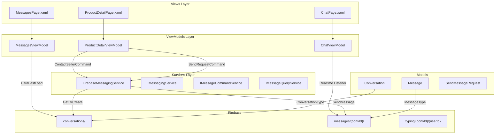
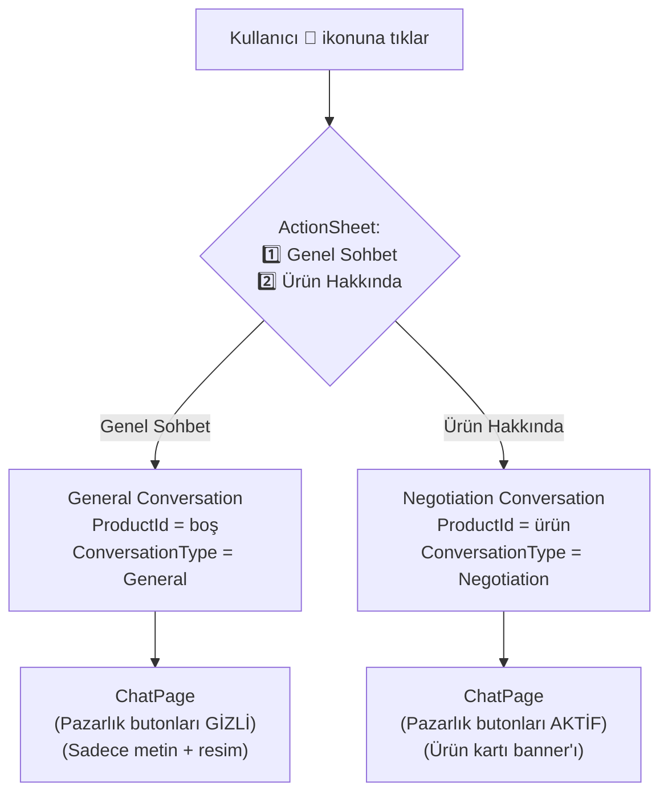
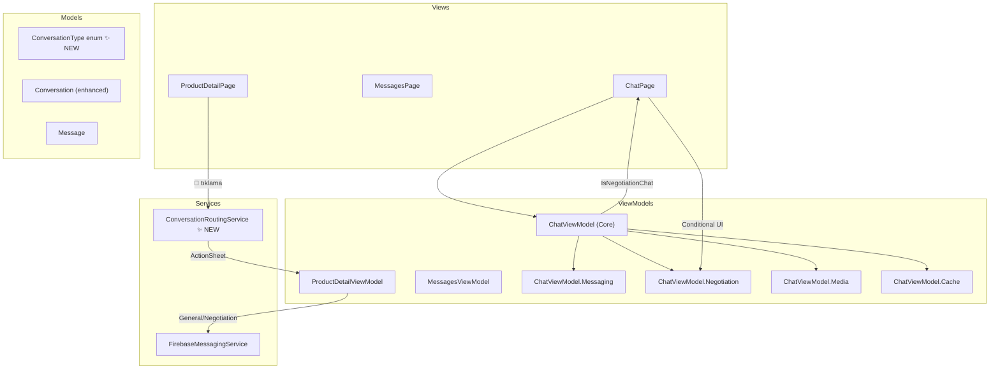

# 🏗️ KamPay Mesajlaşma Modülü — Mimari Analiz & İyileştirme Planı

---

## 1. MEVCUT MİMARİ ÖZETİ



### Mevcut Veri Akışı

| Akış | Tetikleyici | Yönlendirme | ConversationType |
|------|------------|-------------|-----------------|
| Satıcıya Sor (💬 buton) | `ContactSellerCommand` | → ChatPage (direkt) | `"General"` |
| Satın Al/Pazarlık | `SendRequestCommand` | → Transaction → ChatPage | `"General"` (BUG!) |
| Mesajlar Listesi | Tab switch | FilteredConversations | General / Negotiation filtresi |

---

## 2. TESPİT EDİLEN PROBLEMLİ ALANLAR

### 🔴 Kritik Sorunlar

#### P1: Pazarlık Akışı "General" Olarak Başlatılıyor
- [ProductDetailViewModel.cs:L342-L346](file:///c:/Users/seyda/source/repos/seydakaratekeli/KamPay3/KamPay/ViewModels/Products/ProductDetailViewModel.cs#L342-L346) — `ContactSellerAsync()` "General" tipinde conversation oluşturuyor ✅
- **AMA** [ProductDetailViewModel.cs:L456-L462](file:///c:/Users/seyda/source/repos/seydakaratekeli/KamPay3/KamPay/ViewModels/Products/ProductDetailViewModel.cs#L456-L462) — `SendRequestAsync()` içinde sistem mesajı gönderilirken `ConversationType` belirtilmiyor! `SendMessageRequest.ConversationType` default "General" kalıyor.
- [TransactionService](file:///c:/Users/seyda/source/repos/seydakaratekeli/KamPay3/KamPay/Services/Transactions) — `StartConversationForTransactionAsync()` muhtemelen ConversationType'ı "Negotiation" olarak set etmiyor.

> **Sonuç:** Pazarlık başlatılan sohbet bile "General" tipinde olabiliyor → İki akış karışıyor.

#### P2: Kullanıcıya Seçim Sunulmuyor
- 💬 ikonuna basıldığında direkt "General" sohbet açılıyor
- Kullanıcı ürün hakkında konuşmak isteyip istemediğini seçemiyor
- **İstenen:** Kullanıcıya "1-Genel Sohbet / 2-Ürün Hakkında" seçeneği sunulması

#### P3: ChatViewModel'de Akış Ayrımı Yok
- [ChatViewModel.cs](file:///c:/Users/seyda/source/repos/seydakaratekeli/KamPay3/KamPay/ViewModels/Messaging/ChatViewModel.cs) (1519 satır, 65KB!) — ConversationType'a göre hiçbir davranış farklılaştırması yok
- Genel sohbette pazarlık butonları gösterilebiliyor
- Pazarlık sohbetinde günlük mesajlar atılabiliyor → karışıklık

### 🟡 Yapısal Problemler

#### P4: God Object — ChatViewModel 1519 Satır
- Mesaj gönderme, resim yükleme, pazarlık, cache, typing, scroll, navigation → hepsi tek dosyada
- **SRP ihlali:** En az 5 farklı sorumluluk bir arada

#### P5: Tekrar Eden Kod
- Transaction arama mantığı `ProposeOfferAsync()` ve `AcceptOfferAsync()` içinde neredeyse aynı (L964-L998 vs L1082-L1106)
- Profil fotoğrafı yükleme: `UltraFastLoadAsync()`, `ProcessConversationBatchAsync()`, `UpdateConversationsFromRefreshAsync()` hepsinde tekrar
- `Application.Current!.MainPage!.DisplayAlert()` paterni 30+ yerde hardcoded

#### P6: Firebase'den Tüm Conversations Çekiliyor
- [FirebaseMessagingService.cs:L234-L236](file:///c:/Users/seyda/source/repos/seydakaratekeli/KamPay3/KamPay/Services/Messaging/FirebaseMessagingService.cs#L234-L236) — `GetOrCreateConversationAsync()` her seferinde TÜM conversations'ı çekiyor
- [FirebaseMessagingService.cs:L201-L203](file:///c:/Users/seyda/source/repos/seydakaratekeli/KamPay3/KamPay/Services/Messaging/FirebaseMessagingService.cs#L201-L203) — `GetUserConversationsAsync()` da tüm conversations'ı client-side filtreliyor

#### P7: Firebase Index Eksiklikleri
- `conversations/` koleksiyonunda `ConversationType` indexi yok
- Query performansı ölçeklenme ile kötüleşecek

### 🟠 Sürdürülebilirlik Riskleri

#### P8: Encoding Bozuklukları
- ChatViewModel genelinde Türkçe karakterler bozuk: `âÅ"…`, `ğŸ`, `ç` vb.
- Bakım yapılabilirliği düşürüyor

#### P9: Obsolete Metodlar Temizlenmemiş
- `SubscribeToConversations()` ve `SubscribeToMessages()` `[Obsolete]` ama hala interface'de

---

## 3. REFACTOR STRATEJİSİ

### Faz 1: Sohbet Türü Ayrımı (Genel vs Pazarlık) — ÖNCELİK 1
> **Amaç:** Kullanıcıya seçim sunarak iki akışı tamamen izole etmek



**Değişiklikler:**

| Dosya | Değişiklik |
|-------|-----------|
| `ProductDetailViewModel.cs` | `ContactSellerAsync()` → ActionSheet ile seçim sunma |
| `Conversation.cs` | Modele `ConversationType` güvenli enum dönüşümü |
| `FirebaseMessagingService.cs` | `GetOrCreateConversationAsync()` → ConversationType eşleşmesini güçlendirme |
| `ChatViewModel.cs` | `IsNegotiationChat` property + UI guard'ları ekleme |
| `ChatPage.xaml` | Pazarlık butonlarını `IsNegotiationChat` ile koşullu gösterme |

### Faz 2: ChatViewModel Parçalama — ÖNCELİK 2
> **Amaç:** God object'i sorumluluk bazında ayırma

```
ChatViewModel.cs (1519 satır)
  ├── ChatViewModel.cs          (~400) — Core: Load, Navigate, Dispose
  ├── ChatViewModel.Messaging.cs (~300) — Send, ProcessBatch, InsertSorted
  ├── ChatViewModel.Negotiation.cs (~250) — Propose, Accept, LoadTransactions
  ├── ChatViewModel.Media.cs     (~200) — PickImage, TakePhoto, SendImage
  └── ChatViewModel.Cache.cs     (~200) — Save/Restore/Cleanup cache
```

### Faz 3: Transaction Arama DRY Refactor — ÖNCELİK 2

```csharp
// ÖNCE (tekrar eden 30+ satır)
private async Task<Transaction?> FindTargetTransaction(Message? message) { ... }

// SONRA (tek metot, her yerde kullan)
private async Task<Transaction?> ResolveTransactionAsync(string? transactionId)
{
    // 1. ActiveTransactions'da ara
    // 2. GetMyOffersAsync
    // 3. GetIncomingOffersAsync
    // 4. Fallback: ProductId ile ara
}
```

### Faz 4: Firebase Optimizasyonları — ÖNCELİK 3

| Sorun | Çözüm |
|-------|-------|
| Tüm conversations çekme | `ConversationType` index ekle, filtered query |
| Client-side filtre | Firebase compound query (User1Id + Type) |
| Obsolete metodlar | Interface'den kaldır |

---

## 4. GELİŞTİRİLMİŞ MİMARİ



### Yeni ConversationType Enum

```csharp
public enum ConversationType
{
    General = 0,        // Günlük sohbet — ürünsüz
    Negotiation = 1     // Pazarlık — ürün bağlı
}
```

### ChatPage UI Davranış Matrisi

| Özellik | General Sohbet | Pazarlık Sohbeti |
|---------|---------------|-----------------|
| Metin mesajı | ✅ | ✅ |
| Resim gönderme | ✅ | ✅ |
| Ürün banner'ı | ❌ | ✅ (üst kısım) |
| Fiyat teklifi butonu | ❌ | ✅ |
| Kabul/Ret butonları | ❌ | ✅ |
| Transaction chip'leri | ❌ | ✅ |
| FilteredMessages | ❌ | ✅ |
| Typing indicator | ✅ | ✅ |
| Online durumu | ✅ | ✅ |

---

## 5. DETAYLI UYGULAMA PLANI

### 📋 Faz 1: Akış Ayrımı (Tahmini: ~2-3 saat)

#### Adım 1.1: Conversation Modeline Enum Geçişi
- `Conversation.cs` → `ConversationType` string'den enum'a
- Geriye dönük uyumluluk: string "General"/"Negotiation" parse

#### Adım 1.2: ProductDetailPage — ActionSheet Seçimi
- `ContactSellerAsync()` → ActionSheet ile "Genel Sohbet" / "Ürün Hakkında" sunma
- "Genel Sohbet" → `GetOrCreateConversationAsync(user1, user2, productId: null, "General")`
- "Ürün Hakkında" → `GetOrCreateConversationAsync(user1, user2, productId, "Negotiation")`

#### Adım 1.3: SendRequestAsync Düzeltmesi
- Satın alma/pazarlık akışından oluşan conversation'lar kesinlikle "Negotiation" tipinde olmalı
- `StartConversationForTransactionAsync()` → ConversationType = "Negotiation" zorlaması

#### Adım 1.4: ChatViewModel — Sohbet Türü Farkındalığı
- `IsNegotiationChat` property ekleme (Conversation.ConversationType'dan türetme)
- `CanShowNegotiationUI` computed property
- `SendMessageAsync()` → genel sohbette pazarlık mesajı engelleme

#### Adım 1.5: ChatPage.xaml — Koşullu UI
- Pazarlık butonlarını `IsVisible="{Binding IsNegotiationChat}"` ile sarmalama
- Genel sohbette ürün banner'ını gizleme
- Transaction chip bar'ını gizleme

#### Adım 1.6: MessagesPage — Tab Filtreleme Doğrulaması
- Mevcut tab filtreleme zaten var ama ConversationType güvenilirliği artacak

### 📋 Faz 2: ChatViewModel Refactoring (Tahmini: ~2 saat)

#### Adım 2.1: Partial Class Dosyaları Oluşturma
- `ChatViewModel.cs` → Core (constructor, load, dispose, navigate)
- `ChatViewModel.Messaging.cs` → Mesaj gönderme, batch processing
- `ChatViewModel.Negotiation.cs` → Teklif/kabul/ret, transaction yükleme
- `ChatViewModel.Media.cs` → Resim seçme/çekme/gönderme
- `ChatViewModel.Cache.cs` → Cache kaydet/yükle/temizle

#### Adım 2.2: Transaction Arama Konsolidasyonu
- `ResolveTransactionAsync()` ortak metodu
- `ProposeOfferAsync` ve `AcceptOfferAsync` içinden çağırma

### 📋 Faz 3: Firebase & Cleanup (Tahmini: ~1 saat)

#### Adım 3.1: Firebase Index Güncelleme
- `conversations/.indexOn` → `ConversationType` ekleme
- Compound query desteği araştırma

#### Adım 3.2: Obsolete Kod Temizliği
- `SubscribeToConversations()` ve `SubscribeToMessages()` kaldırma
- Encoding bozuk yorum satırlarını düzeltme

---

## 6. ÖNCELİK SIRASI

| Sıra | Faz | Risk | Etki |
|------|-----|------|------|
| 1️⃣ | Faz 1 (Adım 1.2) | Düşük | **YÜKSEK** — Kullanıcı deneyimi |
| 2️⃣ | Faz 1 (Adım 1.3-1.4) | Orta | **YÜKSEK** — Veri bütünlüğü |
| 3️⃣ | Faz 1 (Adım 1.5) | Düşük | **YÜKSEK** — UI tutarlılığı |
| 4️⃣ | Faz 2 (Adım 2.1) | Orta | **ORTA** — Bakım kolaylığı |
| 5️⃣ | Faz 3 (Adım 3.1-3.2) | Düşük | **DÜŞÜK** — Performans |

---

> [!IMPORTANT]
> **Faz 1 en kritik olandır** — Kullanıcının iki akış arasında seçim yapabilmesi ve her akışın kendi sınırlarında kalması sağlanır. Diğer fazlar buna bağlı olarak uygulanır.

> [!TIP]
> Mevcut `ConversationType` string field'ı zaten Conversation modelinde var (satır 29). Bu, Faz 1'in altyapısının kısmen hazır olduğu anlamına geliyor — sadece doğru yerlerde doğru değerle set edilmesi gerekiyor.
