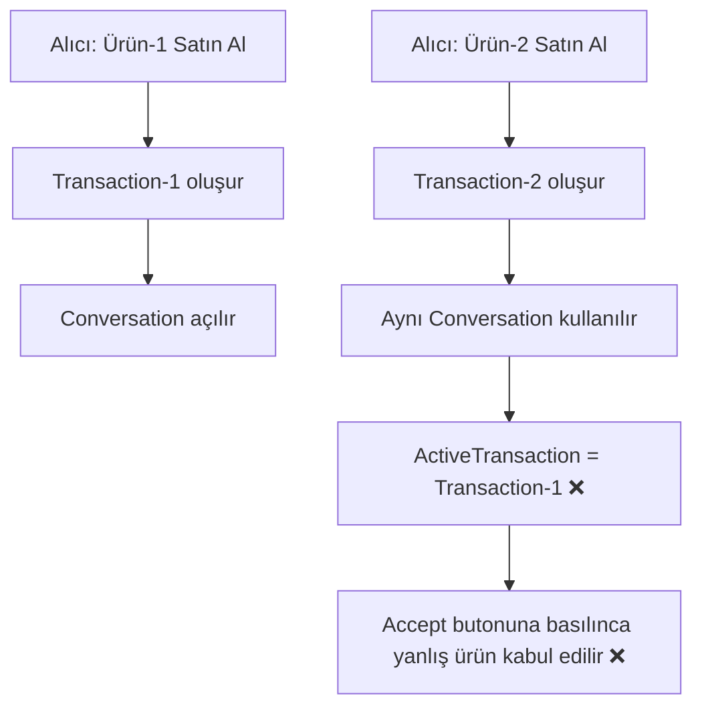
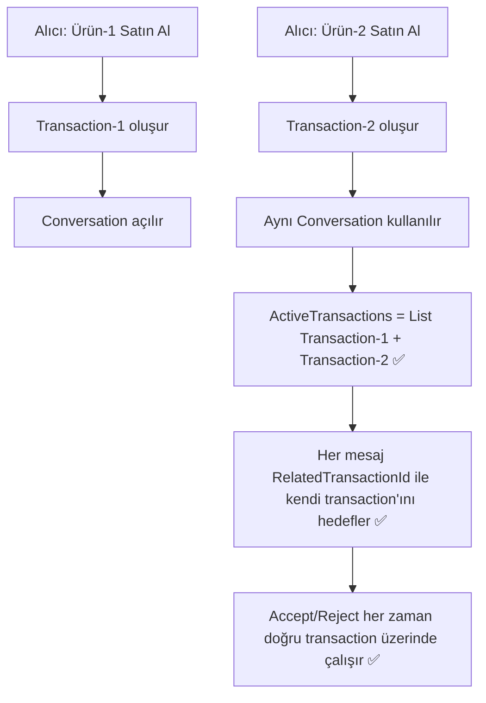

# 🔍 KamPay Satış/Pazarlık Akışı — Hata Analizi & Düzeltme Planı

> **Tarih:** 2026-04-23
> **Kapsam:** İlanlar modülü → Satış işlemi, mesajlar içi çoklu ürün pazarlığı

---

## 📋 Tespit Edilen Hatalar Özeti

| # | Hata | Önem | Dosya(lar) |
|---|------|------|-----------|
| BUG-1 | Liste fiyatıyla satın alma → Satıcı kabul edemez | 🔴 Kritik | `TransactionNegotiationService`, `OffersViewModel`, `ProductDetailViewModel` |
| BUG-2 | `AcceptNegotiatedPriceAsync` QR kod/teslimat akışını bypass ediyor | 🔴 Kritik | `TransactionNegotiationService` |
| BUG-3 | Konuşmada sadece TEK transaction takip ediliyor | 🔴 Kritik | `ChatViewModel` |
| BUG-4 | Satıcı chat'te ActiveTransaction göremez | 🟠 Yüksek | `ChatViewModel` |
| BUG-5 | Yeni ürün pazarlığı başlatırken devam eden pazarlıkla çakışma | 🟠 Yüksek | `ChatViewModel`, `ProductDetailViewModel` |
| BUG-6 | Conversation-Transaction ilişkisi 1:1 değil ama kod öyle davranıyor | 🟠 Yüksek | `TransactionCrudService` |
| BUG-7 | `RespondToOfferAsync` → `AcceptNegotiatedPriceAsync` durum çelişkisi | 🟡 Orta | `OffersViewModel` |

---

## 🐛 Detaylı Hata Analizleri

### BUG-1: Liste Fiyatıyla Satın Alma → "Bu pazarlık zaten sonuçlanmış"

**Senaryo:**
1. Satıcı yeni ürün ekler (Satış, 500₺)
2. Alıcı ürün detayında "Liste Fiyatıyla Al (500₺)" seçer
3. Satıcı Teklifler sayfasında "Kabul Et" butonuna basar
4. **HATA:** "Pazarlık devam ediyor!" uyarısı **VEYA** Chat'te "Bu pazarlık zaten sonuçlanmış"

**Kök Neden:**

[ProductDetailViewModel.cs:427-441](file:///c:/Users/seyda/source/repos/seydakaratekeli/KamPay3/KamPay/ViewModels/Products/ProductDetailViewModel.cs#L427-L441) — Akış şu adımları izler:

```
CreateRequestAsync → Status=Pending, IsNegotiating=false, QuotedPrice=500
    ↓
ProposePriceForSaleAsync(isInitialRequest=true) → IsNegotiating=TRUE ❌
```

`ProposePriceForSaleAsync` her zaman `IsNegotiating = true` set eder — liste fiyatı olsa bile!

Sonuç olarak [OffersViewModel.cs:615](file:///c:/Users/seyda/source/repos/seydakaratekeli/KamPay3/KamPay/ViewModels/Transactions/OffersViewModel.cs#L615):

```csharp
// Blok 2: IsNegotiating=true olduğu için buraya düşer
if (transaction.IsNegotiating)
{
    // "Pazarlık devam ediyor! Önce ✓ butonuna basın" → ÇIKMAZ
    return;
}
```

Satıcı ne "Kabul Et" yapabilir ne de Chat'teki ✓ butonuyla onaylayabilir çünkü bu aslında pazarlık değil, düz satın alma talebidir.

**Etki:** Satıcı hiçbir şekilde liste fiyatı talebini kabul edemez.

---

### BUG-2: AcceptNegotiatedPriceAsync QR Kod Akışını Bypass Ediyor

[TransactionNegotiationService.cs:400-401](file:///c:/Users/seyda/source/repos/seydakaratekeli/KamPay3/KamPay/Services/Transactions/TransactionNegotiationService.cs#L400-L401):

```csharp
transaction.IsNegotiating = false;
transaction.Status = TransactionStatus.Accepted;  // ← Direkt kabul!
```

**Sorun:** Bu metod, `TransactionCrudService.RespondToOfferAsync`'deki kritik adımları **tamamen atlıyor**:
- ❌ QR kod oluşturulmuyor
- ❌ Ürün "Reserved" olarak işaretlenmiyor
- ❌ Atomik güncelleme (multi-path update) yapılmıyor

[TransactionCrudService.cs:222-246](file:///c:/Users/seyda/source/repos/seydakaratekeli/KamPay3/KamPay/Services/Transactions/TransactionCrudService.cs#L222-L246) — Doğru akış burada:

```csharp
// KABUL: Atomik işlem + QR kodlar
await _productService.MarkAsReservedAsync(transaction.ProductId, true);
// QR kod oluşturma...
await _firebaseClient.Child("/").PatchAsync(atomicUpdates);
```

**Etki:** Pazarlık sonrası kabul edilen işlemlerde teslimat doğrulaması çalışmaz.

---

### BUG-3: Konuşmada Sadece TEK Transaction Takip Edilmesi

[ChatViewModel.cs:304-313](file:///c:/Users/seyda/source/repos/seydakaratekeli/KamPay3/KamPay/ViewModels/Messaging/ChatViewModel.cs#L304-L313):

```csharp
// Sadece İLK eşleşen transaction yükleniyor!
var match = myOffersResult.Data.FirstOrDefault(t => t.ConversationId == ConversationId);
ActiveTransaction = match;  // TEK bir property
```

**Senaryo:**
- A (alıcı) ve B (satıcı) arasında Ürün-1 için pazarlık devam ediyor
- B yeni Ürün-2 ekler, A bu ürünü de almak ister
- Yeni transaction oluşur, aynı conversation'a bağlanır
- **AMA** ChatViewModel hala Ürün-1'in transaction'ını tutar
- A Ürün-2 için Accept butonuna basınca → Ürün-1'in transaction'ı üzerinde işlem yapılır

**Etki:** Yanlış ürün kabul/red edilebilir; veri tutarsızlığı oluşur.

---

### BUG-4: Satıcı Chat'te ActiveTransaction Göremez

[ChatViewModel.cs:304](file:///c:/Users/seyda/source/repos/seydakaratekeli/KamPay3/KamPay/ViewModels/Messaging/ChatViewModel.cs#L304):

```csharp
var myOffersResult = await _transactionService.GetMyOffersAsync(_currentUser.UserId);
```

`GetMyOffersAsync` sadece `BuyerId == userId` olan transaction'ları döner. Satıcı olarak chat'e girildiğinde:
- ActiveTransaction = null
- HasActiveTransaction = false
- Satıcı pazarlık butonlarını göremez, kabul/red yapamaz

**Etki:** Satıcı chat üzerinden hiçbir pazarlık işlemi yapamaz.

---

### BUG-5: Devam Eden Pazarlıkla Yeni Ürün Çakışması

Alıcı Ürün-1 için pazarlık yaparken, Ürün-2 için "Satın Al" dediğinde:

1. Yeni transaction oluşur (Ürün-2)
2. `StartConversationForTransactionAsync` mevcut konuşmayı bulur ve aynı conversationId'yi atar
3. ChatViewModel'deki `ActiveTransaction` hala Ürün-1'i gösterir
4. Yeni ürünün teklif mesajı gelir ama AcceptOffer çağrıldığında Ürün-1 üzerinde çalışır

**Etki:** Çoklu ürün pazarlığı tamamen bozuk.

---

### BUG-6: Conversation-Transaction 1:N İlişkisi Yok Sayılıyor

[TransactionCrudService.cs:394-399](file:///c:/Users/seyda/source/repos/seydakaratekeli/KamPay3/KamPay/Services/Transactions/TransactionCrudService.cs#L394-L399):

```csharp
if (existingWithOtherUser != null)
{
    transaction.ConversationId = existingWithOtherUser.Key;  // Mevcut konuşmayı kullan
    // ← Bu conversation'a bağlı BİRDEN FAZLA transaction olabilir ama
    //    ChatViewModel bunu desteklemiyor
}
```

İki kullanıcı arasındaki tüm transaction'lar aynı conversation'a bağlanır. Ama:
- `ChatViewModel.ActiveTransaction` → tek property
- `Conversation` modeli → `ProductId` tek alan (ilk ürünün ID'si)

---

### BUG-7: RespondToOffer vs AcceptNegotiatedPrice Durum Çelişkisi

`OffersViewModel.RespondToOfferInternalAsync` 5 farklı blokla çalışır:

```
Blok 1: Satış + PazarlıkYok + QuotedPrice > 0  → RespondToOfferAsync
Blok 2: IsNegotiating == true                   → "Önce ✓'a bas" uyarısı
Blok 3: Satış + PazarlıkVardı + Bitti           → RespondToOfferAsync
Blok 4: Takas                                   → RespondToOfferAsync
Blok 5: Bağış                                   → RespondToOfferAsync
```

**Sorun:** Blok 1 → `!transaction.IsNegotiating` ama liste fiyatıyla alımda `IsNegotiating=true` (BUG-1 nedeniyle). Bu yüzden Blok 2'ye düşer ve satıcı çıkmaza girer.

Ayrıca Blok 3'ün koşulu:
```csharp
hadNegotiation && !transaction.IsNegotiating
```
Bu sadece `AcceptNegotiatedPriceAsync` çalıştıktan SONRA geçerli olur. Ama AcceptNegotiatedPriceAsync zaten Status=Accepted yapar, bu durumda RespondToOfferAsync "Bu teklif zaten yanıtlanmış" döner.

---

## 🏗️ Çoklu Ürün Pazarlık Senaryosu — Olması Gereken Akış

### Mevcut Durum (Bozuk)


### Hedef Durum (Doğru)


---

## 📐 Düzeltme Planı (4 Faz)

### FAZ 1: Liste Fiyatı Satın Alma Düzeltmesi (BUG-1, BUG-7)
> **Öncelik:** 🔴 Kritik | **Tahmini Süre:** ~2 saat

#### Değişiklik 1.1 — ProposePriceForSaleAsync'e isInitialRequest mantığı

**Dosya:** [TransactionNegotiationService.cs](file:///c:/Users/seyda/source/repos/seydakaratekeli/KamPay3/KamPay/Services/Transactions/TransactionNegotiationService.cs)

```diff
 transaction.ProposedPriceByBuyer = proposedPrice;
-transaction.IsNegotiating = true;
+// Liste fiyatı talebi ise pazarlık başlatma, direkt Pending kal
+transaction.IsNegotiating = !isInitialRequest;
 transaction.LastNegotiationDate = DateTime.UtcNow;
```

#### Değişiklik 1.2 — OffersViewModel Blok 1 koşulunu genişlet

**Dosya:** [OffersViewModel.cs](file:///c:/Users/seyda/source/repos/seydakaratekeli/KamPay3/KamPay/ViewModels/Transactions/OffersViewModel.cs)

```diff
-if (transaction.Type == ProductType.Satis && !transaction.IsNegotiating && transaction.QuotedPrice > 0)
+if (transaction.Type == ProductType.Satis && !transaction.IsNegotiating && transaction.QuotedPrice > 0
+    && transaction.Status == TransactionStatus.Pending)
```

Bu düzeltme ile liste fiyatı talepleri IsNegotiating=false kalacak ve Blok 1'e düşerek RespondToOfferAsync ile doğru şekilde kabul edilecek.

---

### FAZ 2: AcceptNegotiatedPriceAsync QR Kod Düzeltmesi (BUG-2)
> **Öncelik:** 🔴 Kritik | **Tahmini Süre:** ~2 saat

#### Değişiklik 2.1 — Pazarlık kabulü: Sadece fiyat kilitle, Status değiştirme

**Dosya:** [TransactionNegotiationService.cs](file:///c:/Users/seyda/source/repos/seydakaratekeli/KamPay3/KamPay/Services/Transactions/TransactionNegotiationService.cs)

AcceptNegotiatedPriceAsync artık Status=Accepted **yapmamalı**. Sadece:
- `QuotedPrice` = anlaşılan fiyat
- `IsNegotiating = false`
- Status **Pending kalmalı** → Satıcının son onayı (RespondToOfferAsync) ile Accepted olacak

```diff
 transaction.QuotedPrice = agreedAmount;
 transaction.IsNegotiating = false;
-transaction.Status = TransactionStatus.Accepted;
+// Status Pending kalır — satıcının son onayı ile Accepted olacak
+// Bu sayede RespondToOfferAsync akışı (QR kod, reserve) çalışır
```

#### Değişiklik 2.2 — OffersViewModel Blok 3 güncelleme

Blok 3'ün koşulu artık doğru çalışır çünkü:
- `hadNegotiation = true` (ProposedPrice veya CounterOffer var)
- `!IsNegotiating = true` (pazarlık bitti)
- `Status = Pending` (henüz son onay verilmedi)

Satıcı "Kabul Et" dediğinde → RespondToOfferAsync çağrılır → QR kodlar oluşur → Status=Accepted

---

### FAZ 3: Çoklu Ürün Pazarlık Desteği (BUG-3, BUG-4, BUG-5, BUG-6)
> **Öncelik:** 🟠 Yüksek | **Tahmini Süre:** ~4-5 saat

#### Değişiklik 3.1 — ChatViewModel: Tekil → Çoğul transaction takibi

**Dosya:** [ChatViewModel.cs](file:///c:/Users/seyda/source/repos/seydakaratekeli/KamPay3/KamPay/ViewModels/Messaging/ChatViewModel.cs)

```diff
-[ObservableProperty]
-private Transaction? activeTransaction;
-[ObservableProperty]
-private bool hasActiveTransaction;
+// Çoklu transaction desteği
+public ObservableRangeCollection<Transaction> ActiveTransactions { get; } = new();
+[ObservableProperty]
+private bool hasActiveTransactions;
```

#### Değişiklik 3.2 — LoadActiveTransactions: Hem alıcı hem satıcı transaction'ları

```csharp
private async Task LoadActiveTransactionsAsync(string currentUserId)
{
    ActiveTransactions.Clear();
    
    // 1. Alıcı olarak transaction'lar
    var myOffers = await _transactionService.GetMyOffersAsync(currentUserId);
    // 2. Satıcı olarak transaction'lar  
    var incomingOffers = await _transactionService.GetIncomingOffersAsync(currentUserId);
    
    var allActive = new List<Transaction>();
    
    if (myOffers.Success && myOffers.Data != null)
        allActive.AddRange(myOffers.Data.Where(t => 
            t.ConversationId == ConversationId &&
            (t.Status == TransactionStatus.Pending || t.IsNegotiating)));
    
    if (incomingOffers.Success && incomingOffers.Data != null)
        allActive.AddRange(incomingOffers.Data.Where(t => 
            t.ConversationId == ConversationId &&
            (t.Status == TransactionStatus.Pending || t.IsNegotiating)));
    
    if (allActive.Any())
    {
        ActiveTransactions.ReplaceRange(allActive);
        HasActiveTransactions = true;
    }
}
```

#### Değişiklik 3.3 — AcceptOfferAsync: RelatedTransactionId ile doğru hedefleme

```diff
 [RelayCommand]
 private async Task AcceptOfferAsync(Message message)
 {
     if (message == null) return;
     
-    Transaction targetTransaction = ActiveTransaction;
+    // Her zaman mesajın RelatedTransactionId'sini kullan
+    Transaction? targetTransaction = null;
+    
     if (!string.IsNullOrEmpty(message.RelatedTransactionId))
     {
-        // ... eski fallback mantığı
+        // Önce yerel listede ara
+        targetTransaction = ActiveTransactions
+            .FirstOrDefault(t => t.TransactionId == message.RelatedTransactionId);
+        
+        // Bulunamazsa Firebase'den taze çek
+        if (targetTransaction == null)
+        {
+            var allOffers = await _transactionService.GetMyOffersAsync(_currentUser?.UserId ?? "");
+            var incoming = await _transactionService.GetIncomingOffersAsync(_currentUser?.UserId ?? "");
+            // ... merge ve bul
+        }
     }
+    
+    if (targetTransaction == null)
+    {
+        await Application.Current!.MainPage!.DisplayAlert(
+            "Hata", "Bu teklif için işlem bulunamadı.", "Tamam");
+        return;
+    }
```

#### Değişiklik 3.4 — ProposeOfferAsync: Aynı mantık

ProposeOfferAsync'de de aynı şekilde `ActiveTransactions` listesinden `RelatedTransactionId` ile hedefleme yapılacak.

#### Değişiklik 3.5 — Yeni ürün pazarlığı başlatma akışı

**Dosya:** [ProductDetailViewModel.cs](file:///c:/Users/seyda/source/repos/seydakaratekeli/KamPay3/KamPay/ViewModels/Products/ProductDetailViewModel.cs)

Mevcut akışta `CreateRequestAsync` sonrası `StartConversationForTransactionAsync` çağrılıyor. Bu zaten mevcut conversation'ı yeniden kullanıyor. Sorun yok.

Ancak chat'e gidildiğinde `LoadActiveTransactionsAsync` çağrılarak **tüm** aktif transaction'lar yüklenmeli.

---

### FAZ 4: Genel Düzeltmeler & Tutarlılık
> **Öncelik:** 🟡 Orta | **Tahmini Süre:** ~2 saat

#### 4.1 — ChatPage.xaml: Çoklu transaction UI

Aktif transaction'lar için chat üstünde küçük chip/tag'ler gösterilebilir:
```
[📦 Kulaklık - 450₺ Pazarlık] [📦 Telefon - 2500₺ Onay Bekliyor]
```

#### 4.2 — Stale data koruması

OffersViewModel'daki `UpdateOfferInUIAsync` sadece IncomingOffers'ı güncelliyor. OutgoingOffers da güncellenmeli.

#### 4.3 — AcceptOfferAsync durum kontrolü iyileştirme

```diff
-if (targetTransaction.Status != TransactionStatus.Pending || !targetTransaction.IsNegotiating)
+if (targetTransaction.Status != TransactionStatus.Pending)
 {
-    await ... DisplayAlert("Uyarı", "Bu pazarlık zaten sonuçlanmış.", "Tamam");
+    await ... DisplayAlert("Uyarı", 
+        "Bu işlem artık beklemede değil (Durum: " + targetTransaction.StatusText + ").", "Tamam");
     return;
 }
+// Pazarlık bitmişse ama status hala Pending ise → fiyat kilitli, accept edilebilir
+// IsNegotiating kontrolü burada kaldırıldı çünkü pazarlık bitmiş olabilir
```

---

## 🔄 Doğru Satış Akışı (Düzeltme Sonrası)

### Senaryo A: Liste Fiyatıyla Satın Alma
```
Alıcı: "Liste Fiyatıyla Al" → CreateRequest(Pending) + ProposePriceForSale(IsNegotiating=FALSE)
                                     ↓
Satıcı: Teklifler → "Kabul Et" → RespondToOffer(accept=true) → QR Kod ✅
                                     ↓
                              Status=Accepted, QR oluştu, ürün reserved
```

### Senaryo B: Pazarlıklı Satış
```
Alıcı: "Fiyat Teklifi Ver 400₺" → CreateRequest(Pending) + ProposePriceForSale(IsNegotiating=TRUE)
                                     ↓
Satıcı: Chat'te "Karşı Teklif 450₺" → SendCounterOffer(IsNegotiating=TRUE)
                                     ↓
Alıcı: Chat'te "✓ Kabul" → AcceptNegotiatedPrice → QuotedPrice=450, IsNeg=FALSE, Status=PENDING
                                     ↓
Satıcı: Teklifler → "Kabul Et" → RespondToOffer(accept=true) → QR Kod ✅
```

### Senaryo C: Çoklu Ürün (Yeni)
```
[Ürün-1 pazarlık devam ediyor - Chat'te mesaj balonları ile]
                                     ↓
Alıcı: Ürün-2'yi "Liste Fiyatıyla Al" → Yeni Transaction-2 oluşur
                                     ↓
Aynı Conversation'a bağlanır → Chat'te "Ürün-2 satın alma talebi" mesajı
                                     ↓
ChatViewModel: ActiveTransactions = [Transaction-1, Transaction-2]
                                     ↓
Her mesaj balonu kendi RelatedTransactionId'si ile doğru transaction'ı hedefler
                                     ↓
Satıcı Ürün-1 pazarlığını sürdürürken, Ürün-2 talebini bağımsız kabul edebilir ✅
```

---

## 📁 Etkilenen Dosyalar

| Faz | Dosya | Değişiklik Türü |
|-----|-------|----------------|
| 1 | `Services/Transactions/TransactionNegotiationService.cs` | `isInitialRequest` koşulu |
| 1 | `ViewModels/Transactions/OffersViewModel.cs` | Blok 1 koşul düzeltmesi |
| 2 | `Services/Transactions/TransactionNegotiationService.cs` | Status=Accepted kaldır |
| 3 | `ViewModels/Messaging/ChatViewModel.cs` | Çoğul transaction desteği |
| 3 | `ViewModels/Products/ProductDetailViewModel.cs` | LoadActive güncelleme |
| 4 | `Views/Messaging/ChatPage.xaml` | Çoklu transaction UI |
| 4 | `ViewModels/Transactions/OffersViewModel.cs` | UI güncelleme düzeltmeleri |
| 4 | `ViewModels/Messaging/ChatViewModel.cs` | Durum kontrolü iyileştirme |

---

> [!IMPORTANT]
> **Faz 1 ve Faz 2 birlikte uygulanmalıdır.** AcceptNegotiatedPriceAsync'den Status=Accepted kaldırılmadan, OffersViewModel'daki düzeltme tam çalışmaz. İki faz birbirine bağımlıdır.

> [!WARNING]
> **Firebase'deki mevcut transaction'lar:** Faz 2 uygulandığında, daha önce AcceptNegotiatedPriceAsync ile Status=Accepted yapılmış ama QR kodu olmayan transaction'lar olabilir. Bunlar için bir migration veya cleanup düşünülmeli.
