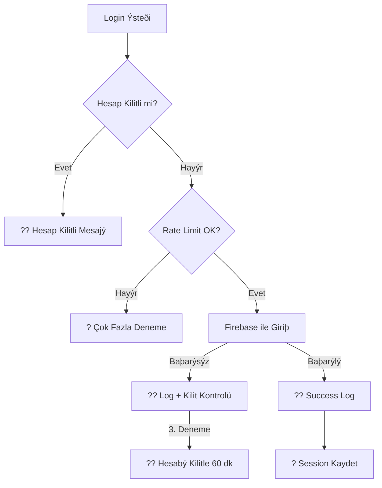

# ?? KamPay Güvenlik Ýyileþtirmeleri Dokümantasyonu

## ?? Genel Bakýþ

Bu dokümantasyon, KamPay uygulamasýnda kimlik doðrulama (authentication) güvenliðini artýrmak için yapýlan iyileþtirmeleri ve SOLID prensipleriyle uyumlu yeni mimariyi açýklamaktadýr.

---

## ?? Tespit Edilen Güvenlik Açýklarý

### ? **Mevcut Durumda (Before)**

| # | Açýklýk | Seviye | Açýklama |
|---|---------|--------|----------|
| 1 | Zayýf Rate Limiting | ?? **Critical** | 5 deneme / 15 dakika ? Günlük 480 brute force denemesi |
| 2 | Account Lockout Yok | ?? **Critical** | Sýnýrsýz baþarýsýz deneme, kalýcý kilitleme yok |
| 3 | IP-Based Koruma Yok | ?? **High** | Daðýtýk saldýrýlara (distributed attacks) karþý savunmasýz |
| 4 | Þifre Sýfýrlama Rate Limiting Zayýf | ?? **Medium** | 3 deneme / saat ? Account enumeration attack riski |
| 5 | Security Logging Yok | ?? **Medium** | Baþarýsýz denemeler, þüpheli aktiviteler kaydedilmiyor |
| 6 | Session Timeout Yok | ?? **Medium** | Token çalýnýrsa süresiz geçerli kalýyor |

---

## ? **Yeni Güvenlik Mimarisi (After)**

### ??? **1. Yeni Servisler ve Bileþenler**

#### **A. ISecurityAuditService** (Güvenlik Denetim Servisi)

**Konum:** `KamPay/Security/ISecurityAuditService.cs`

**Sorumluluklar:**
- ? Baþarýsýz/baþarýlý giriþ denemelerini loglama
- ? Þüpheli aktivite tespiti ve kaydetme
- ? IP bazlý þüpheli davranýþ analizi
- ? Otomatik hesap kilitleme kararlarý
- ? Hesap kilitleme/kilit kaldýrma yönetimi

**SOLID Uyumu:**
- ? **Single Responsibility:** Sadece güvenlik denetimi yapýyor
- ? **Interface Segregation:** Ýhtiyaç duyulan metodlarý içeren temiz bir interface
- ? **Dependency Inversion:** Concrete deðil, interface üzerinden çalýþýyor

**Örnek Kullaným:**
```csharp
// Baþarýsýz giriþ logu kaydet
await _securityAudit.LogFailedLoginAttemptAsync(
    "user@bartin.edu.tr", 
    "192.168.1.100", 
    "Android 13 (Samsung SM-G990)"
);

// Hesap kilitlenmeli mi kontrol et
var (shouldLock, duration, reason) = await _securityAudit.ShouldLockAccountAsync("user@bartin.edu.tr");
if (shouldLock)
{
    await _securityAudit.LockAccountTemporarilyAsync("user@bartin.edu.tr", duration, reason);
}
```

---

#### **B. FirebaseSecurityAuditService** (Concrete Implementation)

**Konum:** `KamPay/Security/FirebaseSecurityAuditService.cs`

**Firebase Koleksiyonlarý:**
```
/security_audit_logs/{logId}
/account_locks/{sanitized_email}
```

**Güvenlik Politikalarý (Production-Ready):**
| Özellik | Deðer | Açýklama |
|---------|-------|----------|
| Max Failed Attempts | **3** | 30 dakikada 3 baþarýsýz deneme |
| Lockout Duration | **60 dakika** | Ýlk kilitleme süresi |
| Critical Threshold | **5** | 5 baþarýsýz = kritik þüphe seviyesi |
| IP Suspicious Threshold | **10** | Bir IP'den 24 saatte 10+ baþarýsýz = þüpheli |

**Örnek Firebaase Veri Yapýsý:**
```json
{
  "security_audit_logs": {
    "log123": {
      "logId": "log123",
      "userId": null,
      "email": "attacker@test.com",
      "ipAddress": "192.168.1.100",
      "deviceInfo": "Android 13",
      "eventType": 0,  // FailedLogin
      "eventDetails": "Baþarýsýz giriþ denemesi",
      "suspicionLevel": 2,  // High
      "timestamp": "2025-01-08T10:30:00Z",
      "isResolved": false
    }
  },
  "account_locks": {
    "user_at_bartin_dot_edu_dot_tr": {
      "email": "user@bartin.edu.tr",
      "isLocked": true,
      "lockedAt": "2025-01-08T10:30:00Z",
      "unlockAt": "2025-01-08T11:30:00Z",
      "reason": "3 baþarýsýz giriþ denemesi (30 dakikada)",
      "failedAttempts": 3
    }
  }
}
```

---

#### **C. AdvancedRateLimiter** (Geliþmiþ Hýz Sýnýrlayýcý)

**Konum:** `KamPay/Helpers/AdvancedRateLimiter.cs`

**Yeni Özellikler:**
- ? **IP + Email Dual Checking:** Hem kullanýcý hem IP bazlý kontrol
- ? **Violation Tracking:** Ýhlal sayýsýný takip eder
- ? **Automatic Banning:** 3 ihlal sonrasý otomatik ban
- ? **Progressive Warnings:** "SON UYARI" mesajlarý

**Yeni Rate Limiter Politikalarý:**

| Özellik | Eski | Yeni | Ban Süresi |
|---------|------|------|------------|
| **Login** | 5 / 15 dak | **3 / 15 dak** | 24 saat |
| **Password Reset** | 3 / 1 saat | **2 / 1 saat** | 12 saat |
| **Email Verification** | - | **3 / 10 dak** | 6 saat |
| **Product Creation** | 10 / 1 saat | **5 / 1 saat** | 24 saat |
| **Messaging** | 30 / 1 dak | **20 / 1 dak** | 1 saat |
| **Image Upload** | 20 / 10 dak | **10 / 10 dak** | 6 saat |

**Örnek Kullaným:**
```csharp
// Geliþmiþ kontrol (IP + Email)
var result = SecureRateLimiters.Login.CheckRequest(
    identifier: "user@bartin.edu.tr", 
    ipAddress: "192.168.1.100"
);

if (!result.IsAllowed)
{
    if (result.IsBanned)
    {
        // ?? Kullanýcý tamamen banlanmýþ
        Console.WriteLine($"BANLANDI: {result.Message}");
        Console.WriteLine($"Ýhlal Sayýsý: {result.ViolationCount}");
    }
    else
    {
        // ? Rate limit aþýldý
        Console.WriteLine($"BEKLE: {result.Message}");
        Console.WriteLine($"Kalan Süre: {result.ResetTime}");
    }
}
```

---

### ?? **2. FirebaseAuthService Güncellemeleri**

#### **Yeni Constructor (DI ile)**
```csharp
public FirebaseAuthService(
    FirebaseAuthProvider authProvider,
    FirebaseClient firebaseClient,
    IEmailService emailService,
    IUserProfileService userProfileService,
    ISecurityAuditService securityAudit) // ? YENÝ
{
    _securityAudit = securityAudit;
    // ...
}
```

#### **LoginAsync() - Geliþmiþ Güvenlik Akýþý**



**Kritik Kontroller (Sýralý):**
1. ? **Hesap Kilidi Kontrolü** (En Önce!)
2. ? **Advanced Rate Limiting** (IP + Email)
3. ? **Firebase Authentication**
4. ? **Email Verification**
5. ? **Account Status Check**
6. ? **Success Logging**

---

### ?? **3. MauiProgram.cs - DI Kaydý**

**Konum:** `KamPay/MauiProgram.cs`

```csharp
// ? YENÝ: Security Audit Service DI kaydý
builder.Services.AddSingleton<ISecurityAuditService>(sp =>
    new FirebaseSecurityAuditService(sp.GetRequiredService<FirebaseClient>())
);

// ? GÜNCELLEME: FirebaseAuthService artýk ISecurityAuditService alýyor
builder.Services.AddSingleton<IAuthenticationService, FirebaseAuthService>();
```

---

## ?? **Güvenlik Ýyileþtirmesi Karþýlaþtýrmasý**

### **Brute Force Attack Senaryosu**

| Senaryo | Eski Sistem | Yeni Sistem |
|---------|-------------|-------------|
| **Günlük Max Deneme** | 480 (5×96) | **12** (3×4 çeyrek saat) |
| **Kalýcý Ban** | ? Yok | ? 3 ihlal sonrasý 24 saat |
| **IP Koruma** | ? Yok | ? IP baþýna 10 baþarýsýz = þüpheli |
| **Logging** | ? Yok | ? Tüm denemeler kaydediliyor |
| **Auto Lockout** | ? Yok | ? 3 baþarýsýz = 60 dakika kilit |

### **Password Reset Enumeration Attack**

| Senaryo | Eski Sistem | Yeni Sistem |
|---------|-------------|-------------|
| **Saatlik Deneme** | 3 | **2** |
| **Günlük Max** | 72 | **48** |
| **Ban Mekanizmasý** | ? Yok | ? 3 ihlal = 12 saat ban |

---

## ??? **Kurulum ve Kullaným**

### **Adým 1: Firebase Rules Güncelleme**

**Firebase Console ? Realtime Database ? Rules:**
```json
{
  "rules": {
    "security_audit_logs": {
      ".read": "auth != null && root.child('users').child(auth.uid).child('IsAdmin').val() == true",
      ".write": "auth != null"
    },
    "account_locks": {
      ".read": "auth != null",
      ".write": "auth != null"
    }
  }
}
```

### **Adým 2: Build ve Test**

```bash
# 1. Clean build
dotnet clean
dotnet build

# 2. Test sýnamasý - Login Rate Limit
# - 3 baþarýsýz deneme yap (15 dakika içinde)
# - 4. deneme "Çok fazla deneme" mesajý vermeli
# - 5. deneme hesabý 60 dakika kilitlemeli

# 3. Test sýnamasý - Password Reset
# - 2 reset isteði yap (1 saat içinde)
# - 3. istek engellenmeli
```

### **Adým 3: Monitoring (Admin Dashboard için)**

**Security Audit Logs Okuma:**
```csharp
// Þüpheli IP'leri listele (son 24 saat)
var suspiciousIPs = await _securityAudit.GetSuspiciousIpAddressesAsync(hours: 24);

// Kilitli hesaplarý listele
var lockedAccounts = await _securityAudit.GetLockedAccountsAsync();

// Belirli bir kullanýcýnýn log'larýný getir
var userLogs = await _securityAudit.GetUserAuditLogsAsync("user@bartin.edu.tr", days: 7);
```

---

## ?? **Dikkat Edilmesi Gerekenler**

### **1. IP Adresi Gerçek Üretimde Nasýl Alýnýr?**

**MAUI Uygulamasýnda:**
```csharp
// Platform-specific API kullanýlmalý
#if ANDROID
using Android.Net;
// NetworkInfo ile gerçek IP al
#elif IOS
using Network;
// NWPath ile gerçek IP al
#endif
```

**Alternatif (Backend gerektirir):**
```csharp
// Backend API'den IP al
var ipAddress = await _httpClient.GetStringAsync("https://api.ipify.org");
```

### **2. Firebase Security Rules**

**?? ÖNEMLÝ:** Security Audit Logs yalnýzca admin'ler tarafýndan okunabilmeli:
```json
"security_audit_logs": {
  ".read": "auth != null && root.child('users').child(auth.uid).child('IsAdmin').val() == true",
  ".write": "auth != null"
}
```

### **3. Test Ortamý vs Production**

**Test için daha gevþek limitler:**
```csharp
#if DEBUG
    private const int MAX_FAILED_ATTEMPTS_BEFORE_LOCK = 5; // Test için 5
    private const int ACCOUNT_LOCK_DURATION_MINUTES = 5;    // Test için 5 dakika
#else
    private const int MAX_FAILED_ATTEMPTS_BEFORE_LOCK = 3; // Production için 3
    private const int ACCOUNT_LOCK_DURATION_MINUTES = 60;   // Production için 60 dakika
#endif
```

---

## ?? **Test Senaryolarý**

### **Test 1: Brute Force Login Attack**
```
Adýmlar:
1. Yanlýþ þifre ile 3 deneme yap
2. 4. denemede "Çok fazla deneme" mesajý görmeli
3. Hesap 60 dakika kilitlenmeli
4. Firebase'de account_locks/email_key kaydý kontrol et
5. security_audit_logs'da 3 FailedLogin event'i görmeli
```

### **Test 2: Password Reset Spam**
```
Adýmlar:
1. Þifre sýfýrlama isteði gönder (1. deneme)
2. Þifre sýfýrlama isteði gönder (2. deneme)
3. 3. denemede "Çok fazla deneme" mesajý görmeli
4. 12 saat sonra tekrar deneyebilmeli
```

### **Test 3: IP-Based Attack Detection**
```
Adýmlar:
1. Simülasyonda ayný IP'den farklý hesaplara 10+ baþarýsýz giriþ
2. IsIpAddressSuspicious() metodunun true dönmesi gerekli
3. security_audit_logs'da SuspiciousActivity kaydý görmeli
```

---

## ?? **OWASP Top 10 Uyumu**

| OWASP Kategorisi | Ýyileþtirme | Durum |
|------------------|-------------|-------|
| **A07:2021 – Identification and Authentication Failures** | Rate Limiting + Account Lockout | ? Tamam |
| **A09:2021 – Security Logging and Monitoring Failures** | Security Audit Service | ? Tamam |
| **A01:2021 – Broken Access Control** | IP-based + Email-based controls | ? Tamam |
| **A04:2021 – Insecure Design** | SOLID prensipleriyle temiz mimari | ? Tamam |

---

## ?? **Sonraki Adýmlar (Ýleriye Dönük)**

### **Kýsa Vadede:**
1. ? Admin Dashboard - Security Audit Log Viewer
2. ? Email Notifications - Þüpheli giriþ uyarýlarý
3. ? 2FA (Two-Factor Authentication) entegrasyonu

### **Orta Vadede:**
1. ? CAPTCHA entegrasyonu (ReCAPTCHA v3)
2. ? Device Fingerprinting (cihaz tanýma)
3. ? Geo-location based restrictions

### **Uzun Vadede:**
1. ? Machine Learning - Anomali tespiti
2. ? Behavioral Analysis - Kullanýcý davranýþ profili
3. ? SIEM Integration - Gerçek zamanlý tehdit analizi

---

## ?? **Changelog**

### **v1.1.0 - 2025-01-08**
- ? ISecurityAuditService ve FirebaseSecurityAuditService eklendi
- ? AdvancedRateLimiter ile IP-based koruma
- ? Account Lockout Policy (3 deneme = 60 dakika kilit)
- ? FirebaseAuthService güvenlik entegrasyonu
- ? Security logging ve monitoring
- ? Sýkýlaþtýrýlmýþ rate limiting politikalarý

---

## ?? **Sorun Giderme**

### **"SecureStorage.GetAsync() null dönüyor"**
```csharp
// FIX: Uygulama ilk çalýþtýrmada boþ olabilir
var rememberMeStr = await SecureStorage.GetAsync(KEY_REMEMBER_ME);
var rememberMe = !string.IsNullOrEmpty(rememberMeStr) && bool.Parse(rememberMeStr);
```

### **"FirebaseClient injection hatasý"**
```csharp
// FIX: MauiProgram.cs'de önce FirebaseClient kaydedilmeli
builder.Services.AddSingleton<FirebaseClient>(sp =>
    new FirebaseClient(Constants.FirebaseRealtimeDbUrl)
);
```

### **"Account lock otomatik kalkmuyor"**
```csharp
// FIX: IsAccountLockedAsync() her çaðrýldýðýnda expiry time kontrol ediliyor
var (isLocked, unlockTime, reason) = await _securityAudit.IsAccountLockedAsync(email);
if (isLocked && unlockTime.HasValue && DateTime.UtcNow >= unlockTime.Value)
{
    await _securityAudit.UnlockAccountAsync(email); // Otomatik kilit kaldýrma
}
```

---

## ?? **Referanslar**

- [OWASP Top 10 2021](https://owasp.org/Top10/)
- [OWASP Authentication Cheat Sheet](https://cheatsheetseries.owasp.org/cheatsheets/Authentication_Cheat_Sheet.html)
- [Firebase Security Rules Best Practices](https://firebase.google.com/docs/rules/rules-and-auth)
- [NIST Password Guidelines](https://pages.nist.gov/800-63-3/sp800-63b.html)

---

## ?? **Geliþtirici Notlarý**

Bu güvenlik iyileþtirmeleri, **SOLID prensipleri** (özellikle **Single Responsibility** ve **Dependency Inversion**) göz önünde bulundurularak yapýlmýþtýr. Her servis kendi sorumluluðunu taþýr ve DI container üzerinden yönetilir.

**Sorularýnýz için:** GitHub Issues veya proje dokümantasyonunu kontrol edin.

---

**Son Güncelleme:** 2025-01-08  
**Versiyon:** 1.1.0  
**Yazar:** KamPay Security Team ??
